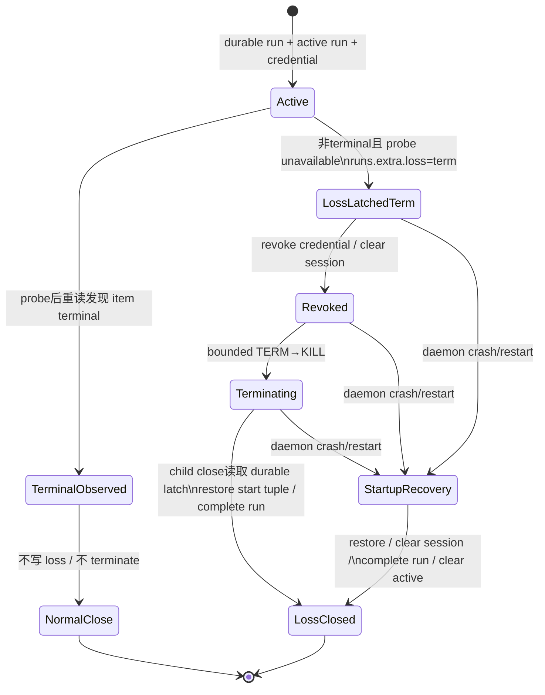
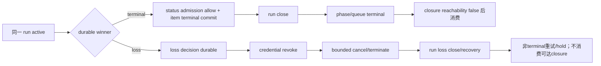

# R7-07 · 同一生产 invocation 的 loss / terminal total order

## A. 主 agent 摘要（≤1页）

### 问题与结论

本切片固定在 `main@699842eba2eefc242d19f8fa9232bc1d9d5c3bdd`，回答稳定 T7、STD-602-3/4/5 所需的一个问题：同一真实 external-terminal invocation 上，loss 检测、凭据撤销、进程终止、业务 terminal 准入、run close、启动恢复和 closure terminal/cleanup 是否已有可复现的总序。

**结论：R7-07 被 R7-06 的真实 invocation 不可达所阻塞；当前不能把 loss ordering 声称为已证明，也不能交给 R8 固化。** 高置信静态事实如下：

1. current main 没有 `hapi` runner 可达面，因此没有 production loss latch。它只有可作为接缝坐标的 current `(closure_id, run_id, runtime_node_id, worktree_path, closure_sessions)` authority、active credential admission、local child close、terminal consumer 与 startup recovery。
2. 历史 `8e9642c` 实现的是 **durable run-extra latch wins**：probe 返回 loss 后重新读取 item；若此时 terminal 已提交则 terminal 胜。否则它先分别写 hold 与 `runs.extra.externalTerminalLoss(term)`，再 revoke credential、清 session、terminate；close handler只要读到 latch就恢复 run-start item tuple、回滚 attempt并把 latch闭合为 `closed`。启动恢复也消费已落盘 latch。
3. 这个历史算法没有建立完整的数据库线性化点。hold、loss latch、session delete、run completion、item restoration、active-run clear 都是独立 SQLite write transaction；Git/process/credential registry也不与 SQLite同事务。尤其“第二次读取非 terminal”到“loss latch commit”之间，terminal 可先提交；代码仍随后 latch loss并在 close时恢复旧状态。现有 terminal-first test 只覆盖 terminal 在 probe 返回后的重读之前提交，loss-first test只覆盖 latch 后 warning await期间的 terminal 写入，未覆盖这个窗口。
4. 历史 active-loss tests 先启动普通 local fake child，再由 `modelControlledExternalTerminalRun` 原地改写 `run.runner` 为 HAPI；startup test直接合成 DB latch。它们证明内部状态机形状和若干崩溃恢复结果，不证明两个竞争结果来自同一真实 remote invocation，也不证明 external CLI terminal artifact、daemon admission和probe loss的实际先后。

### 影响、边界与下一步

- **当前影响：** `S2-D11/D12/R03/T05/U03` 均仍是运行证明缺口。静态结构支持“run-scoped durable latch优先于后续 close bookkeeping”这一形态，但不支持生产 total-order 主张。
- **未来影响：** 必须先满足 R7-06 的 contract gate和真实 invocation E2E；否则任何 loss注入仍是 fake。之后在同一 immutable `closure_id/run_id/phase/session_id` 上分别强制 terminal-first、loss-first和 crash/restart，并断言只有一个 durable winner。
- **纯证明缺口：** 真实 binary 的无副作用 probe、机器可读 terminal/status、原子 admission、session resume/cleanup均未知；因此本报告只交付待执行协议，不虚构结果。
- **可保留资产（形态，不是推荐）：** run-scoped durable loss fact；terminal 后重读；先 revoke 再 terminate；close/startup共同消费 latch；process-group bounded termination；current closure/run/session/consumption authority；围绕竞争窗口的可控 barrier 测试方法。
- **R8 材料边界：** 可使用“current authority是唯一观察坐标”“历史 latch状态机、事务裂缝和测试同错已查清”“真实 total order不可判定”。**仍阻塞 R8 的事实**是：生产 binary/contract存在后，同一真实 invocation 上 terminal admission commit 与 loss decision commit 的实际线性化结果，以及 crash后 winner是否保持。

---

## B. 证据附录

### B1. 设计对照与 Ledger 闭合

| Ledger | 必须证明 | 当前证据 | 结论 |
|---|---|---|---|
| `S2-D11` | active invocation loss进入唯一 durable顺序 | 历史有run-extra latch；production invocation不可达 | 未成立 |
| `S2-D12` | terminal-first/loss-first同一 invocation互斥 | 历史有两条synthetic race tests，但存在未测窗口 | 未成立 |
| `S2-R03` | revoke/terminate/close/recovery保持winner | 静态路径存在；无真实 remote身份 | 形状成立，生产证明缺失 |
| `S2-T05` | 故障注入覆盖竞争及crash | fake child、人工runner改写、synthetic DB | 同错风险，未覆盖真实边界 |
| `S2-U03` | 未知被真实实验关闭 | R7-06证明CLI/invocation不可达 | 仍未知 |

稳定条款要求的对象必须是**同一生产 invocation**；R7-06 已确认 current main无HAPI runner，而历史路径在probe成功后仍于 worktree/run/credential/process之前以 `invocation-pending` 返回（`detail-r7-06-remote-lifecycle.md` A、B4）。因此不得把下面的静态/fixture事实提升为T7运行证明。

### B2. 历史 latch 状态机



精确路径：

1. active run只在external-terminal、仍需业务运行且未被内存set去重时probe（`8e9642c:src/scheduler.ts:543-551`）。
2. probe后重新确认同一slot run；再读item。若item已terminal，清hold并跳过loss（`552-560`）。
3. 否则先写item hold（`562-575`），再读取durable run并以单独写事务写 `externalTerminalLoss={lost, detectedAt, reason, terminationPhase:"term"}`（`576-583`）。
4. latch后依次做内存去重、revoke、session清空、terminate；warning event可以await在后（`583-593`）。
5. child close从durable run读取latch；存在即选择run-start snapshot，而非当前item status（`1643-1651`）。它写artifact、complete run、clear active、revoke；随后恢复status/phase/attempt并清backoff/session（`1653-1761`），结果为`external-terminal-lost`（`1789-1792`）。
6. terminator回调只更新已存在latch的 `terminationPhase`（`1829-1840`）；latch不存在时，普通terminate不能凭空制造loss。

### B3. terminal / loss竞争的实际顺序与缺口

```mermaid
sequenceDiagram
    participant P as Probe tick
    participant DB as SQLite
    participant A as Agent terminal admission
    participant C as Child close
    participant K as Credential/process

    P->>P: probe returns unavailable
    P->>DB: read item status
    alt terminal already visible
        DB-->>P: terminal
        P-->>C: no loss; normal close wins
    else nonterminal visible
        DB-->>P: nonterminal
        P->>DB: write hold (transaction 1)
        Note over A,DB: 未封闭窗口：terminal可先commit
        P->>DB: write run loss latch (transaction 2)
        P->>K: revoke, clear session, terminate
        C->>DB: read latch
        C->>DB: restore run-start tuple / complete run
        Note over C,DB: latch wins even if terminal committed in window
    end
```

因此历史代码实际定义的不是简单的“DB commit先到者胜”，而是“probe后的某次item read若看见terminal则terminal胜；否则稍后成功写入的loss latch胜”。缺少compare-and-set、共同事务、数据库约束或序号，把item terminal write与loss latch write放进一个可审计线性化点。credential revoke又发生在latch之后，故latch与revoke之间仍可能有一次合法active-credential status admission；close仍以latch覆盖它。

现有测试的两个barrier：

- terminal-first：probe阻塞，fixture直接 `store.updateItem(done)`，释放probe；重读看见terminal，断言无latch（`8e9642c:tests/integration/scheduler/external-terminal.integration.ts:604-631`）。
- loss-first：warning callback发生时已断言latch=`term`，再直接写done；close恢复queued（`637-666`）。

它们没有覆盖 `(nonterminal read, hold commit, latch commit, revoke)` 内各排列，也都绕过daemon credential admission。

### B4. 事务、锁、crash与restart

- SQLite store的每个 `write(...)` 是一个同步transaction，但每个API调用独立；历史loss路径没有跨 `updateItem`、`updateRunExtra`、`setItemSessionId`、`completeRun`、`clearCurrentRun` 的组合transaction（历史scheduler上述行；store write包装事实与current一致，见 `detail-r7-09-closure-authority.md` B4）。
- scheduler tick在单JS事件循环内执行同步store写，但会在probe、event、termination/child close等边界await；daemon socket mutation可在这些边界交错。内存 `externalTerminalLossRunIds`只防同进程重复probe，不是durable lock。
- process-group TERM/KILL、credential Map revoke和SQLite不能同事务。历史顺序明确是durable latch→revoke→terminate；这是crash恢复可观察的关键。

| crash位置 | durable状态 | 历史startup结果 / 未知 |
|---|---|---|
| hold后、latch前 | hold存在，无loss | generic orphan recovery；不会按loss恢复start tuple。该语义未被专门测试 |
| latch后、revoke前 | loss=`term`，credential仅在死进程内 | startup读取latch并走loss恢复；旧credential registry随进程消失 |
| revoke/session clear后、child close前 | loss=`term`，session可能已空 | startup重复清session、恢复、complete、clear active |
| item恢复后、complete run前 | item已旧tuple，run仍active | 各写独立；再次startup可重做，未有逐checkpoint kill实验 |
| complete run后、clear active前 | ended run仍被active_runs引用 | startup仍进入current run循环并可重做loss恢复，然后clear；未有逐checkpoint kill实验 |

startup先终止stale process group，再读durable loss；有loss则要求start status/timestamp/attempt与external current事实齐全，依次恢复item、清session、complete run，最后clear current并发recovery event（`8e9642c:src/daemon.ts:2345-2402`）。缺恢复事实会fail closed（`2365-2372`）。测试只通过直接构造run/current/session/latch验证最终恢复（`8e9642c:tests/integration/daemon/external-terminal.integration.ts:598-648`），没有在真实执行的每个crash窗口kill daemon。

### B5. current authority、terminal消费者与closure接缝

R7-07的最终实验不能沿历史 `(chain,repo)` slot判定同一性。唯一坐标是current：

- closure/run/resource创建与active occupancy：`src/scheduler.ts:1565-1656`、`src/sqlite-state.ts:1647-1662,2481-2509`；
- credential/status admission：`src/scheduler.ts:1658-1706,2069-2072`、`src/daemon.ts:3971-4035,4382-4393`；
- local close/retry/terminal消费者：`src/scheduler.ts:2089-2164`；
- terminal后closure reachability/consumption：`src/scheduler.ts:2683-2749`、`src/sqlite-state.ts:2117-2153`；
- session authority：`src/sqlite-state.ts:739-744,1830-1848`；
- startup stale-run与closure资源reconciliation：`src/daemon.ts:2366-2432`。

current terminal status由active credential下的daemon mutation/phase-exit准入产生；scheduler生成的`status.json`只是运行读面，并非外部CLI admission input（`detail-r7-06-remote-lifecycle.md` A、B3）。因此真实实验必须同时观察 admission event、item row、run row、active row与closure consumer，不能以artifact文件mtime替代winner。

### B6. 测试同错与可保留测试资产

`modelControlledExternalTerminalRun` 仅把已spawn的ordinary local run的内存 `runner` 改成 `{kind:"hapi", binary:probeBinary}`（`8e9642c:tests/integration/scheduler/harness.ts:366-372`）。其child、argv、cwd、prompt、credential与remote session均不是HAPI invocation。

历史测试可证明的有限事实：

- per-run latch、两个repo slot的latch互不混淆（external-terminal test `361-480`）；
- chain-complete terminal anchor在synthetic loss后保留（`487-551`）；
-上述两种受控race结果（`604-666`）；
- endpoint warning聚合不是每run重复（`713-737`）；
- synthetic startup latch最终恢复（daemon external-terminal test `598-648`）。

同错风险：fixture可在生产 gate不可达时人工制造“active HAPI”；直接store terminal绕过credential/phase-exit准入；fake probe与真正CLI contract不匹配；slot owner与current closure authority冲突；只断最终状态会掩盖中间双写、重复event及错误closure consumption。

可保留的是barrier/fault-injection方法、run-scoped latch断言、TERM→KILL/process-group测试与逐checkpoint快照格式；不能保留“model-controlled HAPI即真实invocation”或zero-spawn PASS。

### B7. 待执行的真实故障注入协议

#### Contract gate（不满足即停止）

1. 固定生产runner binary绝对路径、版本/hash；证明probe无副作用，且正常invocation提供machine-readable session identity、terminal/status、resume和bounded cancel。
2. current runner ADT/schema已使HAPI真实进入per-closure run路径；禁止fixture改写runner。
3. 隔离daemon/loop-data、专用fixture repo与专用remote machine；记录env名称而不记录secret值。
4. status必须经真实active credential admission，并能以barrier精确暂停在“terminal请求已到达但未commit / 已commit”和“loss已检测但未commit / 已commit”。

#### 公共identity与checkpoint

每一场景保存同一 `closure_id, runtime_node_id, run_id, phase, cwd realpath, session_id, credential subject`；在每个barrier保存SQLite只读快照（item、run、active_run、closure、session、consumption intent）、remote session状态、process group、status artifact、完整events/logs。所有事件断言带run/closure identity，不以时间戳相等推定因果。

#### 场景 T：terminal-first

1. 启动一个真实remote turn并确认active。
2. 阻塞loss probe返回；让remote agent通过真实daemon admission提交允许的terminal status，等待commit及allow event。
3. 释放probe为loss；等待child/remote terminal与scheduler settle。
4. 断言：无durable loss winner；terminal item不回退；run/phase/queue terminal各一次；closure只在无active/reachable后消费；stale credential写被拒。

#### 场景 L：loss-first

1. 阻塞terminal admission在commit前；触发真实endpoint loss并等待durable loss decision checkpoint。
2. 释放terminal请求，并让cancel/close完成。
3. 断言：loss winner只属于该run；credential已撤销，terminal写被明确拒绝且不污染item；run恢复pre-run tuple/attempt策略符合声明；session失效；不得发queue terminal或消费仍可达closure。

#### 场景 R：最窄竞争

至少重复运行并通过barrier覆盖：terminal commit→loss decision、loss decision→terminal commit，以及历史未封闭的 `post-nonterminal-read/pre-latch` 窗口。每轮必须能从durable记录唯一判定winner；若只能靠调度时机/最终覆盖推测，性质即未成立。

#### 场景 C：crash/restart

分别在 loss decision commit后、credential revoke后、TERM后、run complete前、active clear前强杀daemon；每次重新启动同一loop-data。断言winner不翻转、恢复幂等、run只闭合一次、session/credential不可复活、item tuple无混合版本、events可解释重复或恰好一次语义、closure cleanup不早于terminal authority。

#### 必须成立的事件顺序断言



禁止的观察：同一run同时拥有terminal winner与loss winner；loss后仍allow credential写；winner在restart后翻转；run已terminal但closure先于active clear被消费；新retry复用旧runId或不同closure/cwd；status/events无法关联同一identity。

### B8. 事实形态触点（不是实现拆分）

- external execution domain/probe/invocation：`src/runner-execution.ts`、runner selection/schema；
- scheduler active probe、run close、retry/terminal：`src/scheduler.ts`；
- durable run/item/active/session/closure transaction API：`src/sqlite-state.ts`；
- credential admission与startup recovery：`src/daemon.ts`；
- typed loss/hold/status projection：`src/runtime-data.ts`、`src/loop.ts`、observability；
- integration driver：真实external-terminal driver、scheduler/daemon race与restart suites。

此清单只标识必须共同核对的生产者/消费者；不表示实现方案或issue重拆。

### B9. 证据索引与核对

| ID | 证据 |
|---|---|
| E01 | `investigation-index.md:91-100,155-163,177-180`：R7-07范围、依赖与Ledger |
| E02 | `detail-r7-04-external-cli.md` A、B3-B7：真实CLI contract不匹配 |
| E03 | `detail-r7-06-remote-lifecycle.md` A、B2-B8：真实invocation不可达、current local基准与待执行E2E |
| E04 | `detail-r7-09-closure-authority.md` A、B1-B4/B8：current authority、事务/锁/恢复 |
| E05 | `8e9642c:src/scheduler.ts:543-593`：probe、terminal重读、hold、latch、revoke、terminate |
| E06 | `8e9642c:src/scheduler.ts:1606-1840`：close winner、恢复、run close、session与terminator |
| E07 | `8e9642c:src/daemon.ts:2345-2402`：startup latch recovery |
| E08 | `8e9642c:tests/integration/scheduler/harness.ts:366-372`：model-controlled runner改写 |
| E09 | `8e9642c:tests/integration/scheduler/external-terminal.integration.ts:361-737`：synthetic loss/race覆盖 |
| E10 | `8e9642c:tests/integration/daemon/external-terminal.integration.ts:598-648`：synthetic startup latch |

核对：

- [x] A摘要不超过一页量级，明确R8材料边界与阻塞。
- [x] B附录含Mermaid状态/时序、`path:line`、事务/锁/crash/restart、消费者、测试同错、真实实验和事件顺序断言。
- [x] 只写 `detail-r7-07-loss-ordering.md`；未修改产品、测试、配置、DB或WORKFLOW。
- [x] 未创建worktree、未操作中央daemon/真实session/GitHub issue或PR。
- [x] 未用fake冒充真实invocation，未实现、重拆或裁决。
- [x] 未创建 `/tmp/rfc548-r7-07-*`，无需清理。
