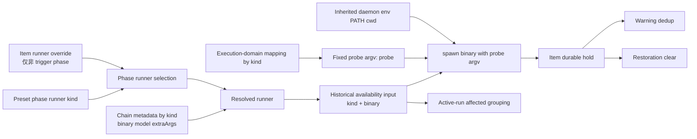

# R7-08 — probe endpoint identity 的真实区分维度

## A. 主 agent 摘要（≤1页）

### 问题、结论与置信边界

本调查固定在 coder-loop `main@699842eba2eefc242d19f8fa9232bc1d9d5c3bdd`，仅回答 `S2-D14`：历史 availability 机制实际把什么当作 endpoint、真实可见配置里哪些输入能够改变可达性，以及哪些维度只是尚无生产合约的假设。

**高置信结论：历史 `8e9642c` 没有独立 probe cache object；它把持久化在 item `extra` 中的 hold、跨 item warning 去重、restoration 批量清除和 active-run 受影响集合都按 `runner kind + binary` 归组。** `probeArgv` 虽被写入 hold/event/status，但类型和 parser 都强制为唯一字面 `["probe"]`，所有 probe 也只执行 `spawn(binary, ["probe"])`，因此在该历史实现中 `kind+binary` 与设计锚点的 `kind+binary+probe argv` 条件等价。phase、item、chain、model、extraArgs、session、closure、machine、target/repo cwd、daemon cwd、环境与配置文件均不参与归组。

**当前真实外部资产证明“同 binary”并不天然等于“同 endpoint”，但不能完成两 endpoint 的真实 probe 对照。** 已安装 `hapi-open-session` 0.1.0 没有 probe；它的可达路径实际受 API URL、认证来源、preferred/selected machine、machine active/root metadata及 session directory 共同影响。它还允许 `--settings`、`--machine-id` 和显式 path 区分这些输入。同一 binary 可因此面向不同 server、credential principal或 machine；反之 agent/model/session type属于 invocation配置，当前证据没有把它们证明为 endpoint identity。历史 probe完全不传 chain `extraArgs`，继承 daemon 的 env与 cwd，所以即使两个 chain为同一 hapi binary配置不同 extraArgs，probe仍相同；同进程内也不能给两个 chain不同 env。

复杂因果是：runner选择先由 preset phase / item override确定 kind，再由 chain metadata为该 kind统一提供 binary/model/extraArgs；历史 availability gate只截取 kind、binary，并从 kind映射出固定 probe argv。随后持久化和并发消费者再次只比较 kind、binary。由此，配置层能表达的差异不等于 probe能观察或状态能归属的差异。

### 影响、资产、未知与 R8 准备度

- **当前影响：** main 没有 hapi/external-terminal实现，故不存在当前生产 key；历史候选若原样恢复，会把同 kind+binary但潜在不同 argv/config/env/server/machine的状态互相去重、清 hold，并把 active runs一并列为 affected。不同 binary（字符串严格不等）会被分开，即使最终解析到同一可执行文件/endpoint。
- **迁移/恢复影响：** hold是 item JSON事实而非独立 endpoint表；daemon重启可恢复 hold/loss，但不会重建一个 endpoint registry。binary或最终CLI配置改变后，旧 hold仍按旧字符串留存，直到某次同 kind+binary成功 probe触发全库清除；loss latch本身按 run持久化。
- **可保留资产：** execution-domain ADT、typed probe结果、hold/current/loss shape、gate前置、按 endpoint做 warning/restoration聚合的消费者边界；均不证明既有 identity字段充分。
- **尚未确定：** 最终生产 runner binary及无副作用 probe不存在，因此其 probe argv、可配置 endpoint/profile、配置读取、机器选择与认证边界未知；也无法安全执行索引要求的“双 endpoint/profile probe”。PATH或binary内容原地变化的生产政策亦未定义。
- **是否具备 R8 裁决材料：** **具备否定“历史 kind+binary 普遍等价于 endpoint”的材料，也具备完整触点清单；不具备确定最终 identity输入集合的材料。** 若 R8只裁决历史资产能否原样作为 key，事实已足够；若要固化最终 production key，仍被 R7-04 已确认的真实 runner/probe合约缺失阻塞。本报告不选择 key结构。

---

## B. 证据附录

### B1. 唯一设计锚点与调查边界

稳定 T7规定 availability “按解析后的 endpoint identity（runner kind + binary + probe argv）管理，不按 tick或item管理”（`AGG-548.md:151-198`）。R7索引只要求查明真实配置输入、key生产/消费及碰撞事实（`investigation-index.md:103-114`）；总账原事实为历史 key仅 `kind+binary`、固定 argv时条件等价（`supply-findings-ledger.md:89`）。本报告未扩入 R7-04 的CLI选择、R7-05 的创建后hold时序、R7-06/07 的真实lifecycle/loss ordering。

### B2. 身份来源与解析流

#### 当前 main 的配置入口（说明历史资产 reconcile 后可见的供给面）

1. runner kind当前词表只有 `claude|codex|opencode`（`src/loop.ts:885-910`）；main没有 hapi或external-terminal生产路径。
2. phase默认kind来自 preset；非trigger phase可被 item `runner`覆盖，trigger phase不吃item override（`src/loop.ts:5299-5321,5342-5361`）。
3. 每个kind的 `binary/model/extraArgs` 唯一运行来源是 `chain.metadata.<kind>`；target侧配置已退役（`src/loop.ts:4275-4327`）。metadata parser保留这三个字段（`src/runtime-data.ts:68-78,260-275,597-608`）。
4. CLI公开的 `chain set-runner-model` 只写model；binary/extraArgs没有同级专用CLI，能够从 `chain.create` metadata或内部 binding update进入（`src/loop.ts:2242-2253`；`src/daemon.ts:2167`）。
5. `buildAgentRunnerCommands` 把同一chain、同一kind的命令配置复用于所有phase/item；phase仅可能提供/覆盖model，不产生独立binary/extraArgs（`src/loop.ts:5262-5282,5331-5361`）。

#### 历史 hapi扩展

历史提交在相同结构中增加 hapi字段和默认 binary `hapi-remote-session`；chain metadata的 `hapi.binary/model/extraArgs`进入 resolved runner（`8e9642c:src/loop.ts:5326-5360`）。但 execution domain仅由kind决定：hapi恒为 `{kind:"external-terminal", probe:{argv:["probe"], deadlineMs:30000, killGraceMs:1000}}`（`8e9642c:src/runner-execution.ts:4-19`）。`probeResolvedExternalTerminal`只消费 `runner.binary`与domain固定argv（同文件 `109-127`），不消费model或extraArgs。

### B3. 历史 key 的全部 producer / consumer

| 触点 | 实际比较/持久化字段 | 确定后果 |
|---|---|---|
| probe spawn | binary +固定 `["probe"]`; child spawn不传env/cwd | 继承daemon env/PATH/cwd；chain extraArgs/model不可改变probe（`8e9642c:src/runner-execution.ts:79-116`） |
| candidate hold写入 | runner、phase、binary、probeArgv、availability | phase被保存供展示，但same-hold比较为runner+phase+binary+kind+reason（`8e9642c:src/scheduler.ts:1308-1346`） |
| warning去重 | runner+binary+availability kind+reason，跨所有chain/item | 同endpoint不同错误原因会产生新transition；phase/item/chain不隔离（同文件 `1280-1293,1342-1345`） |
| restoration清除 | runner+binary，跨所有chain/item | 一个成功probe清除所有同kind+binary hold，不看phase、reason、argv（同文件 `1348-1353,1384-1394`） |
| active affected集合 | active run runner.kind+runner.binary | 同kind+binary的所有active run列为affected；其他维度不隔离（同文件 `1296-1305`） |
| active loss探测 | active run binary+固定argv | 每个active slot会再次probe；不是共享一次probe结果的cache（同文件 `539-595`） |
| run/current持久化 | externalTerminalCurrent仅runner+binary+available checkedAt | 不保存argv、endpoint config、env、machine或profile（同文件 `1135-1164`） |
| hold parser/serializer | probeArgv必须恰为 `["probe"]` | schema不允许第二种probe argv进入旧持久化数据（`8e9642c:src/runtime-data.ts:159-183,750-797,935-947`） |
| loss latch | run extra的lost reason/time/terminationPhase | durable identity是run，不是endpoint；endpoint归属只来自触发它的active runner比较（同文件 `172-177`; `8e9642c:src/scheduler.ts:577-593`） |
| in-memory重复终止锁 | `externalTerminalLossRunIds: Set<runId>` | 只防同一run被并发重复终止，不是endpoint lock/cache（`8e9642c:src/scheduler.ts:191,543-548,583-593`） |
| status/events | hold/current/loss与warning/restoration event | wire暴露runner/binary/fixed probeArgv；无法观察server/machine/profile/env归属（`8e9642c:src/loop.ts:3449,3567-3570`; `8e9642c:src/daemon.ts:833-855`） |

因此“historical probe cache/latch key”需拆开陈述：没有结果缓存表；durable absence状态按item存放，聚合操作按kind+binary；active loss latch按run；并发终止抑制也按run。

### B4. 配置维度能否在当前系统实际区分

| 维度 | 当前/历史能否表达 | 历史probe能否区分 | 当前事实支持的语义 |
|---|---|---|---|
| runner kind | phase/preset与item override可表达 | 能 | execution domain也由kind决定 |
| binary字符串 | chain metadata per kind可表达 | 能，严格字符串比较 | 不做realpath、inode、版本或内容归一化；两个字符串可指向同文件，同字符串内容可原地变化 |
| probe argv | 历史schema固定唯一字面 | 不能形成两个值 | 只在固定事实下与kind+binary等价 |
| runner extraArgs | chain metadata可表达 | 不能；probe不传 | invocation配置，不进入旧availability |
| model | chain/phase可表达 | 不能 | 当前launcher可在本地或spawn阶段验证；没有证据表明它定义endpoint |
| phase / item / chain | 均可区分 | 不进入endpoint聚合 | hold锚在item且记录phase，但dedup/clear/affected跨chain |
| API/server URL | 当前launcher由env或settings表达 | 历史引擎不可见 | 直接决定请求endpoint（`hapi-open-session/cli.py:51-70,91-100`） |
| credential/auth principal | env或settings表达 | 历史引擎不可见 | 影响认证可达性；报告不读取值 |
| settings/profile path | launcher有 `--settings` | 历史probe不传extraArgs | 同binary可读取不同server/token/machine配置 |
| preferred/selected machine | `--machine-id`或settings，随后由active/root选择 | 历史引擎不可见 | machine active与workspace root实际决定可选机器（`cli.py:224-245,253-255,284-311`） |
| target/session directory | launcher显式path决定 | 历史probe不传；且gate早于worktree创建 | directory改变machine root匹配；process cwd不是其替代 |
| daemon process cwd | spawn默认继承 | 同daemon内相同 | 仅对依赖cwd的未知probe可能有影响；当前launcher显式path后cwd不决定session directory |
| PATH / inherited env | spawn默认继承 | 同daemon内chain间不能区分；重启间可变 | 同binary短名可解析到不同executable；HAPI_API_URL/CLI_API_TOKEN可改变server/principal |
| session id / closure / run id | current main分别持久化closure session与run identity | 不进入pre-run probe | 属于invocation/lifecycle identity，不是已证endpoint输入（`src/sqlite-state.ts:459,739-742,1831-1844,1945-1965`） |

“机器、cwd、session”不能合并为一个维度：当前launcher在创建前用**目标session directory**筛machine；真实session id只在spawn后产生；process cwd因path resolve而不决定目标directory（`hapi-open-session/cli.py:73-88,224-245,323-336`）。

### B5. 当前 HAPI 本机事实与最小实验边界

2026-07-30只读核对：

- `/opt/homebrew/bin/hapi-open-session`存在；`hapi-remote-session`不在PATH。
- `~/.hapi/settings.json`存在，key包括 `apiUrl`、`cliApiToken`、`machineId`；三字段均为非空相应类型。本报告未输出值。当前进程未设置 `HAPI_API_URL`/`CLI_API_TOKEN`。
- `read_settings`规定env URL/token优先于settings，machine仅来自settings或CLI override（`hapi-open-session/src/hapi_open_session/cli.py:51-70,253-286`）。
- settings当前mode为0644；这是本机事实，不改变identity结论。

索引要求的“双 endpoint/profile probe”没有执行，原因不是实验失败，而是R7-04已证明当前CLI没有无副作用probe；字面`probe`会被当作path并可能创建session（`detail-r7-04-external-cli.md:B2-B4`）。本任务禁止创建remote session，也不得用dry-run代替availability。因此以下只能列为事实支持的可实验形态，不是假装已验证的生产probe：

1. 同binary +不同`--settings`可解析出不同API URL/preferred machine（dry-run只证明解析，不证明availability）。
2. 同binary +不同`--machine-id`或path可选择不同machine（需真实list/spawn路径，具有session副作用）。
3. 同binary +不同env可指向不同server/auth principal（历史daemon无法按chain注入不同env）。
4. 不同binary字符串在历史key中必然隔离，即使shell/PATH最终指向同一文件。

### B6. 并发、恢复与迁移后果

- **并发：** scheduler对每个active slot与每个candidate分别probe，没有endpoint级single-flight。两个同endpoint probe可并行/相继得到不同结果；warning dedup依赖之后的DB扫描，不是probe锁（`8e9642c:src/scheduler.ts:539-595,1280-1355`）。
- **碰撞后果：** 如果同kind+binary背后实际指向不同server/machine/profile，一个availability结果可压掉另一者warning、清除另一者hold，或把另一endpoint active run列为affected。是否实际终止另一run取决于它自己的slot probe；`affected`聚合本身已经错误归属。
- **分裂后果：** 同endpoint若以不同binary字符串表示，会产生独立warning/hold/restoration，无法共享恢复transition。
- **restart：** hold在item extra、loss在run extra，可跨daemon重启；`externalTerminalLossRunIds`仅内存，startup另消费durable loss。没有持久化endpoint registry或probe generation（`8e9642c:src/daemon.ts:2348-2399`）。
- **配置漂移：** hold只保存binary字符串和固定argv。settings/env/PATH/binary内容变化没有generation；状态无法说明它对应变化前还是变化后的endpoint。
- **迁移：** 历史hold/current/loss均位于JSON extra，不由独立SQL endpoint表约束。历史hapi schema migration主要扩runner CHECK；current main closure/session migration不补endpoint identity（`supply-hapi-reconcile-audit.md:170-182`）。直接恢复历史类型会再次固化fixed argv parser。

### B7. 测试覆盖与同错

历史scheduler tests证明同一个fake binary上的warning去重、restoration、same-endpoint affected runs与loss latch（例如 `8e9642c:tests/integration/scheduler/external-terminal.integration.ts:39-135,713-739`）。daemon tests也都用单一fakeBinary或手工构造external state（`8e9642c:tests/integration/daemon/external-terminal.integration.ts:67-105,185-287,598-644`）。

盲区/同错：

1. 没有测试同binary但不同argv、settings、env、server、machine、cwd/profile；类型本身禁止不同probe argv。
2. 没有测试不同binary字符串解析到同一executable/endpoint，或binary内容/PATH在restart后漂移。
3. 所谓“same endpoint”测试以相同binary直接定义endpoint，正好复述实现key，不能独立证明等价。
4. fake binary只读取字面`probe`并由共享state file返回结果；没有真实CLI config/machine/profile选择。
5. 当前main tests不含external-terminal，不能证明历史identity与current closure/run/session接缝。

### B8. 事实支持的身份形态与确定触点（不作选择）

1. **历史实现形态：** `{runnerKind, binaryString}`；probe argv为全局常量而非变量。触点是gate、hold dedup/clear、affected聚合、status。
2. **稳定文字形态：** `{runnerKind, binaryString, probeArgv}`。当前没有可变argv实现，故只在类型层比历史形态多一个恒定字段。
3. **当前launcher可达目标形态：** `{apiUrl, auth principal, selected machine constrained by sessionDirectory}`，其输入可来自env/settings/argv/path。它是session-launcher事实，不是已存在的runner probe合约。
4. **可执行解析形态：** `{binaryString, inherited PATH/env/cwd, executable content/version}`；历史状态只记录第一项。
5. **invocation/lifecycle形态：** phase/item/chain选择、model/extraArgs、closure/session/run/cwd。现有事实证明这些被不同层消费，但未证明它们都属于availability endpoint。

确定触点不是key建议：任何最终生产identity若与上述某一真实可达性输入不同步，受影响的不是单一cache，而是hold归属、warning dedup、restoration清除、active affected列表、status解释与restart后的陈旧状态。

### B9. 未知、如何确定与证据索引

仍未知：

- 最终production runner binary/version；
- 是否提供无副作用probe、其完整argv/env/config schema与machine/profile语义；
- endpoint availability是否按server、principal、machine、workspace root或其组合定义；
- binary/PATH/config轮换时旧hold的兼容/失效规则。

确定这些事实的前提实验必须先满足R7-04：定位真实runner并证明probe无session副作用；然后在隔离daemon内对两个明确不同的endpoint/profile各执行probe，记录解析输入与hold/status归属，再做restart和并发交叉。当前不能用`hapi-open-session --dry-run`或创建session替代。

| 证据 | 支持结论 |
|---|---|
| `AGG-548.md:151-198` | 稳定T7 endpoint identity锚点 |
| `investigation-index.md:103-114`; `supply-findings-ledger.md:89` | R7-08问题与S2-D14回指 |
| `8e9642c:src/runner-execution.ts:4-19,79-127` | 固定probe argv、spawn继承环境、probe输入 |
| `8e9642c:src/scheduler.ts:539-595,1088-1164,1280-1394` | 全部key消费者、并发probe、hold/current |
| `8e9642c:src/runtime-data.ts:159-183,750-815,935-947` | 持久化schema强制fixed argv |
| `src/loop.ts:885-910,4275-4327,5254-5361`; `src/runtime-data.ts:68-78,260-275,597-608` | current runner配置/选择入口 |
| `hapi-open-session/src/hapi_open_session/cli.py:51-100,195-245,248-336` | server/auth/settings/machine/path真实输入 |
| `detail-r7-04-external-cli.md:B2-B7` | 无probe、禁止用launcher创建路径冒充availability |
| 历史scheduler/daemon external-terminal tests | 单fake binary覆盖与同错边界 |

核对：A摘要在分隔线前且不超过一页密度；唯一写入本报告；未修改产品、测试、config、DB或`WORKFLOW.md`；未创建worktree、daemon、remote session、issue/PR；未调查R7-04/05/06/07的独立问题；未推荐key、实现或重拆，也未作规模估算。
