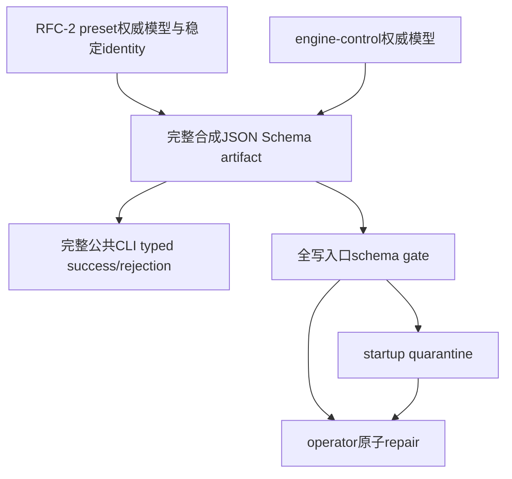

# RFC #548 · 下一批 rolling resplit 草案

> 本文件只起草一个 future-work issue，不创建或修改 GitHub issue，不分配虚构编号。标题与 body 不含内部草稿 ID。

# 线性化 durable request record/query 与 mutation/read verdict

## 目标

让每个可关联的 engine request 形成唯一、durable、typed verdict，并能由调用方按稳定 request identity 通过公共 PATH CLI 查询；verdict 与对应 mutation 或稳定判定读点具有同一线性化语义。

## 使用场景

- PATH CLI 或 Unix socket caller 在提交请求后未收到 reply，仍可按 request identity 查询最终 verdict，并确认请求不会被重复执行。
- daemon 重启后，operator 仍能区分 `created | changed | already-existing | no-op | rejected`，并把 verdict 与业务当前态互证。
- 两个进程并发重放相同 identity，或用同一 identity 发送不同意图时，原 record 不被覆盖，第二意图不产生额外 mutation。
- validation、conflict、unknown command、权限或持久层拒绝发生时，identity 已关联的请求留下 typed `rejected` 与必要 details，目标业务状态保持不变。

## 上下文

- **Repo**: coder-loop 当前仓库。
- **Design source**: `operator-decisions.md` D7；`expected-foundation.md` D7；`demand-schema-audit.md` B6/B7；`supply-demand-match.md` S-25～S-30；`detail-request-record-runtime-seam.md` B1～B7。
- **事实 baseline**: `main@699842eba2eefc242d19f8fa9232bc1d9d5c3bdd` 已有 socket `id/command/args`、真实 daemon、SQLite immediate transaction、现有 admission、隔离 data root、重启与只读 SQLite 观察面；尚无 durable request record/query，也没有 request verdict 与 dispatcher mutation/read verdict 的共同线性化。
- **当前验证 seam**: `detail-request-record-runtime-seam.md` C1～C12 已证明真实 PATH CLI、raw Unix socket、隔离 daemon、只读 SQLite、断连、重启、外部 SQLite abort trigger与真实 credential admission足以验收，不需要产品 test hook。

## 问题

当前 socket response 只能关联同一连接，PATH CLI 又隐藏随机 identity；reply、current row 与 best-effort JSONL event 无法在断连、crash、重启或并发下重建一次 request 的唯一 verdict。dispatcher 处于 store transaction 之外，因此业务 mutation与 request事实可能分裂；already-existing、no-op与rejected也可能基于事务外过期读点得出。

同时，当前只有完整 envelope parse成功后才保留 request id。malformed JSON与缺失 id本来就不可关联；但“合法 id + 非法 command/args”也被降为 `id:"unknown"`，使本可关联的业务 rejection无法形成 durable record。

## 预期结果

1. **可关联 identity边界：** caller可以稳定提供并取得 request identity；malformed JSON与缺失/非法 identity明确处于 record量词外，合法 identity在业务 command/args判定前被取得，后续业务 envelope错误可查询为 `rejected`。
2. **穷尽 verdict：** recordable surface 是全部可关联 engine request。完成态 production registry 共 23 个已知 variants：`chain.list`、`chain.status`、`item.list`、`item.exits`、`daemon.status`、`logs.query`、`chain.create`、`chain.stop`、`chain.resume`、`chain.delete`、`chain.updateBindings`、`daemon.down`、`queue.unblock`、`item.add`、`item.batchAdd`、`item.update`、`item.exitAction`、`item.reorder`、`context.append.begin`、`context.append.chunk`、`context.append.commit`、`request.get`、`request.list`；合法 identity + unknown command 也必须产生可查 `rejected`。合法 identity + 已知 command但坏 args归入该 variant的 rejected路径。该集合产生 `created | changed | already-existing | no-op | rejected/read`；每个 record包含 request identity、规范化请求身份、admission所得主体、目标/command、typed verdict、必要 details与可关联 work identity（若存在），但不包含 delivery verdict。`request.get/list` 本身也生成 typed durable record，subject/admission/verdict与其他variants相同；查询handler不得special-case绕过registry，也不得在处理query时递归自动查询自己的record，query完成后可用另一个identity查询其record。malformed JSON、缺失/非法 identity及 size gate早于 identity提取的超限输入才在量词外。
3. **mutation线性化：** `created/changed` record与业务 mutation共同 commit或共同不出现；reply只发生在 durable事实之后，socket reply失败不能撤销事实。
4. **read verdict线性化：** `already-existing/no-op/rejected` 与其竞争后的最终事实或稳定判定读点处于同一串行化语义；不得用事务外 lookup留下随后失效的 verdict。
5. **重放与碰撞：** 相同 identity与同一规范请求返回原 verdict且不重做 mutation；相同 identity携带不同 command、target、规范请求或主体时 fail closed，原 record不可覆盖，第二意图零 mutation。
6. **恢复与查询：** 公共 PATH CLI按 identity返回稳定机器 JSON；reply丢失、daemon restart与crash recovery后，所有已提交 record仍可查并与业务事实一致。
7. **权限与边界：** record主体来自现有 admission，不信 caller自报；无 credential 的 agent-oriented调用仍是 `operator` subject，不能伪称 unauthenticated-agent。operator、unknown credential、live credential own-item、cross-item、expired credential、phase allow/deny、hard-deny与 reorder均记录实际 admission reason；read和 agent-oriented request不得排除。request query权限沿既有 admission实测，不新增认证模型；engine record不吸收 `deliveryId`、consumer账本、router retry或 GitHub/HAPI领域。

## 完成态片段

- 对会 mutation 的可关联 request，恢复后只允许“mutation与成功 verdict共同存在”或“两者共同不存在/形成允许的 rejected事实”，不允许 split-brain。
- 对无 mutation 的 request，唯一 durable verdict来自稳定判定读点，而不是 reply后补写 event。
- SQLite只用于验收事务与恢复事实；正式 caller只消费 PATH CLI query，不把 DB schema变成公共协议。

## 约束

- 本 issue拥有 RR 所需的最小 request identity传递、typed verdict与机器 query公共面，但不交付 D4 的完整 schema-aware CLI ADT。
- 不依赖 RFC-2 preset authority、JSON Schema、engine-control schema、write gate、startup quarantine或 repair。
- 不规定 request record 的 table、column、index或具体存储结构。
- 不发明并发 single-winner：不同 request identities 可按真实线性化顺序各自得到一致 verdict；只要求同 identity唯一且不重执行。
- `(chain,itemId)` 仍是规范 work identity；request identity不是 operation payload比较机制，也不是 delivery identity。

## 不应残留

- 不应残留 JSONL event、current status或 SQLite uniqueness冒充 request record。
- 不应残留 mutation后 best-effort补写 record、事务外“先查再判”、reply成功后才记录，或 identity collision 的 last-write-wins。
- 不应残留只记录 `item.add`、只记录成功、只提供 DB内部查询、或对合法 identity的业务 envelope错误返回 `id:"unknown"`。
- 本 issue范围之外不应改动 preset schema、历史 item资格、consumer/router、GitHub或 external-terminal。

## Changed paths

本节只限定概念边界，不规定文件或模块结构：

- request envelope 的最早可关联 identity提取与规范请求 identity；
- production dispatcher registry 的全部23个已知 variants、可关联 unknown/shape rejection及其 verdict surface；
- mutation/read verdict 与 durable record的共同事务/串行化边界；
- PATH CLI 的最小 `--request-id` 传递与 `request get/list --json` 机器读面；
- startup 对既有 request record 的普通 SQLite恢复与 query可用性。

不得触及 preset/schema模型、scheduler资格、startup item reconciliation、repair、delivery/router或 external runner。

## 验收准备

全部 checkpoint使用同一冻结实现 SHA、独立临时 git repository、隔离 data root与 scheduler-disabled production daemon。以下固定 setup 在每个 runtime shell 开头执行，定义本文后续命令使用的全部变量，并以 `trap` 有界清理：

```sh
set -euo pipefail
export SOURCE_ROOT="$(git rev-parse --show-toplevel)"
export BASE_SHA="$(git -C "$SOURCE_ROOT" rev-parse HEAD)"
export FIXTURE_ID="$(uuidgen | tr '[:upper:]' '[:lower:]')"
export ARTIFACT_DIR="/tmp/rfc548-rr-$FIXTURE_ID"
export LOOP_DATA_ROOT="$ARTIFACT_DIR/data"
export FIXTURE_REPO="$ARTIFACT_DIR/repo"
export REPO="fixture/main"
export OTHER_REPO="fixture/other"
export CHAIN="rr-main"
export LOST_CHAIN="rr-lost"
export ITEM="rr-item"
export RACE_ITEM="rr-race-item"
export RR_SOCKET="$LOOP_DATA_ROOT/daemon.sock"
export DB="$LOOP_DATA_ROOT/db.sqlite"
export DEADLINE_SECONDS=10
mkdir -p "$LOOP_DATA_ROOT" "$FIXTURE_REPO"

git -C "$FIXTURE_REPO" init -q
git -C "$FIXTURE_REPO" config user.email fixture@example.invalid
git -C "$FIXTURE_REPO" config user.name fixture
printf 'rr fixture\n' >"$FIXTURE_REPO/README.md"
git -C "$FIXTURE_REPO" add README.md
git -C "$FIXTURE_REPO" commit -qm init

rr_cli() { bun "$SOURCE_ROOT/src/loop.ts" "$@"; }
start_rr_daemon() {
  LOOP_DATA_ROOT="$LOOP_DATA_ROOT" bun --cwd "$SOURCE_ROOT" --eval '
    import { startCoderLoopDaemon } from "./src/daemon.ts";
    await startCoderLoopDaemon({
      loopDataRoot: process.env.LOOP_DATA_ROOT,
      scheduler: { enabled: false },
    });
  ' >"$LOOP_DATA_ROOT/fixture-daemon.log" 2>&1 &
  export RR_DAEMON_LAUNCH_PID=$!
  end=$((SECONDS+10))
  until test -S "$RR_SOCKET"; do
    test "$SECONDS" -lt "$end"
    sleep .1
  done
  rr_cli daemon status --loop-data-root "$LOOP_DATA_ROOT" >/dev/null
}
cleanup() {
  rr_cli daemon down --loop-data-root "$LOOP_DATA_ROOT" >/dev/null 2>&1 || true
  test -z "${RR_DAEMON_LAUNCH_PID:-}" || wait "$RR_DAEMON_LAUNCH_PID" 2>/dev/null || true
  sqlite3 "$DB" 'DROP TRIGGER IF EXISTS rr_abort' >/dev/null 2>&1 || true
  test ! -d "$ARTIFACT_DIR" || find "$ARTIFACT_DIR" -depth -delete
}
trap cleanup EXIT INT TERM

seed_main_fixture() {
  rr_cli chain create "$CHAIN" \
    --preset single-phase-example \
    --config-json "$(jq -nc --arg r "$REPO" '{repository:$r}')" \
    --request-id rr-created \
    --loop-data-root "$LOOP_DATA_ROOT"
  rr_cli item add "$CHAIN" \
    --issue "$ITEM" \
    --repo-cwd "$FIXTURE_REPO" \
    --preset single-phase-example \
    --request-id rr-seed \
    --loop-data-root "$LOOP_DATA_ROOT"
}
require_main_fixture() {
  rr_cli chain status "$CHAIN" --loop-data-root "$LOOP_DATA_ROOT" --json | jq -e --arg c "$CHAIN" '.name==$c' >/dev/null
  rr_cli item list "$CHAIN" --loop-data-root "$LOOP_DATA_ROOT" --json | jq -e --arg id "$ITEM" '[.items[]|select(.itemId==$id)]|length==1' >/dev/null
}
start_rr_daemon
assert_zero_runner_artifacts() {
  test "$(sqlite3 "$DB" 'select count(*) from runs')" -eq 0
  test "$(find "$LOOP_DATA_ROOT/chains" -path '*/slots/*' -mindepth 1 -print 2>/dev/null | wc -l | tr -d ' ')" -eq 0
  find "$LOOP_DATA_ROOT/chains" -path '*/slots/*' -mindepth 1 -print 2>/dev/null >"$ARTIFACT_DIR/slots.before-cleanup"
}
assert_zero_runner_artifacts
```

raw socket驱动使用固定 inline Bun 程序，不进入产品源码或测试套件：

```sh
rr_socket() {
  RR_PAYLOAD="$1" RR_READ_REPLY="${2:-1}" bun -e '
    import net from "node:net";
    const socket = net.createConnection(process.env.RR_SOCKET);
    await new Promise((ok, bad) => { socket.once("connect", ok); socket.once("error", bad); });
    socket.write(process.env.RR_PAYLOAD + "\n");
    if (process.env.RR_READ_REPLY === "0") { socket.destroy(); process.exit(0); }
    let data = "";
    socket.on("data", chunk => data += chunk);
    await new Promise(ok => socket.once("end", ok));
    process.stdout.write(data);
  '
}

rr_registry_names() {
  bun --cwd "$SOURCE_ROOT" --eval '
    import { DAEMON_COMMAND_SPECS } from "./src/daemon.ts";
    process.stdout.write(JSON.stringify(Object.keys(DAEMON_COMMAND_SPECS).sort()));
  '
}
record_variant() {
  id="$1"; command="$2"; args="$3"; expected="$4"
  rr_socket "$(jq -nc --arg id "$id" --arg command "$command" --argjson args "$args" '{id:$id,command:$command,args:$args}')" >"$ARTIFACT_DIR/$id.reply.json" || true
  rr_cli request get "$CHAIN" --request-id "$id" --loop-data-root "$LOOP_DATA_ROOT" --json >"$ARTIFACT_DIR/$id.record.json"
  jq -e --arg id "$id" --arg command "$command" --arg expected "$expected" \
    '.requestId==$id and .command==$command and .verdict==$expected' "$ARTIFACT_DIR/$id.record.json"
}
```

该 driver只控制真实 Unix socket的写、读与断连；不注入 daemon私有状态。rollback使用隔离 SQLite上的外部 abort trigger，执行后立即删除；trigger不是产品接口或 test hook。

生产 dispatcher、authorization 与 RR wrapper必须共同消费 `DAEMON_COMMAND_SPECS` 这一 production registry。`DaemonCommandName` union 与 registry keys必须以两个 `Exclude<...>` 的 `never` assertion形成真正双向编译期 equality；不得以 tuple成员属于 union 的单向检查或每项自报 `durableVerdict: true`替代。`rr_registry_names`只读实际执行 registry keys，不读取 coverage boolean。

```ts
type RegistryName = keyof typeof DAEMON_COMMAND_SPECS
type AssertNever<T extends never> = T
type MissingFromRegistry = AssertNever<Exclude<DaemonCommandName, RegistryName>>
type ExtraInRegistry = AssertNever<Exclude<RegistryName, DaemonCommandName>>
```

## 固定 admission checkpoint driver

以下脚本逐字固定为验收输入，执行者不得修改 expected subject、verdict 或 admission reason。公共验收 harness 在执行表格前把下列 code block逐字物化为 `$ARTIFACT_DIR/rr-admission-driver.sh`；物化过程不作模板替换，唯一 argv 为 `bash "$ARTIFACT_DIR/rr-admission-driver.sh" "$SOURCE_ROOT"`。它使用 production daemon、production scheduler credential issuer、真实 runner child与 Unix socket；`worktreeManager`只复用当前 production `SchedulerOptions` seam 避免创建真实worktree，不替换credential issuer。

```bash
#!/usr/bin/env bash
set -euo pipefail
SOURCE_ROOT="${1:?source root required}"
FIXTURE_ID="$(uuidgen | tr '[:upper:]' '[:lower:]')"
ARTIFACT_DIR="$(mktemp -d "/tmp/rfc548-rr-admission.${FIXTURE_ID}.XXXXXXXX")"
# macOS /tmp -> /private/tmp；runner filesystem grant与实际写路径必须同一canonical spelling。
ARTIFACT_DIR="$(cd "$ARTIFACT_DIR" && pwd -P)"
cleanup() {
  if test -d "$ARTIFACT_DIR"; then rm -r "$ARTIFACT_DIR"; fi
}
trap cleanup EXIT INT TERM
mkdir -p "$ARTIFACT_DIR/repo" "$ARTIFACT_DIR/data" "$ARTIFACT_DIR/preset-allow" "$ARTIFACT_DIR/preset-deny"
git -C "$ARTIFACT_DIR/repo" init -q
git -C "$ARTIFACT_DIR/repo" config user.email fixture@example.invalid
git -C "$ARTIFACT_DIR/repo" config user.name fixture
printf 'fixture\n' >"$ARTIFACT_DIR/repo/README.md"
git -C "$ARTIFACT_DIR/repo" add README.md
git -C "$ARTIFACT_DIR/repo" commit -qm init

for MODE in allow deny; do
  PRIVILEGED='[]'; test "$MODE" = allow && PRIVILEGED='["item.reorder"]'
  cat >"$ARTIFACT_DIR/preset-$MODE/preset.toml" <<TOML
name = "rr-$MODE"
[item]
idField = "id"
[statuses]
continuable = ["pending"]
terminal = ["done", "exhausted"]
exhausted = "exhausted"
[[phases]]
name = "run"
runner = "claude"
prompt = "prompt.md"
  [[phases.exits]]
  status = "done"
  when = "fixture complete"
  [phases.rights]
  privilegedOps = $PRIVILEGED
  writableFields = ["title"]
  [phases.variables]
  ITEM_ID = "item.id"
TOML
  printf 'fixture {{ITEM_ID}}\n' >"$ARTIFACT_DIR/preset-$MODE/prompt.md"
done

cat >"$ARTIFACT_DIR/runner.ts" <<'RUNNER'
import { connect } from "node:net"
import { writeFile } from "node:fs/promises"
type Response = { id: string; ok: boolean; result?: Record<string, unknown>; error?: { code: string; message: string; details?: Record<string, unknown> } }
const promptIndex = Bun.argv.indexOf("-p")
const promptText = promptIndex < 0 ? (Bun.argv.at(-1) ?? "") : (Bun.argv[promptIndex + 1] ?? "")
const config = JSON.parse(promptText.split("\n")[0]!) as { socket: string; repo: string; mode: "allow"|"deny"; chain: string; own: string; other: string }
const credential = process.env.CODER_LOOP_RUN_CRED
if (!credential) throw new Error("scheduler did not inject CODER_LOOP_RUN_CRED")
async function request(id: string, command: string, args: Record<string, unknown>): Promise<Response> {
  return await new Promise((resolve, reject) => {
    const socket = connect(config.socket); let output = ""
    socket.on("connect", () => socket.write(JSON.stringify({ id, command, args: { ...args, agentCredential: credential } }) + "\n"))
    socket.on("data", chunk => { output += chunk; if (output.includes("\n")) { socket.end(); resolve(JSON.parse(output.split("\n")[0]!)) } })
    socket.on("error", reject)
  })
}
const responses = [
  await request(`${config.mode}-own`, "item.update", { chainName: config.chain, itemId: config.own, fields: { title: `${config.mode}-own` } }),
  await request(`${config.mode}-reorder`, "item.reorder", { chainName: config.chain, itemId: config.own, position: 1 }),
  await request(`${config.mode}-cross-item`, "item.update", { chainName: config.chain, itemId: config.other, fields: { title: "must-not-write" } }),
  await request(`${config.mode}-hard-deny`, "logs.query", {}),
]
await writeFile(`${config.repo}/${config.mode}.credential`, credential)
await writeFile(`${config.repo}/${config.mode}.responses.json`, JSON.stringify(responses))
await request(`${config.mode}-finish`, "item.update", { chainName: config.chain, itemId: config.own, fields: { status: "done" } })
RUNNER

cat >"$ARTIFACT_DIR/driver.ts" <<'DRIVER'
import { connect } from "node:net"
import { readFile } from "node:fs/promises"
import { startCoderLoopDaemon } from "__SOURCE_ROOT__/src/daemon.ts"
type Response = { id: string; ok: boolean; result?: Record<string, any>; error?: { code: string; message: string; details?: Record<string, any> } }
const root = process.argv[2]!, data = `${root}/data`, repo = `${root}/repo`, runner = `${root}/runner.ts`
async function request(socketPath: string, id: string, command: string, args: Record<string, unknown>): Promise<Response> {
  return await new Promise((resolve, reject) => {
    const socket = connect(socketPath); let output = ""
    socket.on("connect", () => socket.write(JSON.stringify({ id, command, args }) + "\n"))
    socket.on("data", chunk => { output += chunk; if (output.includes("\n")) { socket.end(); resolve(JSON.parse(output.split("\n")[0]!)) } })
    socket.on("error", reject)
  })
}
async function bounded(predicate: () => Promise<boolean>, timeoutMs: number): Promise<void> {
  const deadline = Date.now() + timeoutMs
  while (Date.now() < deadline) { if (await predicate()) return; await Bun.sleep(50) }
  throw new Error(`bounded wait exceeded ${timeoutMs}ms`)
}
function expectCode(response: Response, code: string): void { if (response.ok || response.error?.code !== code) throw new Error(`expected ${code}: ${JSON.stringify(response)}`) }
function expectOk(response: Response): void { if (!response.ok) throw new Error(`expected ok: ${JSON.stringify(response)}`) }
async function record(socketPath: string, requestId: string): Promise<any> {
  const response = await request(socketPath, `query-${requestId}`, "request.get", { requestId })
  expectOk(response); return response.result!.record
}
function expectRecord(value: any, expected: { command: string; subject: "operator"|"agent"; verdict: string; reason: string }): void {
  if (value.requestId === undefined || value.command !== expected.command || value.subject?.kind !== expected.subject || value.verdict?.kind !== expected.verdict || value.admission?.reason !== expected.reason) {
    throw new Error(`record mismatch expected=${JSON.stringify(expected)} actual=${JSON.stringify(value)}`)
  }
}
let daemon = await startCoderLoopDaemon({ loopDataRoot: data, scheduler: { enabled: false } })
try {
  let socketPath = daemon.snapshot().socketPath
  for (const mode of ["allow", "deny"] as const) {
    const presetPath = `${root}/preset-${mode}`
    expectOk(await request(socketPath, `setup-${mode}-chain`, "chain.create", { name: `rr-${mode}`, preset: null, repository: `fixture/${mode}`, metadata: { presetPath } }))
    for (const suffix of ["own", "other"] as const) expectOk(await request(socketPath, `setup-${mode}-${suffix}`, "item.add", { chainName: `rr-${mode}`, itemId: `${mode}-${suffix}`, repoCwd: repo, presetPath }))
    expectOk(await request(socketPath, `setup-${mode}-other-terminal`, "item.update", { chainName: `rr-${mode}`, itemId: `${mode}-other`, fields: { status: "done" } }))
  }
  expectOk(await request(socketPath, "operator-allow", "item.update", { chainName: "rr-allow", itemId: "allow-own", fields: { title: "operator" } }))
  const noCredential = await request(socketPath, "no-credential-agent-oriented", "item.exitAction", { chainName: "rr-allow", itemId: "allow-own", agentRunId: "claimed", agentPhase: "missing", action: "stop" })
  expectCode(noCredential, "invalid_request")
  const unknown = await request(socketPath, "unknown-credential", "item.update", { chainName: "rr-allow", itemId: "allow-own", fields: { title: "forbidden" }, agentCredential: "never-minted" })
  expectCode(unknown, "invalid_caller")
  expectRecord(await record(socketPath, "operator-allow"), { command: "item.update", subject: "operator", verdict: "changed", reason: "operator" })
  expectRecord(await record(socketPath, "no-credential-agent-oriented"), { command: "item.exitAction", subject: "operator", verdict: "rejected", reason: "operator" })
  expectRecord(await record(socketPath, "unknown-credential"), { command: "item.update", subject: "operator", verdict: "rejected", reason: "unknown-credential" })

  await daemon.stop()
  daemon = await startCoderLoopDaemon({ loopDataRoot: data, shutdownGraceMs: 100, scheduler: {
    enabled: true, intervalMs: 20,
    runner: { kind: "claude", source: "iteration-default", binary: "bun", extraArgs: [runner], model: null },
    // Existing production SchedulerOptions seam used by admission.integration.ts; credential mint/inject/revoke is NOT replaced.
    worktreeManager: async () => repo,
    prompt: ({ chain, item }) => JSON.stringify({ socket: `${data}/daemon.sock`, repo, mode: chain.name.slice(3), chain: chain.name, own: item.itemId, other: `${chain.name.slice(3)}-other` }),
    chainCompleteTriggerForChain: () => null,
  } })
  socketPath = daemon.snapshot().socketPath
  await bounded(async () => { try { await readFile(`${repo}/allow.responses.json`); await readFile(`${repo}/deny.responses.json`); return true } catch { return false } }, 15_000)
  await bounded(async () => daemon.snapshot().activeRuns.length === 0, 10_000)
  const allowCredential = (await readFile(`${repo}/allow.credential`, "utf8")).trim()
  const expired = await request(socketPath, "expired-credential", "item.update", { chainName: "rr-allow", itemId: "allow-own", fields: { title: "expired" }, agentCredential: allowCredential })
  expectCode(expired, "invalid_caller")
  const checks = [
    ["allow-own", { command:"item.update", subject:"agent", verdict:"changed", reason:"agent-credential-admitted" }],
    ["allow-reorder", { command:"item.reorder", subject:"agent", verdict:"changed", reason:"phase-privileged-op" }],
    ["allow-cross-item", { command:"item.update", subject:"agent", verdict:"rejected", reason:"wrong-item" }],
    ["allow-hard-deny", { command:"logs.query", subject:"agent", verdict:"rejected", reason:"hard-deny-for-agent" }],
    ["deny-own", { command:"item.update", subject:"agent", verdict:"changed", reason:"agent-credential-admitted" }],
    ["deny-reorder", { command:"item.reorder", subject:"agent", verdict:"rejected", reason:"no-privileged-ops" }],
    ["deny-cross-item", { command:"item.update", subject:"agent", verdict:"rejected", reason:"wrong-item" }],
    ["deny-hard-deny", { command:"logs.query", subject:"agent", verdict:"rejected", reason:"hard-deny-for-agent" }],
    ["expired-credential", { command:"item.update", subject:"operator", verdict:"rejected", reason:"unknown-credential" }],
  ] as const
  for (const [id, expected] of checks) expectRecord(await record(socketPath, id), expected)
} finally {
  await daemon.stop().catch(() => {})
}
DRIVER
sed -i '' "s|__SOURCE_ROOT__|$SOURCE_ROOT|g" "$ARTIFACT_DIR/driver.ts"
bun build "$ARTIFACT_DIR/runner.ts" "$ARTIFACT_DIR/driver.ts" --target=bun --outdir "$ARTIFACT_DIR/syntax-check" >/dev/null
bun "$ARTIFACT_DIR/driver.ts" "$ARTIFACT_DIR"
```

固定 main 在首个 `request.get(operator-allow)` 应得到 `unknown_command` 红灯；这证明 driver 到达尚未实现的RR边界。实现后必须原样继续执行全部 operator、无credential-as-operator、unknown credential、live own-item、phase allow/deny、cross-item、hard-deny与expired矩阵。

## 验收标准

验收表由同一个固定 shell按 **1→13** 顺序执行，任一行失败立即退出；第14行随后执行卫生 gate。第2行实际调用 `seed_main_fixture` 创建 `rr-main` 与 `$ITEM`（值为 `rr-item`），随后以 `require_main_fixture` 机器核对；3/4/5/6/10/12/13 每行开头再次调用 `require_main_fixture`，不靠注释假定前置。第8行先查询第7行已提交的 `rr-lost` identity再重启；其他行自建自己的状态。每行输出都写入本次 `$ARTIFACT_DIR`，不得读取其他测试轮次artifact。

| # | Dimension | Check | Command | Env | Expect |
|---|---|---|---|---|---|
| 1 | function | 覆盖预期结果 1：最早 identity边界 | `before="$(rr_cli request list "$CHAIN" --request-id rr-boundary-list-before --loop-data-root "$LOOP_DATA_ROOT" --json | jq '[.records[]|select(.command!="request.list" and .command!="request.get")]|length')"; rr_socket '{bad json' >"$ARTIFACT_DIR/rr-malformed.out" || true; rr_socket '{"command":"chain.create","args":{}}' >"$ARTIFACT_DIR/rr-missing-id.out" || true; after="$(rr_cli request list "$CHAIN" --request-id rr-boundary-list-after --loop-data-root "$LOOP_DATA_ROOT" --json | jq '[.records[]|select(.command!="request.list" and .command!="request.get")]|length')"; test "$before" -eq "$after"; ! rr_cli request get "$CHAIN" --request-id unknown --loop-data-root "$LOOP_DATA_ROOT" --json >/dev/null 2>&1; rr_socket '{"id":"rr-bad-command","command":7,"args":{}}' >/dev/null; rr_socket '{"id":"rr-bad-args","command":"chain.create","args":[]}' >/dev/null; rr_cli request get "$CHAIN" --request-id rr-bad-command --loop-data-root "$LOOP_DATA_ROOT" --json | jq -e '.verdict=="rejected" and .details.code=="invalid_command"'; rr_cli request get "$CHAIN" --request-id rr-bad-args --loop-data-root "$LOOP_DATA_ROOT" --json | jq -e '.verdict=="rejected" and .details.code=="invalid_args"'` | scheduler-disabled isolated daemon/socket | exit 0；扣除query自身record后，两类不可关联输入零record；两类合法id业务坏envelope可查 |
| 2 | integration | 覆盖预期结果 2、3：创建后续共享的rr-main/rr-item并证明created与mutation共同存在 | `seed_main_fixture >"$ARTIFACT_DIR/rr-created-reply.json"; require_main_fixture; rr_cli request get "$CHAIN" --request-id rr-created --loop-data-root "$LOOP_DATA_ROOT" --json >"$ARTIFACT_DIR/rr-created-record.json"; rr_cli chain status "$CHAIN" --loop-data-root "$LOOP_DATA_ROOT" --json >"$ARTIFACT_DIR/rr-created-state.json"; jq -e '.verdict=="created" and .requestId=="rr-created" and .subject and .command and .target' "$ARTIFACT_DIR/rr-created-record.json"; jq -e --arg c "$CHAIN" '.name==$c' "$ARTIFACT_DIR/rr-created-state.json"` | scheduler-disabled isolated daemon | exit 0；机器确认rr-main与rr-item存在，record与唯一业务结果同时可见 |
| 3 | integration | 覆盖预期结果 2、4：真实 no-op/read verdict | `require_main_fixture; rr_cli chain create "$CHAIN" --preset single-phase-example --config-json "$(jq -nc --arg r "$REPO" '{repository:$r}')" --request-id rr-noop --loop-data-root "$LOOP_DATA_ROOT" --json >/dev/null; rr_cli request get "$CHAIN" --request-id rr-noop --loop-data-root "$LOOP_DATA_ROOT" --json >$ARTIFACT_DIR/rr-noop.json; jq -e '.verdict=="no-op" and .details.stableReadPoint' $ARTIFACT_DIR/rr-noop.json; rr_cli chain list --loop-data-root "$LOOP_DATA_ROOT" --json | jq -e --arg c "$CHAIN" '[.chains[]|select(.name==$c)]|length==1'` | scheduler-disabled isolated daemon | exit 0；没有第二条业务row |
| 4 | integration | 覆盖预期结果 2、4：typed rejected矩阵与零mutation | `require_main_fixture; rr_socket '{"id":"rr-unknown","command":"rr.unknown","args":{}}' >/dev/null; rr_cli chain create "$CHAIN" --preset single-phase-example --config-json "$(jq -nc --arg r "$OTHER_REPO" '{repository:$r}')" --request-id rr-conflict --loop-data-root "$LOOP_DATA_ROOT" --json >/dev/null 2>&1 || true; rr_cli request get "$CHAIN" --request-id rr-unknown --loop-data-root "$LOOP_DATA_ROOT" --json >$ARTIFACT_DIR/rr-unknown.json; rr_cli request get "$CHAIN" --request-id rr-conflict --loop-data-root "$LOOP_DATA_ROOT" --json >$ARTIFACT_DIR/rr-conflict.json; jq -e '.verdict=="rejected" and .details.code=="unknown_command"' $ARTIFACT_DIR/rr-unknown.json; jq -e '.verdict=="rejected" and .details.code=="conflict"' $ARTIFACT_DIR/rr-conflict.json; rr_cli chain status "$CHAIN" --loop-data-root "$LOOP_DATA_ROOT" --json | jq -e --arg r "$REPO" '.repository==$r'` | scheduler-disabled isolated daemon | exit 0；unknown/conflict分类可查且原row不变 |
| 5 | integration | 覆盖预期结果 2、3：真实 changed与mutation共同提交 | `require_main_fixture; rr_socket '{"id":"rr-changed","command":"item.update","args":{"chainName":"rr-main","itemId":"rr-item","fields":{"title":"rr-changed"}}}' >/dev/null; rr_cli request get "$CHAIN" --request-id rr-changed --loop-data-root "$LOOP_DATA_ROOT" --json >"$ARTIFACT_DIR/rr-changed.json"; jq -e '.verdict=="changed" and .command=="item.update"' "$ARTIFACT_DIR/rr-changed.json"; rr_cli item list "$CHAIN" --loop-data-root "$LOOP_DATA_ROOT" --json | jq -e --arg id "$ITEM" '.items[]|select(.itemId==$id)|.title=="rr-changed"'` | scheduler-disabled isolated daemon | exit 0；record与title mutation共同可见，rr-item仍continuable供后续variant使用 |
| 6 | integration | 覆盖预期结果 7：完整production admission主体、权限与query矩阵 | `require_main_fixture; chmod +x "$ARTIFACT_DIR/rr-admission-driver.sh"; bash "$ARTIFACT_DIR/rr-admission-driver.sh" "$SOURCE_ROOT"` | 独立UUID production daemon+scheduler+真实runner credential issuer | exit 0；固定driver断言operator、无credential=operator、unknown/live own/cross-item/expired、phase allow-deny、hard-deny/reorder的subject/verdict/admission reason；当前main在request.get处unknown_command红 |
| 7 | integration | 覆盖预期结果 3、6：commit后reply未交付仍可查 | `rr_socket "$(jq -nc --arg id rr-lost --arg c "$LOST_CHAIN" --arg r "$REPO" '{id:$id,command:"chain.create",args:{name:$c,preset:"single-phase-example",config:{repository:$r}}}')" 0; end=$((SECONDS+DEADLINE_SECONDS)); found=0; while test "$SECONDS" -lt "$end"; do if rr_cli request get "$CHAIN" --request-id rr-lost --loop-data-root "$LOOP_DATA_ROOT" --json >$ARTIFACT_DIR/rr-lost.json 2>/dev/null; then found=1; break; fi; sleep .1; done; test "$found" -eq 1; jq -e '.verdict=="created"' $ARTIFACT_DIR/rr-lost.json; rr_cli chain create "$LOST_CHAIN" --preset single-phase-example --config-json "$(jq -nc --arg r "$REPO" '{repository:$r}')" --request-id rr-lost --loop-data-root "$LOOP_DATA_ROOT" --json >/dev/null; rr_cli chain list --loop-data-root "$LOOP_DATA_ROOT" --json | jq -e --arg c "$LOST_CHAIN" '[.chains[]|select(.name==$c)]|length==1'` | scheduler-disabled isolated daemon/raw socket | exit 0；bounded deadline内确认daemon接受，重放不产生第二row |
| 8 | integration | 覆盖预期结果 6：重启后query与业务事实不变 | `rr_cli daemon down --loop-data-root "$LOOP_DATA_ROOT"; wait "$RR_DAEMON_LAUNCH_PID" || true; unset RR_DAEMON_LAUNCH_PID; start_rr_daemon; rr_cli request get "$CHAIN" --request-id rr-created --loop-data-root "$LOOP_DATA_ROOT" --json >$ARTIFACT_DIR/rr-restarted-created.json; rr_cli request get "$CHAIN" --request-id rr-lost --loop-data-root "$LOOP_DATA_ROOT" --json >$ARTIFACT_DIR/rr-restarted-lost.json; cmp $ARTIFACT_DIR/rr-created-record.json $ARTIFACT_DIR/rr-restarted-created.json; jq -e '.verdict=="created"' $ARTIFACT_DIR/rr-restarted-lost.json; rr_cli chain status "$LOST_CHAIN" --loop-data-root "$LOOP_DATA_ROOT" --json >/dev/null` | same scheduler-disabled isolated data root | exit 0 |
| 9 | integration | 覆盖预期结果 3、6：真实mutation失败时无半提交/伪success | `drop_abort(){ sqlite3 "$DB" 'DROP TRIGGER IF EXISTS rr_abort' >/dev/null 2>&1 || true; }; trap 'drop_abort; cleanup' EXIT INT TERM; sqlite3 "$DB" "CREATE TRIGGER rr_abort BEFORE INSERT ON chains WHEN NEW.name='rr-rollback' BEGIN SELECT RAISE(ABORT,'rr checkpoint'); END;"; rr_cli chain create rr-rollback --preset single-phase-example --config-json "$(jq -nc --arg r "$REPO" '{repository:$r}')" --request-id rr-rollback --loop-data-root "$LOOP_DATA_ROOT" --json >/dev/null 2>&1 || true; drop_abort; rr_cli chain list --loop-data-root "$LOOP_DATA_ROOT" --json | jq -e '[.chains[]|select(.name=="rr-rollback")]|length==0'; if rr_cli request get "$CHAIN" --request-id rr-rollback --loop-data-root "$LOOP_DATA_ROOT" --json >$ARTIFACT_DIR/rr-rollback.json 2>/dev/null; then jq -e '.verdict=="rejected" and .details.code=="persistence_rejected"' $ARTIFACT_DIR/rr-rollback.json; fi` | scheduler-disabled isolated daemon/SQLite fixture | exit 0；trap保证trigger清理，绝无created record或业务row |
| 10 | integration | 覆盖预期结果 4、5：fresh item并发 already-existing与同identity重放 | `require_main_fixture; test "$(rr_cli item list "$CHAIN" --loop-data-root "$LOOP_DATA_ROOT" --json | jq --arg id "$RACE_ITEM" '[.items[]|select(.itemId==$id)]|length')" -eq 0; rr_cli item add "$CHAIN" --issue "$RACE_ITEM" --repo-cwd "$FIXTURE_REPO" --preset single-phase-example --request-id rr-race-a --loop-data-root "$LOOP_DATA_ROOT" --json >$ARTIFACT_DIR/rr-race-a-reply.json & pid_a=$!; rr_cli item add "$CHAIN" --issue "$RACE_ITEM" --repo-cwd "$FIXTURE_REPO" --preset single-phase-example --request-id rr-race-b --loop-data-root "$LOOP_DATA_ROOT" --json >$ARTIFACT_DIR/rr-race-b-reply.json & pid_b=$!; wait "$pid_a"; wait "$pid_b"; rr_cli request get "$CHAIN" --request-id rr-race-a --loop-data-root "$LOOP_DATA_ROOT" --json >$ARTIFACT_DIR/rr-race-a.json; rr_cli request get "$CHAIN" --request-id rr-race-b --loop-data-root "$LOOP_DATA_ROOT" --json >$ARTIFACT_DIR/rr-race-b.json; jq -s -e 'map(.verdict)|sort==["already-existing","created"]' $ARTIFACT_DIR/rr-race-a.json $ARTIFACT_DIR/rr-race-b.json; rr_cli item add "$CHAIN" --issue "$RACE_ITEM" --repo-cwd "$FIXTURE_REPO" --preset single-phase-example --request-id rr-race-a --loop-data-root "$LOOP_DATA_ROOT" --json >/dev/null; rr_cli item list "$CHAIN" --loop-data-root "$LOOP_DATA_ROOT" --json | jq -e --arg id "$RACE_ITEM" '[.items[]|select(.itemId==$id)]|length==1'` | scheduler-disabled isolated daemon/two processes | exit 0；并发前零row，一个created、一个already-existing，重放后仍一行 |
| 11 | integration | 覆盖预期结果 5：identity collision fail closed | `rr_socket "$(jq -nc '{id:"rr-collision",command:"chain.list",args:{}}')" >/dev/null; rr_socket "$(jq -nc --arg n collision --arg r "$REPO" '{id:"rr-collision",command:"chain.create",args:{name:$n,preset:"single-phase-example",config:{repository:$r}}}')" >$ARTIFACT_DIR/rr-collision-reply.json; jq -e '.error.code=="request_identity_conflict"' $ARTIFACT_DIR/rr-collision-reply.json; rr_cli request get "$CHAIN" --request-id rr-collision --loop-data-root "$LOOP_DATA_ROOT" --json >$ARTIFACT_DIR/rr-collision-record.json; jq -e '.command=="chain.list"' $ARTIFACT_DIR/rr-collision-record.json; rr_cli chain list --loop-data-root "$LOOP_DATA_ROOT" --json | jq -e '[.chains[]|select(.name=="collision")]|length==0'` | scheduler-disabled isolated daemon/raw socket | exit 0；typed collision rejection、原record不变、第二意图零mutation |
| 12 | integration | 覆盖预期结果 7：公共面与delivery域隔离 | `require_main_fixture; rr_cli request get "$CHAIN" --request-id rr-created --loop-data-root "$LOOP_DATA_ROOT" --json | jq -e 'has("deliveryId")|not and has("consumerVerdict")|not'; ! git -C "$SOURCE_ROOT" diff --unified=0 "$BASE_SHA"...HEAD -- src | rg '^\+[^+].*(deliveryId|consumed|not-consumed|GitHub|HAPI|external-terminal)'` | isolated runtime + local diff hygiene | exit 0；正式读取走PATH CLI，新增生产代码无consumer/external领域 |
| 13 | integration | 覆盖预期结果 2、7：production registry双向相等；23项分别以handler-reaching args执行并查询 | `require_main_fixture; expected='["chain.create","chain.delete","chain.list","chain.resume","chain.status","chain.stop","chain.updateBindings","context.append.begin","context.append.chunk","context.append.commit","daemon.down","daemon.status","item.add","item.batchAdd","item.exitAction","item.exits","item.list","item.reorder","item.update","logs.query","queue.unblock","request.get","request.list"]'; actual="$(rr_registry_names)"; jq -e -n --argjson a "$actual" --argjson e "$expected" '($a-$e|length)==0 and ($e-$a|length)==0'; rr_cli chain create rr-delete --preset single-phase-example --config-json "$(jq -nc --arg r "$REPO" '{repository:$r}')" --loop-data-root "$LOOP_DATA_ROOT"; record_variant v-chain-create chain.create '{"name":"rr-v-create","preset":"single-phase-example","repository":"fixture/main"}' created; record_variant v-chain-list chain.list '{}' read; record_variant v-chain-status chain.status '{"name":"rr-main"}' read; record_variant v-chain-stop chain.stop '{"name":"rr-main"}' changed; record_variant v-chain-resume chain.resume '{"name":"rr-main"}' changed; record_variant v-chain-delete chain.delete '{"name":"rr-delete"}' changed; record_variant v-chain-bindings chain.updateBindings '{"name":"rr-main","patch":{}}' no-op; record_variant v-item-add item.add "$(jq -nc --arg cwd "$FIXTURE_REPO" '{chainName:"rr-main",itemId:"variant-add",repoCwd:$cwd,preset:"single-phase-example"}')" created; record_variant v-item-batch item.batchAdd "$(jq -nc --arg cwd "$FIXTURE_REPO" '{chainName:"rr-main",items:[{itemId:"variant-batch",repoCwd:$cwd,preset:"single-phase-example"}]}')" created; record_variant v-item-list item.list '{"chainName":"rr-main"}' read; record_variant v-item-update item.update '{"chainName":"rr-main","itemId":"rr-item","fields":{"title":"updated"}}' changed; record_variant v-item-reorder item.reorder '{"chainName":"rr-main","itemId":"rr-item","position":0}' no-op; record_variant v-item-exits item.exits '{"chainName":"rr-main","itemId":"rr-item","agentRunId":"fixture-run","agentPhase":"run"}' read; record_variant v-item-exit-action item.exitAction '{"chainName":"rr-main","itemId":"rr-item","agentRunId":"fixture-run","agentPhase":"missing","action":"stop"}' rejected; jq -e '.details.code=="invalid_request"' "$ARTIFACT_DIR/v-item-exit-action.record.json"; record_variant v-daemon-status daemon.status '{}' read; record_variant v-logs logs.query '{}' read; record_variant v-queue queue.unblock '{"chainName":"rr-main","issue":"missing","dryRun":true}' rejected; jq -e '.details.code=="not_found"' "$ARTIFACT_DIR/v-queue.record.json"; rr_socket '{"id":"v-context-begin","command":"context.append.begin","args":{"chainName":"rr-main","scope":{"kind":"chain"}}}' >"$ARTIFACT_DIR/v-context-begin.reply.json"; rr_cli request get "$CHAIN" --request-id v-context-begin --loop-data-root "$LOOP_DATA_ROOT" --json >"$ARTIFACT_DIR/v-context-begin.record.json"; jq -e '.verdict=="created"' "$ARTIFACT_DIR/v-context-begin.record.json"; SESSION_ID="$(jq -r '.result.sessionId' "$ARTIFACT_DIR/v-context-begin.reply.json")"; record_variant v-context-chunk context.append.chunk "$(jq -nc --arg s "$SESSION_ID" '{sessionId:$s,sequence:0,chunk:"fixture"}')" changed; record_variant v-context-commit context.append.commit "$(jq -nc --arg s "$SESSION_ID" '{sessionId:$s}')" created; record_variant v-request-get request.get '{"requestId":"rr-created"}' read; record_variant v-request-list request.list '{}' read; rr_socket '{"id":"v-unknown","command":"rr.unknown","args":{}}' >/dev/null; rr_cli request get "$CHAIN" --request-id v-unknown --loop-data-root "$LOOP_DATA_ROOT" --json | jq -e '.verdict=="rejected" and .details.code=="unknown_command"'; assert_zero_runner_artifacts; rr_socket '{"id":"v-daemon-down","command":"daemon.down","args":{}}' >"$ARTIFACT_DIR/v-daemon-down.reply.json" || true; wait "$RR_DAEMON_LAUNCH_PID" || true; unset RR_DAEMON_LAUNCH_PID; start_rr_daemon; rr_cli request get "$CHAIN" --request-id v-daemon-down --loop-data-root "$LOOP_DATA_ROOT" --json | jq -e '.command=="daemon.down" and .verdict=="changed"'` | scheduler-disabled production daemon + actual registry | exit 0；20项成功、exitAction/queue稳定domain rejection、daemon.down最后执行并重启查询；runs/slots在down/prune前为0 |
| 14 | function | 默认卫生 gate | `bun run typecheck && bun test` | local | exit 0 |

第 9 行的 abort trigger只存在于隔离 DB，并由行内 trap与全局 cleanup双重删除。本 issue不把非确定 crash race列为 gate：当前没有不依赖产品hook的事务中点到达信号；确定 rollback与重启恢复分别由第 9、8 行证明，不能用 kill-before-work的“全部缺席”冒充 crash线性化。若未来增加已有公共到达观察面，应另行更新契约后再加入补强。

**命令级结论：** 本 issue 不运行 `bun scripts/real-e2e.ts`；该 compatibility 验证只由 #685 在冻结发布候选 SHA 上执行。

## 依赖关系

- Depends on: 无 future issue；只依赖 main已有 socket request id、daemon、SQLite transaction、admission、隔离 data root与业务CLI作为窄底座。
- Blocks: 未来 consumer把自己的 delivery ledger通过 request identity与 engine record关联；consumer不属于本 issue。

## 对抗检查

- **只写 event：** checkpoint 7丢 reply、8重启、9 rollback，event与业务事实分裂会被抓住。
- **mutation后补写 record：** checkpoint 9在真实 production write点 abort，record与业务row不能分裂。
- **只记录 success：** checkpoint 3/4/6直接查询或观察 no-op、unknown/conflict与permission rejected；checkpoint 13覆盖全部23 variants的真实record。
- **事务外预读 duplicate：** checkpoint 10以fresh item和两个真实进程竞争同一 work identity，要求每个 verdict与最终唯一 row一致。
- **identity覆盖或重执行：** checkpoint 10重放同 identity，checkpoint 11用同 identity换 command并检查typed rejection、原record与零mutation。
- **把DB当公共协议：** 消费者断言均走 PATH CLI query；SQLite只在 checkpoint 9承担外部故障注入与事务互证。
- **偷带 consumer领域：** checkpoint 12同时检查query shape与新增 diff，delivery/router/external字段不能进入 RR。

---

## 后续阻塞账本（不展开 issue）

### Schema链



该图是阻塞关系，不是 issue树。与 RR 不同，schema链首端仍有未闭合 RFC-2 owner；本批不得吸收。

前置闭合后重新起草时必须保留完整验收债务：

1. **schema artifact矩阵：** preset loader真实接受/拒绝与 artifact必须消费同一 model identity；分别覆盖旧字符串/旧对象默认 required、显式 optional、全部 engine-control字段类型与 writable、unknown policy、preset/engine同名冲突、model drift、一致 snapshot、schema/projection kind分离及标准 validator直接编译。不得扩张 projection shape来证明同源。
2. **公共 write/CLI矩阵：** 对真实 add、batch-add、update、resume/retry/re-entry及 scheduler/internal-control写回逐入口触发；覆盖 created/changed/already-existing/no-op、missing required、unknown、type mismatch、missing preset、readonly、concurrency/model conflict与未知内部转换。每类检查 tag、request/work/schema/model identity、必要 details、exit、单一 stdout JSON与stderr；每个已提交版本都合法，不发明 single-winner。
3. **startup矩阵：** fixture同时包含合法/非法 active、stopped、retryable、terminal与deleted-chain item；用真实 daemon readiness、run、spawn、status与只读 SQLite证明 reconciliation先于scheduler、非法可执行项跨重启零run/零spawn、合法项继续、terminal/deleted快照不改；missing-preset reason有明确 identity shape，不使用私有 pause hook。
4. **repair矩阵：** 在一致 snapshot核对 preset、完整 `extra`、资格、reason与RR verdict共同变化；repair前零run、repair后只按新状态run；逐项覆盖 missing target preset、invalid fields、readonly、model drift、并发冲突，以及真实 operator允许、agent和普通consumer拒绝。

### Consumer、router与 external-terminal

- consumer 的 HMAC、GitHub映射、schema cache/type derive、两步 orchestration、delivery账本与 `consumed | not-consumed`不进入 RR；未来只通过 request identity关联两个独立事实域。
- router规范 envelope、durable queue/retry、per-target fire-and-forget与GitHub App source model仍是后续阻塞。
- external-terminal 的 production binary/readiness、headless terminal/status/session、endpoint identity、terminal/loss winner、真实HAPI E2E与frozen candidate gate仍是事实阻塞。

## 发布前核对

- [x] 仅一个原子 child，不创建 forward umbrella。
- [x] RR不依赖 typed CLI/schema/RFC-2；仅交付自身最小 identity/query机器面。
- [x] 14条验收行中，13条直接观察 runtime/公共registry结果，1条是默认卫生 gate。
- [x] runtime checkpoint使用真实 PATH CLI/raw socket/隔离daemon/SQLite/restart/reply-loss/abort trigger与production scheduler credential admission；固定 admission driver完整内嵌且唯一argv，不引用未来修改的test。
- [x] admission driver固定断言operator、无credential-as-operator、unknown/live/cross-item/expired、phase allow-deny、hard-deny与reorder的subject/verdict/reason；实现者不能修改expected值。
- [x] admission driver自身先执行`bun build`检查runner/driver；固定main在首个`request.get`处应以`unknown_command`红灯，RR实现后才继续完整矩阵。
- [x] 未规定record表结构，未发明single-winner。
- [x] schema阻塞DAG包含 engine-control→schema边；schema artifact、public write/CLI、startup、repair验收债务完整保留但不展开issue。
- [x] consumer/router/external-terminal只作阻塞账本。
- [x] 已逐字写入本仓 real-e2e 排除结论。
- [x] 未创建或修改 GitHub issue，未实现代码，未创建worktree。
