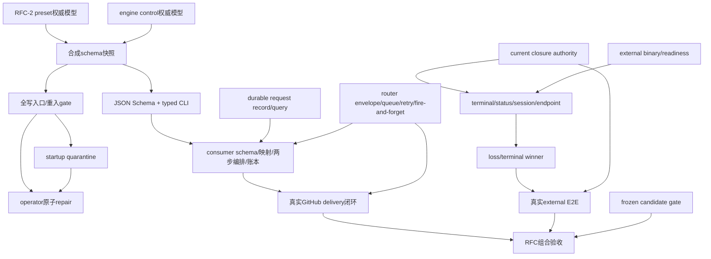

# RFC #548 · R11 供需匹配与接缝识别

**输入边界：** 本报告只匹配 `supply-findings-ledger.md`、`expected-foundation.md`、`r9-foundation-review.md`、三份 R10 demand 报告与当前 `AGG-548.md`；不重新调查源码、外部系统或旧 issue，不作实现裁决。

## A. 主 agent 摘要（≤1页）

### A1. 分类结论

本轮把需求收敛为 **67 项原子保证**：

| 分类 | 数量 | 含义 |
|---|---:|---|
| 直接复用 | 9 | current main 已有且需求可原样消费的窄地基 |
| 修补后复用 | 24 | 有可保留结构，但须补齐已裁契约后才能成为公共保证 |
| 过渡兼容 | 4 | 只服务旧语法、历史快照或跨版本过渡，不是新路径的常态机制 |
| 消费能力自建 | 11 | GitHub consumer 自己拥有的 ingress、映射、预校验、delivery 账本与 verdict 转换 |
| 地基仍缺 | 19 | preset/router/external runner/candidate 等对端事实或共同线性化保证尚未闭合 |

分类不是完成度。尤其“修补后复用”仍是 expected foundation，不得写成 current supply；“消费能力自建”也不能掩盖其依赖的 engine、router 或 external-terminal 地基。

### A2. 关键接缝

1. **schema artifact：** RFC-2 的 preset 权威 field model 与本 RFC 的 engine-control model，必须在 PATH CLI 边界合成真正 JSON Schema；version、identity、required、unknown policy、可写性与 projection 身份分离是同一接缝。
2. **typed CLI：** 内部 socket envelope 不能直接冒充公共 ADT；CLI success/rejection、unknown variant fail-closed、request identity 与 exit/stdout/stderr 分工必须完整穿越边界。
3. **request ↔ delivery：** engine durable request record 只证明 engine request/mutation；consumer delivery 日志证明 GitHub delivery→映射→CLI→verdict。二者仅以 request identity 关联，均不能替代对方。
4. **两步调用：** `chain.create` 与 `item.add` 维持两个通用调用；空 chain 长期合法且无 delivery 结论；只有 item `created/already-existing` 可转为 consumed。
5. **router 重推：** consumer 的 `not-consumed` 只有在 router durable queue、稳定 delivery identity、per-target fire-and-forget 与重推合约成立时才能闭环。
6. **schema quarantine/repair：** 合成 schema、全写入口 gate、startup barrier、durable 不可启动状态、scheduler 资格和 operator 原子 repair 必须共享同一 model identity 与线性化语义。
7. **external-terminal：** current closure authority 可复用，但 binary/probe、headless terminal/status/session、endpoint identity、loss winner、真实 E2E 均仍是事实阻塞，不能归入 consumer 自建。
8. **candidate gate：** 真实业务 E2E 与 frozen candidate/live merge-base 双基线分别证明业务闭环和候选无回归；两者不能互代。

### A3. 阻断 R12 的项

- preset 权威归一模型及其稳定 identity 尚只是预期供给（FND-01）。
- engine request identity 的 parse-before-record 边界、durable record 与 mutation/read verdict 的共同线性化，以及 startup/write/repair/scheduler 共用屏障尚未闭合（FND-02～04）。
- router 的规范 envelope、durable queue/retry、per-target fire-and-forget 与 GitHub App source model 尚未成为供给事实（FND-05～07）。
- B-ET-1～4 的真实外部 CLI/status/session/endpoint/loss contract 全缺；B-ET-5～6 的真实 E2E 与 immutable candidate gate也未建立（FND-08～16）。

因此 R12 不能把 external-terminal 或 router 链路排成可实现单元；只能先滚动拆出不依赖未知 wire 的能力。

### A4. 可滚动拆出的下一批能力

- engine-control 权威子模型、preset model 消费边界与合成 schema artifact；
- 公共 CLI typed result/rejection 与 schema identity/version 协议；
- 全写入口 gate、startup quarantine、operator 原子 repair 的共同资格模型；
- durable request record/query 及其与 mutation 的线性化；
- consumer 侧 HMAC/映射/schema 缓存与派生类型、两步 orchestration、delivery 决策账本；
- 在 router 合约未闭合前，只能定义其接缝验收，不得声称重推闭环已可实施；
- external-terminal 只能先保留 current closure authority 和领域 ADT，不得生成假 binary/probe/pending seam。

---

## B. 完整匹配附录

### B1. 分类判定规则

- **直接复用：** supply ledger 已证明 current 行为，且需求不要求扩大其量词。
- **修补后复用：** current 有结构资产，但 expected foundation 明示还需新增或修正才能满足需求。
- **过渡兼容：** 只用于旧输入/历史持久态的安全过渡；不得扩大成新路径双轨。
- **消费能力自建：** owner 明确是 GitHub consumer，且不依赖其自行发明 engine/router/external contract。
- **地基仍缺：** 对端或共同接缝尚无确定供给；若缺的是 B-ET、router 或 candidate 事实，禁止改标为消费自建。

### B2. engine schema、持久态与 request record 匹配矩阵

| ID | 原子保证 | 分类 | 供给 / 预期地基证据 | owner | 前置 | consumer | 阻塞 |
|---|---|---|---|---|---|---|---|
| S-01 | preset field type/required 只有一个归一模型 | 地基仍缺 | expected D1/D2；R9 B1；AGG C1 | RFC-2 | 权威模型及稳定 identity | schema producer、consumer type derive | 仍是预期供给 |
| S-02 | engine-owned key 的类型、可写性与冲突规则有权威模型 | 修补后复用 | supply S1-R05；expected D8；demand schema B1 | engine | engine key 完整分类 | schema/gate/repair | 历史 opaque `extra` 不能反推 |
| S-03 | preset 与 engine 子模型合成完整严格 `extra` schema | 修补后复用 | expected D8；R9 B1；AGG T2/C2 | engine | S-01、S-02 | CLI、所有写 gate | 同名冲突/组合失败规则待闭合 |
| S-04 | PATH CLI 输出真正 JSON Schema，且不与 projection 混同 | 修补后复用 | supply S1-D07/R01；expected D1；R9 B2 | engine CLI | S-03 | consumer | current 仅 projection instance |
| S-05 | schema 带 preset/model identity 与可检查版本 | 修补后复用 | expected D1；demand schema B1 | engine CLI | S-03 | consumer cache/version gate | 版本兼容协议未证 |
| S-06 | required：旧字符串/对象默认 required，optional 显式 false | 过渡兼容 | expected D2；R9 B1 | preset loader + engine | S-01 | schema/gate | 旧语法加载路径未证 |
| S-07 | artifact 表达 required、unknown policy 与 caller writable | 修补后复用 | expected D1/D8；demand schema B1 | engine CLI | S-03 | consumer prevalidation | writable 如何公开尚待实现但保证不可省 |
| S-08 | schema 输出对应同一 preset+engine model 快照 | 地基仍缺 | demand schema B1/B7；expected D1/D8 | engine + RFC-2 | S-01～S-03 | CLI、gate、repair | model drift/一致快照未闭合 |
| S-09 | add、batch-add 与所有 `extra` 写入口共用 gate | 修补后复用 | supply S1-D08～D12/A02；expected D3 | engine/store | S-03 | 全部写调用 | 低层/scheduler 写回可绕过 |
| S-10 | engine 内部 control 写回也保持完整 business remainder 合法 | 修补后复用 | expected D3/D8；demand schema B2 | engine/scheduler/store | S-02、S-03 | scheduler | 内外可写性不同但持久合法性相同 |
| S-11 | validate 的 model 与提交的新 preset/extra/资格同一事务语义 | 地基仍缺 | demand schema B2/B7；expected D3/D11 | engine/store | S-08 | add/update/repair | validate-then-write TOCTOU |
| S-12 | terminal/deleted 保持历史快照，不被追溯改写 | 过渡兼容 | expected D10；R9 B2 | engine/store | 状态模型 | operator/history | 不得据此放行重入 |
| S-13 | 任一 resume/retry/未来重入可执行态先过 schema gate | 修补后复用 | expected D3/D10；AGG C3 | engine/scheduler | S-03、状态模型 | scheduler | 可执行状态须穷尽 |
| S-14 | startup 在 scheduler/spawn 前扫描可能再次执行的 item | 修补后复用 | expected D9/D10；R9 B1 | daemon/scheduler/store | S-03 | 可执行 item | startup barrier 未闭合 |
| S-15 | 非法 item durable 标为不可启动并保存 typed reason | 修补后复用 | expected D9；supply S1-R10 | engine/store/status | S-14 | operator、scheduler | events 不能替代资格事实 |
| S-16 | terminal/deleted-chain 不扫描；重入前才升级 | 过渡兼容 | expected D10；R9 B2 | engine | 状态模型 | archive/re-entry | 状态词表变化需穷尽 |
| S-17 | scan、普通写、repair、scheduler 共用资格屏障 | 地基仍缺 | demand schema A/B3/B7 | daemon/store/scheduler | S-11、S-14 | 所有可执行 item | 混合 epoch 可短暂放行 |
| S-18 | operator repair 原子替换现存 preset+完整 `extra`+资格 | 修补后复用 | expected D11；R9 B1/B2 | operator CLI + daemon/store | S-03、S-11 | operator | preset/model 快照与并发冲突待闭合 |
| S-19 | repair 失败全不变；成功同时清原因并恢复资格 | 修补后复用 | expected D11/B7 | engine/store | S-18 | scheduler/operator | 不可留半状态 |
| S-20 | repair 沿 operator admission，consumer/agent 不得调用 | 直接复用 | supply S1-D02/R03；demand schema B4 | operator boundary | 本机 socket trust | operator | 新命令仍须证明 admission |
| S-21 | 公共 CLI 是独立 typed success/rejection ADT | 修补后复用 | supply S1-D15/R06；expected D4 | engine CLI | 公共 wire | consumer/operator | current `code: message` 有损 |
| S-22 | socket→CLI 穷尽转换，未知内部 variant fail closed | 修补后复用 | expected D4；demand schema B5 | engine CLI | S-21 | consumer | 内部 envelope 不能冒充公共协议 |
| S-23 | `(chain,itemId)` 是规范工作身份 | 直接复用 | supply S1-D10；expected D5 | engine + caller | stable mapping | consumer | uniqueness 已供；执行一次仍待 E2E |
| S-24 | duplicate 显式为 already-existing，不比较 payload | 修补后复用 | supply S1-D05/D14；expected D5 | engine CLI/daemon | S-21、S-23 | consumer verdict | current duplicate 是 conflict |
| S-25 | 每个可关联 engine request 只有一个 durable typed verdict | 修补后复用 | supply S1-D16/R10；expected D7 | engine/store | request identity | consumer/operator query | events best-effort |
| S-26 | created record 与 mutation 同 commit/rollback | 地基仍缺 | expected D7；demand schema B6/B7 | engine/store | S-25 | mutation callers | 共同线性化尚未闭合 |
| S-27 | already-existing/no-op/rejected 的 record 与判定读点同一串行化语义 | 地基仍缺 | demand schema B6/B7 | engine/store | S-25 | consumer | 事务外 lookup 会竞态 |
| S-28 | request identity 在业务判定前可靠取得；冲突 fail closed | 地基仍缺 | demand schema A/B6 | CLI/daemon/store | wire identity contract | consumer | malformed-before-identity、保留期未闭合 |
| S-29 | commit 后 reply 丢失可按 request identity 查询同一 verdict | 修补后复用 | supply S1-R09；expected D7 | engine query surface | S-25～S-28 | consumer/operator | current status/event 不足 |
| S-30 | delivery、engine request、work identity 三者仅显式关联 | 直接复用 | expected D5/D7；demand schema B7 | engine + consumer | S-23、S-25 | consumer ledger | 禁止相互替代 |

### B3. GitHub consumer 与 router 匹配矩阵

| ID | 原子保证 | 分类 | 供给 / 预期地基证据 | owner | 前置 | consumer | 阻塞 |
|---|---|---|---|---|---|---|---|
| G-01 | NetBird ingress、HMAC 验签与授权先于业务映射 | 消费能力自建 | AGG §2/C9；demand GitHub G-01 | consumer | router signed envelope | GitHub delivery | envelope 尚缺 |
| G-02 | label/repo/issue 稳定映射为 preset/chain/item/extra | 消费能力自建 | demand GitHub G-02 | consumer | normalized event fields | 两分支 orchestration | 具体 event shape 尚缺 |
| G-03 | 获取/缓存 schema，校验 identity/version并派生类型 | 消费能力自建 | demand GitHub G-03～05 | consumer | S-04～S-08 | payload prevalidation | schema 地基未成 |
| G-04 | 写调用前预校验 required/unknown/type/writable | 消费能力自建 | demand GitHub G-05 | consumer | G-03 | chain/item requests | 不能替代引擎 gate |
| G-05 | into-chain 只发通用 `item.add` | 直接复用 | supply S1-D01/D17；demand G-06/G-21 | CLI transport | S-09、S-21 | consumer | typed result/gate待修补 |
| G-06 | new-workspace 依次 `chain.create`、`item.add` | 直接复用 | supply S1-D03；expected D6 | CLI transport | chain/item APIs | consumer | 两步非原子是稳定边界 |
| G-07 | 空 active chain 长期合法，不自动补种/删除且无 verdict | 过渡兼容 | expected D6；R9 B2 | engine + consumer | G-06 | retry/orphan observation | 不得把空 chain 当 consumed |
| G-08 | 只有 item created/already-existing 转 consumed | 消费能力自建 | demand GitHub G-13/B3 | consumer | S-24～S-29 | router | chain/no-op/event/current-state 均不足 |
| G-09 | reject/unreachable/unknown 转 structured not-consumed/blocker | 消费能力自建 | demand GitHub G-12/G-14/G-17 | consumer | S-21/S-22 | router retry | retryable/permanent 尚未裁 |
| G-10 | durable delivery 账本记录 auth、mapping、schema、CLI、request、verdict | 消费能力自建 | AGG LOG-746/747；demand G-16/B4 | consumer | request identity | replay/audit | engine record 不能替代 |
| G-11 | 相同 delivery 重推稳定复算同一 work identity | 消费能力自建 | demand G-10/G-18 | consumer | stable mapping、S-23 | router retry | crash/concurrent duplicate待证 |
| G-12 | 不同 delivery 同 identity 也收敛为同一工作，分别留账 | 消费能力自建 | demand G-11 | consumer | S-23/S-24 | delivery audit | mapping 无碰撞由 caller 承担 |
| G-13 | consumer 只 spawn PATH CLI，不 import/直连 socket/SQLite/自由 prompt | 消费能力自建 | supply S1-D17；AGG T6 | consumer | CLI contracts | engine purity | 最终依赖面需验收 |
| G-14 | consumer 不调用 operator repair，不迁移历史 item | 消费能力自建 | demand G-22；expected D11 | consumer | S-20 | ingress | 遇非法历史 item只记 blocker |
| G-15 | router 提供稳定 signed normalized envelope/delivery identity | 地基仍缺 | AGG C9/Q1；demand G-01/G-02 | router | GitHub source | consumer | 未有树外运行事实 |
| G-16 | router durable queue 保留 not-consumed 并重推同 delivery | 地基仍缺 | AGG C9/H5；demand G-17/G-18 | router | G-09/G-10 | retry closure | 不能由 consumer 本地 retry替代 |
| G-17 | coder-loop target 使用 per-target fire-and-forget | 地基仍缺 | AGG C9/H5；demand G-19 | router | consumed response | router slot | completion policy 未闭合 |
| G-18 | GitHub App/source model 保持业务终态事件 | 地基仍缺 | AGG C9；demand G-20 | router | GitHub App contract | issue/PR lifecycle | 树外待证 |
| G-19 | consumed 结束投递责任，不代表工作完成 | 直接复用 | AGG T4；demand G-19/G-20 | consumer/router/engine | G-08 | operator | 业务完成仍需真实 GitHub E2E |

### B4. external-terminal 与候选验收匹配矩阵

| ID | 原子保证 | 分类 | 供给 / 预期地基证据 | owner | 前置 | consumer | 阻塞 |
|---|---|---|---|---|---|---|---|
| ET-01 | execution domain 穷尽区分 local/external | 修补后复用 | supply S2-D01/D02/A01；expected ET-2 | engine runner domain | external contract | scheduler | 历史 invocation仍 pending |
| ET-02 | current closure/run/runtime-node/cwd authority唯一 | 直接复用 | supply S2-R04；expected ET-1 | engine closure authority | current main | external runner | 禁止恢复 slot/item owner |
| ET-03 | local attempt/result/status admission/retry基准 | 直接复用 | expected ET-1；demand external B7 | engine | current closure | external integration | 只证明本地路径 |
| ET-04 | production binary/version与无副作用 readiness | 地基仍缺 | supply S2-U01；B-ET-1 | external runner owner | 真实 binary contract | engine availability | 不得发明 probe/exit code |
| ET-05 | 完整 prompt/cwd/run/auth 的真实 invocation | 地基仍缺 | supply S2-D09/R01；B-ET-1/2 | external runner + engine | ET-04、ET-02 | remote session | zero-spawn/pending禁止 |
| ET-06 | headless terminal/status producer与 admission checkpoint | 地基仍缺 | supply S2-D09/D10/U01；B-ET-2 | external runner + engine | ET-05 | scheduler | stdout/status.json不能冒充 |
| ET-07 | remote session fresh/resume/invalid/cleanup进入closure authority | 地基仍缺 | supply S2-D15/R04/U04；B-ET-2 | external runner + engine | ET-05/06 | retry/stop/consume | session contract不存在 |
| ET-08 | 缺席 durable hold、零 invocation、同repo让位 | 修补后复用 | supply S2-D05～D07/R02 | engine scheduler | ET-04 | runnable items | create→hold crash窗需修补 |
| ET-09 | restoration 清 hold 后自动进入真实 execution | 修补后复用 | supply S2-D08/N01；expected ET-2 | engine scheduler | ET-04/05 | held item | current停在 pending |
| ET-10 | endpoint identity隔离 hold/warning/restoration/loss | 地基仍缺 | supply S2-D14/U01；B-ET-3 | external contract + engine | 至少两 endpoint/profile | availability/loss | `kind+binary`不够 |
| ET-11 | active loss绑定单一 run并处置 credential/process/session | 修补后复用 | supply S2-D11/R03 | engine | ET-05～07/10 | retry/cleanup | 真实 active source缺失 |
| ET-12 | terminal-first/loss-first唯一 durable winner | 地基仍缺 | supply S2-D12/U03；B-ET-4 | engine admission/run ledger | ET-06/10/11 | cleanup/retry | commit点与竞争未线性化 |
| ET-13 | stop/resume/completion/delete/restart幂等回收 | 修补后复用 | supply S2-R03/R04/U04；expected ET-1 | engine closure saga | ET-07/12 | operator/scheduler | remote session事实缺失 |
| ET-14 | operator status区分 absence/readiness/spawn/business/loss/terminal | 修补后复用 | supply S2-D13/R02 | engine observability | ET-04～12 | operator | synthetic state不能冒充真实 |
| ET-15 | coder-loop 内不实现 HAPI HTTP/auth/session-server wire | 直接复用 | supply S2-D03；AGG T7 | engine boundary | external CLI | architecture | 真实 CLI仍缺 |
| ET-16 | 真实 HAPI 全路径 E2E | 地基仍缺 | supply S2-D16/U02；B-ET-5 | external+engine验收 | ET-04～14 | T7 acceptance | fake/probe/zero-spawn无效 |
| ET-17 | frozen candidate/live merge-base clean双基线 gate | 地基仍缺 | supply S2-D17/U05；B-ET-6 | global acceptance | immutable candidate | T7 acceptance | candidate未冻结 |
| ET-18 | local runners不进入external probe且行为无回归 | 修补后复用 | supply S2-D17；STD-602-9/10 | engine acceptance | ET-17 | claude/codex/opencode | focused fake不能替代 |

### B5. 独立接缝 contract

| 接缝 | producer 必须给出 | consumer 必须做 | 成功判据 | 禁止替代 |
|---|---|---|---|---|
| J-SCHEMA | preset model + engine model 的单快照 JSON Schema、identity、version、required/unknown/writable | 校验 version/identity，从 artifact 派生类型并预校验 | 相同模型驱动 artifact 与 engine gate | compile projection、private TS symbol、手写平行 shape |
| J-CLI | typed success/rejection、request identity、稳定机器输出；未知内部错误 fail closed | 穷尽匹配，未知 variant→not-consumed/blocker | 必要分类/details 无损穿越 PATH CLI | `code: message`、直连 socket |
| J-REQ-DELIVERY | engine durable request verdict/query，与 mutation/读判定线性化 | delivery 账本记录 mapping、每步 request identity 与最终 verdict | 任一 delivery 可重建，任一 request 可独立重查 | JSONL events、current status、互相替代账本 |
| J-TWOSTEP | chain/item 两个通用 typed request；空 chain无结论 | chain成功后才发item；只按item verdict决定 consumed | reply丢失/重推最终收敛到同一 item | GitHub专用组合命令、空chain当成功 |
| J-ROUTER | signed envelope、stable delivery id、durable queue/retry、per-target fire-and-forget | auth/map/call/log并返回 consumed/not-consumed | 停机保留，恢复重推同 delivery | consumer本地重试冒充router保留 |
| J-QUARANTINE | 同一model gate、durable资格/reason、startup barrier、原子repair | status/operator读取并按权限修复；普通consumer只记blocker | 非法可执行item零spawn，修复无半状态 | event日志、调度时再失败、逐字段猜值 |
| J-EXT-CLI | production binary/version、安全readiness、invocation/cancel contract | engine按execution domain调用，不内建HAPI wire | readiness无副作用且真实 invocation可达 | fake argv、probe-only、pending |
| J-EXT-STATUS | terminal/status/session/resume/cleanup与endpoint identity | 绑定closure/run/node/phase/credential并admit | stale/wrong/late拒绝，retry/cleanup同一authority | stdout文本、第二owner |
| J-LOSS | terminal admission与loss decision的durable commit语义 | credential/process/session/closure按winner收敛 | 两种顺序、race、restart、并发不翻转/串扰 | 内存set、事件最后覆盖 |
| J-CANDIDATE | immutable SHA、live fetch/merge-base、clean双基线与真实E2E环境 | 保存逐checkpoint证据并清理 | 业务闭环与无回归两类证据均成立 | 脏checkout、单侧测试、fake E2E |

### B6. 依赖 DAG

### B7. 循环依赖审计

| 候选循环 | 审计结果 | 消除方式 |
|---|---|---|
| schema consumer定义shape → engine照做 → consumer“验证” | 已消除 | 权威方向固定为 RFC-2 preset model + engine model → schema → consumer；consumer不得手写平行shape |
| request record证明delivery → delivery日志反过来定义request | 已消除 | engine record与consumer账本各自有独立identity/事实域，只通过request identity单向关联 |
| chain创建成功→consumer判consumed→router停止重推→item永不创建 | 已消除 | consumed只由item created/already-existing驱动；空chain无结论 |
| router等待GitHub完成→占住delivery→engine完成事件又依赖router释放 | 已消除 | coder-loop target固定fire-and-forget；delivery consumed与业务完成分层 |
| startup scan依赖scheduler状态→scheduler先启动才能给状态→非法item被调度 | 尚待地基闭合但无设计循环 | 可执行状态来自权威状态模型；startup barrier先于scheduler，scheduler只消费durable资格 |
| repair清除quarantine→gate需要新model→model由可执行item反推 | 已消除 | model来自preset/engine权威源，不从历史item推导 |
| endpoint identity由hold记录推断→hold又按endpoint identity分组 | 未闭合，明确阻塞 | B-ET-3必须先提供真实解析identity；不得由历史hold反推 |
| loss winner靠事件结果定义→cleanup事件又由winner产生 | 未闭合，明确阻塞 | B-ET-4先定义durable commit语义；events仅观察，不作winner authority |
| E2E反向定义binary/status wire | 已禁止 | B-ET-1～4先成为外部事实，B-ET-5才可执行 |
| candidate测试决定candidate内容→内容未冻结又重跑测试 | 已消除 | 先冻结immutable SHA，再在candidate/live merge-base双基线验收 |

依赖图无已接受的有向循环；两个未闭合候选均保留为 **地基仍缺**，没有降格为“消费能力自建”。

### B8. 证据索引

| 来源 | 本报告用途 |
|---|---|
| `supply-findings-ledger.md` S1-D01..D18、S1-R01..R11、S1-A01/A02 | current CLI/socket、两步调用、uniqueness、projection/validation/typed verdict/audit缺口 |
| `supply-findings-ledger.md` S2-D01..D17、S2-R01..R08、S2-A01/A02、S2-U01..U05 | external领域资产、current偏离、真实CLI/session/loss/E2E/candidate未知 |
| `expected-foundation.md` D1–D11、ET-1/ET-2、五项不变量 | 修补后预期地基与历史兼容量词 |
| `r9-foundation-review.md` B1–B5 | D1–D11、旧预裁清除、T7 authority及B-ET阻塞一致性复核 |
| `demand-schema-audit.md` B1–B8 | schema/gate/startup/repair/CLI/request record原子需求与owner |
| `demand-github-consumer.md` B1–B6 | router→consumer→CLI两分支、delivery账本、verdict与重推需求 |
| `demand-external-terminal.md` B1–B8 | closure authority、availability、invocation、status/session、loss与candidate需求 |
| `AGG-548.md` T1–T7、LOG-746/747、C1–C10、F1–F12、H1/H5/H6、Q1–Q3 | 稳定量词、跨树接缝、既有事实与未闭合洞 |

### B9. 完成核对

- [x] 每项标为且仅标为五类之一。
- [x] 每项列出证据、owner、前置、consumer 与阻塞。
- [x] schema/version、typed rejection、request↔delivery、两步/空chain/verdict、router重推、quarantine/repair、external contract/loss与candidate gate均抽成独立接缝。
- [x] B-ET-1～6及router外部前置没有被归成消费能力自建。
- [x] 依赖DAG无接受的循环；未闭合循环保留为显式地基阻塞。
- [x] 未给 issue 编号、顺序、规模；未调查源码、实验、实现或重拆。
