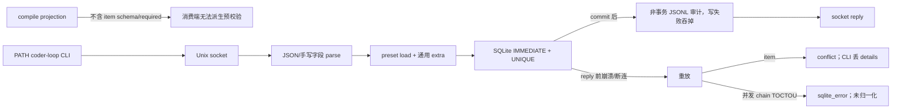
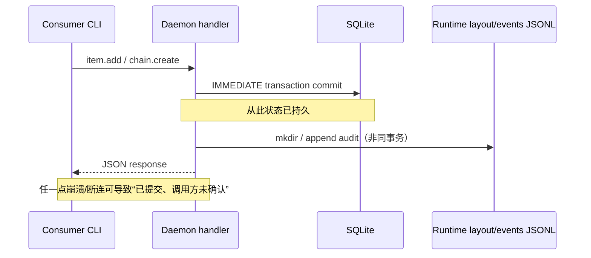

# RFC #548 S1 — main 供给侧稳定契约审计

## A. 主 agent 摘要

### 问题

在固定基线 `main@699842eba2eefc242d19f8fa9232bc1d9d5c3bdd` 上，核实 preset compile 产物、CLI→Unix socket 调用面、`chain.create` / `item.add` 的校验、幂等、事务及审计，能否按 AGG-548 §2.1 A/C/D/F、§2.2、T1/T2/T3/T5/T6、LOG-746/747、P-746-6 成为 GitHub 消费 daemon 的稳定地基。本报告刻意区分“符号/测试存在”与“能提供下游保证”。

### 结论与置信边界

**总判定：只能作为 T1/T6 的调用运输地基与 T3 的部分存储地基；不能按现状作为 T2、完整 T3、T5 忠实 verdict、LOG-746 所声称的既有入队审计地基。** 结论来自生产代码全路径、真实 `preset compile --json` 运行和现有隔离测试证据；未触碰中央 daemon、生产数据库或产品代码。

1. **A/F/T1/T6 的窄保证符合**：生产 CLI 确实把 `chain create`、`item add` 变成一行 JSON 请求，经本地 Unix socket 到 daemon；引擎没有 HTTP/webhook 入口。无 `agentCredential` 的本机调用被归为 operator，符合既定“本机 socket = operator”。外部消费 daemon可只 spawn PATH 上 CLI完成两分支。
2. **D/T2 明确偏离**：真实 compile 成功输出是 8-key projection instance，虽有 `schemaVersion: 1`，但既不是 JSON Schema，也不含 `item.idField`、`[item.fields]` 字段名/类型，更没有 required 表达；package 为 `private` 且仅暴露 CLI binary。daemon `item.add` 也不按 preset 的字段声明校验 `extra`：未声明字段可入库，声明类型不符可入库，字段 required 语法本身不存在。因此 AGG 所需“产物预校验 + 创建期 required 兜底”不能成立。
3. **C/T3 仅部分符合**：串行 `chain.create` 同字段返回同一链，字段冲突返回结构化 socket `conflict`；`items` 有 `(chain_id,item_id)` UNIQUE，竞争插入的胜者唯一。可是 `item.add` 的 already-exists 在稳定 API 中是失败 `conflict`，不是成功/typed already-exists variant；CLI还把 daemon error details 压成一行 stderr。更关键的是并发同名 `chain.create` 有 TOCTOU：两个 handler 都可读到不存在，后者在 UNIQUE 上得到未归一化的 `sqlite_error`，不满足“同字段幂等”。
4. **T5 忠实 verdict 需消费端修补，但仅靠当前 CLI不足以稳健修补**：item 已插入后到 reply 前崩溃/断连，重放会得到 `conflict`；消费端理论上可将该 code 解释为 consumed，但当前 CLI不给结构化响应/details，且 `conflict` 语义还需与真实同 item identity绑定。并发 chain race的 `sqlite_error`更无法安全当成已存在。
5. **LOG-746 的“既有审计事件已覆盖入队审计”不成立**：新 item成功后有 `item.created`；重复 add不产生该事件，只回 conflict。`chain.layout` 每次 create/replay都发，payload不区分 created/already-existing。观测写使用吞错的 `appendObservabilityEvent`，所以即使响应成功也可能没有事件；事件也不和 SQLite mutation同事务。审计日志不能独立证明 consumed/already-exists。
6. **稳定语义还有第四种形态**：不仅是“符合/偏离/静态不可判定”，还存在“**状态已提交但响应/审计不确定**”的跨 SQLite→文件事件→socket reply 窗口。它正是重试语义必须识别的中间形态，不能被单函数的 UNIQUE 或绿色测试掩盖。

置信边界：串行生产路径、schema 能力、错误投影、事务边界为高置信；精确 kill-point 后 WAL durability、多个 daemon 进程误共用同 DB 的表现未做故障注入，列为最小实验，不影响上述设计偏离结论。

### 简明复杂因果



### 影响分类

- **当前影响**：消费 daemon若今天接入，可创建/追加任务；但无法用 compile 产物实现 T2，不能只看审计判断实际入队，也不能把所有失败忠实映射为 consumed/not-consumed。
- **未来影响**：schema artifact/required 语法与 daemon 创建期字段校验未补齐前，消费端手写 shape 会违反 P-747-3；并发或 crash 重放会把已接管事件误报 not-consumed，或靠脆弱 stderr 文本误判。
- **纯证明缺口**：WAL 在逐 kill-point 下的最终可见性、并发 chain.create 的真实 wire error已由代码决定但尚缺隔离故障实验；它们不是 T2 缺失的原因。

### 可保留资产

- Unix socket 单行 JSON协议、CLI-only 外部调用形态与 operator/agent caller ADT。
- `chain.create` 串行同字段比较及结构化 conflict payload。
- SQLite `BEGIN IMMEDIATE` 写事务、WAL、busy timeout、foreign key，以及 `(chain_id,item_id)` UNIQUE。
- `item.add` 在写入前完成 preset存在/可加载、repoCwd、itemId、top-level known-key、JSON安全/大小、依赖图校验；batch add的整批事务资产。
- socket 层 `DaemonResponse {ok,result|error{code,message,details}}` 本身足够结构化；损失发生在通用 CLI投影。
- `item.created` / rights admission / privileged-op admission 的 typed event边界可继续使用，但不能宣称是事务性 consumed证明。

### 未知与下一步

- **需要设计裁决而非继续泛查**：T2 的 schema artifact究竟由 CLI emit JSON Schema还是版本化 package；required 如何进入 preset grammar；成功/duplicate 是否需要 CLI稳定 JSON ADT。AGG 已指出 STD-745 洞，main没有替代事实。
- **可继续最小调查**：隔离 daemon + 独立 loop-data 对 concurrent same-field chain.create、commit后断连、审计路径不可写做故障注入，确认具体 wire观察；不应以这些实验延迟确认 T2/LOG偏离。
- **无需新增引擎需求的部分**：消费 daemon自身 delivery去重、映射/verdict ADT、结构化决策日志仍按 AGG 放在消费端；本审计不把它们推回引擎。

## B. 证据附录

### B1. 设计逐条对照（三态）

| 稳定语义 | 判定 | 证据与下游地基结论 |
|---|---|---|
| §2.1 A：原生面为 daemon socket，不长 HTTP/token/第三方主体 | **符合** | `src/loop.ts:2487-2504`；`src/daemon.ts:1660-1722,4652-4678`。可直接作 T1/T6 地基。 |
| A：本机 socket无凭证=operator | **符合** | `src/loop.ts:2490-2495,2549-2556`；`src/daemon.ts:1943-1983`。消费 daemon无需新增凭证主体。 |
| §2.1 C：new-workspace=chain.create+item.add | **符合（可达性）** | 两条 CLI分别到两个 daemon verb：`src/loop.ts:2185-2219,2260-2284`。不是原子组合；部分失败依赖重放。 |
| C：chain.create 同字段幂等 | **偏离（并发）** | 串行符合：`src/daemon.ts:2193-2219`；并发有读后写竞态，DB name UNIQUE在 `src/sqlite-state.ts:608-617`，错误仅转 `sqlite_error`（`:2798-2800`）。只可在串行/修补后作地基。 |
| C：item.add 唯一拒绝 | **符合（唯一性）/偏离（消费语义）** | UNIQUE：`src/sqlite-state.ts:537-560`；竞争失败后二次查询归一为 daemon `conflict`：`src/daemon.ts:2912-2918,3089-3097,5586-5592`。CLI无 typed already-exists成功分支。 |
| §2.1 D：per-item preset引用 | **符合** | CLI要求 exactly one preset spec，daemon兜底：`src/loop.ts:1704-1740,2115-2124`；`src/daemon.ts:3060-3086`。 |
| D：compile产物是字段/类型/required预校验面 | **偏离** | projection boundary `src/loop.ts:533-583` 无 item schema；真实输出见 B2。 |
| D：创建期 required校验 | **偏离** | field模型只有 `{type}`：`src/loop.ts:877-879,4913-4939`；item.add仅通用 extra校验：`src/daemon.ts:3001-3057,5109-5112`。 |
| §2.2 三层校验：compile→CLI/socket parse→required兜底 | **偏离** | 中层存在，第一/第三层缺目标能力。 |
| §2.2 itemId+(chain,itemId)唯一 | **符合** | schema UNIQUE及 lookup/translation见上；可作“最多一个item”存储地基。 |
| §2.2 未声明字段拒绝 | **偏离** | top-level unknown拒绝，但 `extra`任意安全key被接受；测试甚至把 `note` 入库：`tests/integration/daemon/item-crud.integration.ts:219-286`。 |
| §2.2 类型不符拒绝 | **偏离** | preset field type只参与声明/变量编译，item.add没有按 map验证 `extra`。 |
| preset不存在创建前拒绝、无部分item | **符合** | `validateBundledPresetForRequest`/load发生在 createItem之前：`src/daemon.ts:2899-2916,3010-3023,3077-3084`。失败事件测试：`tests/integration/daemon/item-crud.integration.ts:416-470`。 |
| T3 任意前缀失败重放收敛 | **偏离** | DB commit与event/reply分离；item replay为 error conflict，chain并发可sqlite_error。需消费者/CLI契约修补及并发归一后才能保证。 |
| T5 consumed iff实际入队或已在队 | **偏离（当前CLI）** | socket error细节充分，但 `requestDaemonResult`只 `fail(code: message)`：`src/loop.ts:2496-2504`；item CLI无 JSON error ADT。 |
| LOG-746 既有事件覆盖入队审计 | **偏离** | item首次有 `item.created`，重复无 already-exists事件；chain.layout不标新/旧；append吞错：`src/daemon.ts:2221-2229,2927-2937,2285-2289`; `src/observability.ts:923-935`。 |
| T6 外挂仅CLI、引擎无GitHub ingress知识新增 | **符合（供给侧现状）** | 外部生产调用方只有 root CLI；直接 store调用仅daemon及专用integration scripts，见 B3。 |
| P-746-6 消费端 verdict/mapping ADT | **静态不可判定（树外）** | main只提供 daemon response结构；消费 daemon尚不在本repo。本报告不代其裁决。 |

### B2. preset compile 的真实产物与 artifact 边界

运行（repo root，未写生产状态）：

```sh
bun src/loop.ts preset compile gh-issue-pr-iteration --json > /tmp/rfc548-s1-compile.json
```

观察：exit 0，stdout 32802 bytes；顶层恰为 `schemaVersion,preset,statuses,stateGraph,phases,tools,fragments,findings`。`schemaVersion === 1`；`item === undefined`、`schema === undefined`、`jsonSchema === undefined`。随后临时文件已截空。

生产实现：

- 成功 stdout只写 `publicResult.projection`，外层 `{kind,schemaVersion}`不输出：`src/loop.ts:2990-3002`。
- rejection则把外层 `{kind:"rejected",schemaVersion:1,diagnostics}`写 stderr并exit 1：同上。
- projection schema在 `src/loop.ts:533-583`：phase variable仅给 `key,type:"string",sourceKind`，丢失实际 source field名称；完全没有 item idField、字段表、required。
- 源 preset grammar `[item.fields]`只允许 `string|number|boolean|json` 或 `{type=...}`，无 required：`src/loop.ts:458-459,4913-4939`。
- `package.json:1-18` 为 `private:true`，无 `exports`，仅 `bin.coder-loop=src/loop.ts`。导出的 arktype TS symbol不是树外可版本化 artifact。

因此当前 `schemaVersion`只版本化 projection instance shape，不能证明消费者能校验请求或派生类型。把 instance的 arktype边界存在视为 JSON Schema会混淆运行时内部assert与分发artifact。

### B3. CLI→socket→domain→SQLite：入口、旁路与消费者

#### 生产入口

1. CLI parse：chain create `src/loop.ts:1690-1701,2185-2219`；item add `:1704-1740,2260-2284`。
2. CLI transport：resolve loop-data socket、可选注入 run credential、`sendDaemonRequest`：`src/loop.ts:2487-2504`。
3. socket server：每连接按换行分帧、同连接请求串行，不同连接可并发：`src/daemon.ts:1660-1697`。
4. wire parse：JSON object、id/command/args：`src/daemon.ts:4978-5002`。
5. typed command dispatch/auth：`src/daemon.ts:1920-1931,1732-1766`。
6. domain：chain handler `:2166-2229`；item handler `:2887-2937` + input build `:3001-3057`。
7. SQLite：每个 store write包 `transaction(...).immediate()`：`src/sqlite-state.ts:1605-1612`；insert chain `:1683-1703`；insert item `:2184-2225`。

#### 旁路/调用方

- 产品 `src/` 中只有 daemon调用 `store.createChain/createItem/createItems`。
- `scripts/issue-558-integration.ts`、`scripts/issue-560-integration.ts`直接写隔离 store，是专用测试/验收fixture，不是外部稳定生产入口。
- exported `sendDaemonRequest`允许本repo测试/内部调用直连 socket；AGG F 对消费 daemon明确禁止此旁路，要求 PATH CLI。
- `item.batchAdd`也是生产写入口（`src/loop.ts:2287-2289`, `src/daemon.ts:2940-2998`），但不是 C 裁决的两步调用；它整批预构造后单 store transaction，不能把 chain.create一起原子化。

#### 主体准入

- scheduler给 agent env注入 `CODER_LOOP_RUN_CRED`，CLI对列举命令自动附 `agentCredential`：`src/loop.ts:2490-2556`。
- 未携带 credential即operator；chain.create为 agent hard-deny，operator allow并写 `privileged_op.caller_admission`：`src/daemon.ts:1948-2001`。
- item.add为 bespoke gate：operator允许，agent需新item preset对应phase的 `createItems` rights：`src/daemon.ts:2889-2908,4136-4212`。
- 这是主体/rights准入，不是第三方鉴权。任何能连接本机socket且不带 credential的进程都按operator；这正是锚点A既定信任模型，不是本报告新增威胁需求。

### B4. 校验拒绝层、错误忠实度与部分状态

| 情形 | 拒绝层 | item是否部分创建 | wire错误 | CLI可消费性 |
|---|---|---:|---|---|
| preset spec缺失/两者同时 | daemon input domain，create前 | 否 | `invalid_request`, details.field | 普通 item CLI自身先拒；stderr非JSON |
| bundled preset不存在 | validate/load，create前 | 否 | `invalid_request`（load上下文） | stderr仅 code+message |
| presetPath坏/内容坏 | load，create前；另发 validation event | 否 | `invalid_request`, details含chain/presetDir | stderr丢details |
| top-level未声明arg | `validateKnownKeys` | 否 | `invalid_request`, details allowed | stderr丢details |
| `extra`未声明preset字段 | **不拒绝** | 是 | success | 与T2相反 |
| `extra`声明字段类型不符 | **不拒绝** | 是 | success（仅JSON安全shape） | 与T2相反 |
| 漏“required item field” | **没有这种grammar/校验** | 是 | success，可能到render时missing throw | 与D/C3相反 |
| itemId重复 | precheck或UNIQUE失败后二次lookup | 已存在一行 | `conflict`, details含chain/item/existing rowid | CLI stderr丢details，exit非0 |
| chain同名字段冲突 | daemon compare | 原链保留 | `conflict`, details.conflicts | CLI stderr丢details |

`requiredString`等手写parse产生结构化 daemon code/message，有些没有 `details.field`（`src/daemon.ts:5021-5057`）；所以即使socket层结构化，也不足以稳定满足 P-747-2 对四类schema违规的统一 typed verdict。

### B5. 幂等、事务、锁与崩溃窗口

#### 串行语义

- chain name DB UNIQUE；handler先读 existing，再逐字段比较 preset/repository/baseBranch/status及请求metadata键。请求metadata是**子集比较**：existing多出的metadata键不构成冲突（`src/daemon.ts:5552-5580`）。所以“同字段”实际稳定语义不是完整对象相等，而是固定标量相等+请求metadata不冲突。
- item唯一性在 DB约束，单次 insert为 IMMEDIATE事务。`nextItemPosition`与insert同事务，竞争不会生成两个相同key。

#### 并发与锁

- DB初始化 `foreign_keys=ON`,`busy_timeout=5000`,`journal_mode=WAL`：`src/sqlite-state.ts:825-850`。
- 每个store write是独立 IMMEDIATE事务，但 daemon的 existing lookup在该事务之外。不同socket handler可交错。
- item race由 UNIQUE + `translateCreateItemFailure` lookup归一为 `conflict`，设计较强。
- chain race没有对应 catch/re-read：败者从 `store.createChain`抛 `SqliteStateError("sqlite_error", "create chain failed: UNIQUE...")`，最终daemon未识别错误会被 `responseError`降为 `internal_error`，因为它不是 `DaemonError`（`src/daemon.ts:5016-5018`）。故并发同字段不幂等。

#### 崩溃/副作用窗口



- item：DB insert→`item.created`→queue tick→reply。DB后崩溃，重放得到 conflict；若消费者只把exit 0当consumed，会误报 not-consumed。
- chain：DB insert→runtime directories/files→`chain.layout`→reply。layout失败会留下chain；重放同字段可重做layout。该串行路径趋于收敛，但 concurrent race仍破坏稳定错误。
- audit append使用吞错wrapper，写失败会stderr警告而handler继续成功；因此“响应成功⇒审计存在”不成立。
- SQLite事务提供原子行写，不提供SQLite+文件+socket的原子确认。没有outbox/operation id。本报告不据此新增outbox需求，只指出既有保证强度。

### B6. 审计消费者与 consumed/not-consumed 证明力

- CLI `logs`通过 daemon `logs.query`读取事件，而非直接文件：`src/loop.ts:2143-2163`；operator path可读。
- `chain.layout` payload只有 chainId/state（可选updatedKinds），没有 `created|already-existing`：`src/observability.ts:304-313`。同字段重放再次发同形事件。
- `item.created`只在成功insert后发，payload rowId/itemId/status：`:320-325`；duplicate早于emit抛错，所以没有 already-exists审计。
- `item.add.rights_admission`证明准入决策，不证明insert成功；它发生在构造/insert之前。
- socket duplicate response的 `conflict` details能证明查询时已有该 `(chain,itemId)`；但CLI丢details且它不是日志事件。
- `status --json` / `item list --json`可在事后证明当前存在，却不是每次决策的审计记录，且查验与verdict之间仍可变化（例如operator删除chain）。

所以 LOG-746 的消费 daemon自有一行决策日志仍必要，但其“引擎既有事件已覆盖入队审计”只能弱化为：首次正常创建通常有非事务best-effort事件；already-exists和写失败没有完整证明。

### B7. migration/历史数据兼容

- 当前 state schema version 16；迁移整体以 IMMEDIATE事务运行，必要时临时关 foreign_keys并在finally恢复：`src/sqlite-state.ts:980-1090`。
- v11→v12把历史 integer issue identity迁到 opaque `item_id TEXT`并建立 `(chain_id,item_id)` UNIQUE，salvage旧字段进extra：`:1229-1367`。
- v9迁移为items增加preset/preset_path并从chain preset回填：`:1034-1049`。
- chain preset仍是nullable legacy default seed，但新item daemon API要求per-item preset：`src/sqlite-state.ts:603-607`; `src/daemon.ts:2166-2187,3007-3015`。
- 这些迁移保住历史读/调度，不制造 required字段证据，也不改变duplicate的CLI语义。

### B8. 测试资产、同错风险与盲区

#### 可保留覆盖

- compile closed ADT、deterministic projection、CLI成功/拒绝：`tests/unit/preset/compile.test.ts:18-62,250-261,367-370`。
- chain串行idempotent及字段冲突：`tests/integration/daemon/chain-crud.integration.ts:38-89`。
- item duplicate结构化socket conflict且仅一行：`tests/integration/daemon/item-crud.integration.ts:149-188`。
- item top-level严格字段/DB前拒绝：同文件 `:190-286`。
- batch invalid/conflict整批无部分写：`:81-147`。
- operator/agent credential及rights audit有大量真实daemon integration（例如 `tests/integration/daemon/admission.integration.ts:556-837`）。

#### 代码—测试同错风险

1. compile测试assert的是当前 projection boundary本身；producer与oracle同源，无法证明它含AGG要求的item schema。测试绿色反而会稳定错误的8-key projection。
2. item strict-fields测试把top-level unknown与preset未声明 `extra`混为两类；其成功fixture明确接受 `extra.note`，没有对照preset字段表，故不能证明T2。
3. chain idempotency测试只有串行请求，没有 `Promise.all`同名竞争、handler kill或断连重放。
4. duplicate test直接调用socket helper，能看到完整 `details`；没有经PATH CLI验证外部消费者实际只收到扁平stderr。
5. audit测试验证正常文件系统事件存在，未覆盖audit append失败仍返回success、duplicate无item.created、chain replay事件不可区分。
6. 许多daemon harness会自动补默认preset，测试源码省略preset不等同生产CLI可省略；不能据此否定per-item preset要求。

#### 最小后续实验（隔离，非当前完成前提）

- 启隔离 `--loop-data-root /tmp/rfc548-s1-*` daemon，两个独立socket同时发完全相同chain.create，记录两个完整wire response及最终一链。
- 在item commit后、event/reply前加测试seam/子进程kill，重启后重放，核对DB、event和CLI exit。
- 令隔离events路径append失败，确认item add仍success且DB存在、event缺失。
- 以自定义preset声明 string字段，分别add number、额外key、漏字段，直接证明三者均可入库（静态路径已经确定）。

### B9. 证据索引与调查限制

- 设计唯一锚点：`AGG-548.md` §2.1 A/C/D/F、§2.2、T1/T2/T3/T5/T6、LOG-746/747、P-746-6、§4。
- 生产 compile：`src/loop.ts:533-598,2900-3002,4913-4939`。
- CLI transport/error：`src/loop.ts:2185-2219,2260-2284,2487-2557`。
- daemon dispatch/auth：`src/daemon.ts:1660-1766,1920-2121`。
- create handlers：`src/daemon.ts:2166-2243,2887-3097`。
- SQLite schema/事务：`src/sqlite-state.ts:534-618,825-850,1605-1708,1740-1759,2184-2225,2798-2800`。
- observability：`src/daemon.ts:2285-2294,2927-2937`; `src/observability.ts:297-325,923-950`。
- 调查未运行全套测试（本任务是只读供给侧审计，且伞不直接运行测试）；只运行无状态 compile CLI。未启动/触碰 `~/.coder-loop` 中央daemon，未修改产品/测试/config/DB，未创建worktree。
