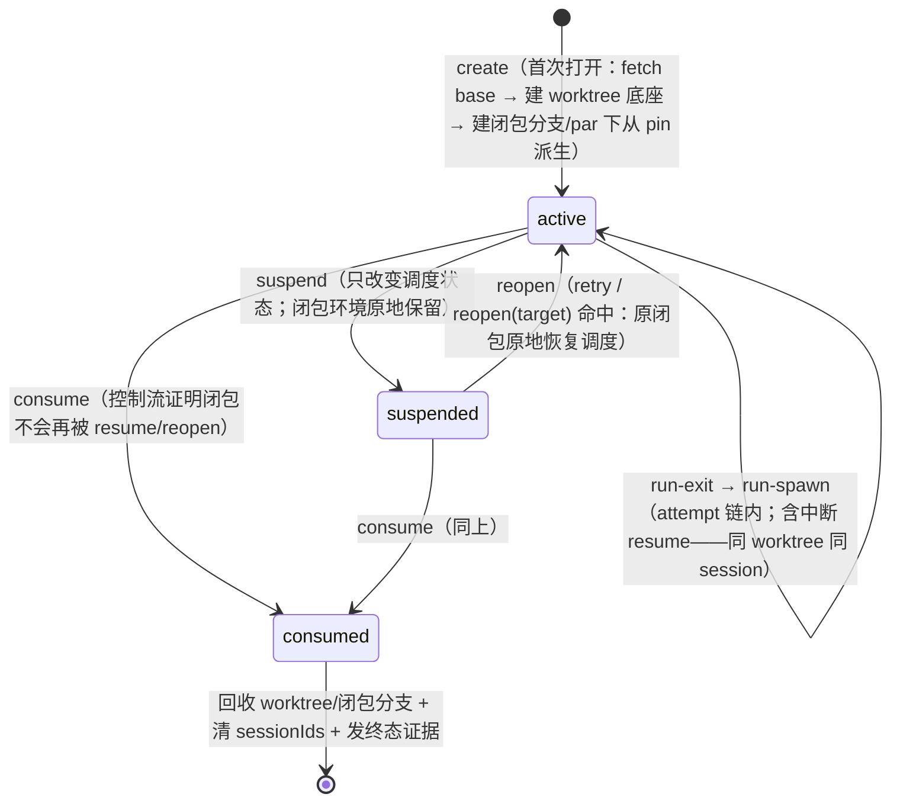

# v3 裁决报告：供给条款与闭包生命周期（边界 1）

> 裁决日期 2026-07-10，裁决主体操作员，产生于「边界 1：任务代数的数据流/产物流」受边界约束设计审查会话。
> 本报告是该系列裁决的权威记录；#546 body 的对应条款以本报告为源同步修订。影响面：#546、#558、#559、#560、#561、#562、#563、#564、#565、#566、#543、#586、#587、#589、#590、#592、#593、#544、#547、#554、#567、#545、#601 与 bundled preset 改写线。
> 姊妹报告：`task-closure-decision.md`（边界 2，同日）——本报告在其「任务闭包」与「引擎递出面定理」之上工作。

## 1. 裁决内容

边界 1 的原问题是「控制代数（seq/par/join/reopen）是否缺配套的 Value/Artifact algebra」。审查与四轮裁决后收口为：**不需要 Value/Artifact algebra**——产物的语义与传递全部在声明通道上（agent 侧），系统侧配套物是「闭包边界程序化」原则下的供给条款，其核心对象是升格为持久对象的任务闭包。

四波裁决，层层递进：

1. **worktree 起点**：起点必然是「所有分支都要合并进去的公共目标分支」（integration base；`chain.baseBranch`，默认 main，per-chain 可配——系统迁就现场，不是现场迁就系统）。判据不是「谁值得对齐」，而是 (a) 当前任务的起点依赖于谁、(b) 合并冲突谁来解决。模型 =「main 尽可能最新」：worktree 环境是创建时刻该分支最新快照的拷贝，在最新基础上迭代。「倒退到特定历史节点」不可靠、无法计算、程序无法兜底——声明面历史回退永久出局。
2. **seq 与 par 的 worktree 语义**：worktree 之间无依赖关系，只有并发时等待问题。不并发的任务流转时，前驱需被构建于其上的工作已合入 base（不然不流转）；「依赖前驱未合并工作树」的 seq 形态不存在——评审类任务经声明通道审视发布物。并发任务同时启动，**程序必须确保其 worktree 从同一 commit 派生**（par pin），否则并发代数语义被调度时序引入副作用。
3. **闭包边界程序化，分支归程序**：LLM 不可 FP 化、git 内容操作（commit、合并冲突解决、push、PR）是 LLM 自己做且程序无法替代；但 worktree 是抽象闭包的边界，**边界可程序化**——worktree 创建、工作分支创建与命名、起点解析、终态采样、回收全部归引擎。现行 preset 让 agent 自建分支（`git switch -c`）是设计错误，v3 修正。
4. **闭包是持久对象，retry/reopen 作用于闭包本身**：闭包函数不应看作独立无接口的单个函数对象——它是显式的、可 retry/reopen 的对象；「对谁 retry/reopen」的答案是闭包，不是再造一个抽象。正因为闭包边界程序化，「可保护的上下文是什么」程序可计算，所以现场可以拷贝保存、可以 retry/reopen——而不是有一个不确定的路径再想办法把现场还原。这是使用已有类型的元数据，不是丢弃它再造一个。

### 操作员 verbatim（2026-07-10，按裁决顺序）

> "worktree的起点到底是谁，我认为必然是一个所有分支都要合并进去的公共目标分支，选择哪个分支的核心问题不是谁值得对齐，而是，第一，当前的任务的起点依赖于谁，第二，合并冲突谁来解决，而模型里是main尽可能最新，那就是说，worktree的环境是当时的main的快照的拷贝，从而在最新的基础上迭代，这符合绝大多数的情况，如果需要倒退到特定节点是不可靠，无法计算的完全不可能程序兜底的情况，所以默认worktree的起点是main，而是不是必须一定是main，这就不一定了，因为不一定所有的仓库都在main下迭代，这是gitops怎么用的问题，这一点是系统迁就现场，不是现场迁就系统"

> "worktree不应该有依赖关系，只有并发时等待问题，不并发的任务永远都是上一个任务已经合入main，不然怎么流转？并发的任务是同时启动，那么程序应该确保他们的worktree是同一个commit派生的，不然并发的代数语义怎么保证？引入副作用？"

> "llm不可fp化，也就是行为不可预测，而git操作是llm自己做的，并且程序无法替代llm，因为要处理合并冲突，那么单个任务内的终态到底有没有合并回去没人知道，甚至不知道git到底做了哪些东西，我认为，对于某个任务内，因为worktree的名字和分支名是确定的，所以程序可计算git到底合没合回去，遍历git 树的可达性，所以这部分实际上应该有更好的解决方案"

> "现在的preset让ai自己建分支是设计错误，应该是程序做，worktree是抽象闭包的边界，可程序化"

> "不应该外溢到闭包之外，闭包函数不应该看作独立无接口的单个函数对象，消费闭包本身可以retry/reopen才对，你有显式可retry/reopen的对象，单纯提出retry/reopen而对谁retry/reopen才是核心问题，而不是再多一个抽象，正因为闭包本身retry/reopen，那么顺带，程序可计算，可保护的上下文是什么，所以可以拷贝保存，可以retry/reopen，而不是有一个不确定的路径，然后想办法把现场还原，这是丢弃已有类型的元数据不要再造一个"

> "而这个闭包本身存在生命周期这个概念，直接也敲定了另一个问题，git的worktree的gc到底什么时候做。以及系统hook到底挂在哪"

## 2. 闭包生命周期模型

闭包（= 同一 (item, phase) 的 attempt 链的执行环境：worktree + 工作分支 + session + scratch）从「调用帧」升格为持久对象，三态生命周期：

- **挂起只改变调度状态，不是资源生命周期事件**：worktree、工作分支、index、未提交文件、session 与 per-task scratch 全部原地保留；不得在 suspend 上 stash、commit、删除或重建任何闭包环境。挂起和闭包被完全消费是两件事。
- **重开是原闭包原地恢复调度**：业务打回重入（changes_requested → 第二轮 iter）= 对同一闭包从 suspended 切回 active；cwd、文件系统、index、分支与 session 没有搬运或还原步骤。
- **只有 consumed 才允许 GC**：`consumed` 不是 item terminal、预算耗尽或取消的同义词，而是控制流已经证明该闭包不会再被任何合法 resume/reopen 命中的事实。该可计算消费谓词由 #560 在实现前钉死；证明未成立时环境必须保留。
- **单活性**：每闭包同一时刻至多一个活 run（执法键 = 闭包）；挂起态无活 run；par 只存在于闭包之间。

### 一个类型，四张视图

闭包状态机同时是：**执行语义**（调度消费）、**GC 表**（仅 consumed 允许回收）、**hook 挂点表**（转移边 = observer 事件）、**暴露谓词表**（证据采样点 = suspend/consume）。四视图共同事实源，持久化归 #558 shape。零新增抽象。

**GC 语义**：active 与 suspended 都必须保有完整 worktree 与闭包分支；只有 consumed 才回收 worktree、闭包分支与 sessionIds（git 对象随不可达自然过期，引擎不做显式 `git gc`）。daemon 启动扫尸 = **状态对账**——枚举磁盘 worktree 目录 + 引擎命名空间分支，对照 SQLite 闭包状态表（active/suspended→目录与分支都该在；consumed→都不该在；异常→暴露不掩盖）。无独立 GC 策略参数。

**hook 挂点**：observer 挂事件词表（闭包转移边 create / run-spawn / run-exit / suspend / reopen / consume 作为新事件类型入词表）；gate 决策点闭集不扩（仍为推进类：run pre-spawn/post-exit、状态转移、par join、seq 推进、reopen 派发、chain-complete）。转移边不可 gate；要阻止推进，在对应推进决策点 hold。consume 只有在消费谓词已经成立后才发生，不能由资源回收反向决定控制流。

## 3. 供给条款（终版）

递出面定理（`task-closure-decision.md` §3）的对偶小节：定理证「引擎递出了什么面」（隔离视角），供给条款证「引擎自身 git 行为的承诺是什么」（供给视角）——量化域同样只是引擎代码，设计期可证。

| # | 条款 |
|---|---|
| 1 | **起点公理**：worktree 底座 = 创建时刻 `chain.baseBranch` 最新快照；引擎创建前 fetch base（per-repo 串行化/去重，网络失败显式化，pin 成员免 fetch）；重开时 checkout 闭包分支尖端（底座无关）；声明面历史回退永久出局；无 origin 的 target 走 doctor 警告，不装载拒绝 |
| 2 | **闭包分支程序化**：引擎创建 per-闭包工作分支随闭包递出，贯穿闭包全生命周期至终结（PR headRef 即闭包分支）；agent 契约 = 在其上 commit、解决冲突、push、开 PR；preset 指示 agent 自建分支退役；push 到 origin 的 ref 属声明通道，未发布的自建 ref 是 escape 类 |
| 3 | **seq 流转**：前驱需被构建于其上的工作已合入 base；引擎不执法——合并真相是 GitHub 面事实，经声明通道由 preset 判定器（validator/script 自查）按 `advance\|hold\|reopen` 消费；引擎零产物传递机制；引擎级 mergedness gate 出局 |
| 4 | **par 同 commit 派生**：par 展开/物化时引擎 pin base 尖端 commit 并持久化；成员子树共同启动入口任务集的闭包首次打开从 pin 派生（凝固点语义：后续追加复用同 pin）；嵌套 par 内层重新 pin；rationale = 入口输入侧确定性（输出侧合并顺序归 join 策略与下游） |
| 5 | **回收与消费采样**：suspend 零 GC；只有控制流证明闭包已完全消费后才进入 consumed 并回收引擎命名空间内的 worktree/分支/sessionIds。证据谓词对象 = 闭包分支，suspend 只发状态事件，consume 时发 `{无工作, 已发布, 未发布即弃, 无法求值}` + origin 新鲜度戳——只暴露不参与推进 |

## 4. mergedness 可计算性的检验记录

操作员原主张「worktree 名/分支名确定 → 程序遍历 git 可达性可算合没合回去」经对抗检验修正——两个结构性击穿都来自本系统自己的 preset：

1. **squash merge 杀可达性**：bundled preset 合并动作是 `gh pr merge --squash --delete-branch`——原分支 commits 在 base 历史永久不可达，`merge-base --is-ancestor` 恒假阴性；patch-id 类替代谓词在多 commit squash、retry 时 merge base 进 PR 分支等常规动作下同样碎。
2. **工作不在引擎知道名字的分支上**（v2 现状）：preset 指示 `git switch -c` 自建分支，引擎分支停在 startRef（base 祖先），可达性检查恒假阳性。

**可救的部分**：引擎可靠计算的不是「合没合」，而是「引擎自有面上有没有工作、发布没发布」（条款 5 谓词）；「合没合」的 ground truth 在声明通道上（review 流程已消费 `mergedAt`/`mergeCommit`），归 preset 判定器。裁决 3（分支程序化）使谓词有真对象，闭合此环。

## 5. 对抗检验记录

两轮独立 fable subagent 对抗（第二轮 fresh、无第一轮记忆），关键消化：

- **坐实并吸收**：squash/自建分支击穿 mergedness（→ §4）；retry 与 PR headRef 的跨任务延续矛盾（→ 闭包持久对象裁决后整组消解：retry 重开同一闭包，同一分支）；「phase 推进 = 终结」销毁 retry 现场（→ 挂起态）；引擎零 fetch 使「最新快照」无承载者（→ 条款 1 fetch 义务）；递出面审计表口径不等价——evidenceDir/currentIssueFile（item 级）与 SHARED_CONTEXT_FILE（chain 级）在纯 seq 下已是「生命周期 ⊆ 任务」反例（→ 缺口③扩围）；preset 制度性指示结构性 git 操作（e2e 自建 standing worktree、spike 分支）使 blame 空转（→ preset v3 化改写清单扩容）；条款 1「历史回退出局」与 par pin 字面互斥（→ 作用域精化：出局的是声明面）；「入口任务」在成员以 par 开头时为复数（→ 入口任务集）；ambient git 凭据与 escape 清单字面冲突（→ 收窄为凭据滥用；git 面凭据不在 #406 覆盖内，登记）。
- **打回**：「引擎注入 mergedness 进判定 payload」（引擎理解 GitHub 字段，违反 L1 红线——判定器自查）；「suspend/finalize 转移边可 gate」（副作用上放 gate = 第二推进语义——转移边 observer-only）。

## 6. 方法论记录

本会话自身的错误，供后续审查会话对照（先例：`task-closure-decision.md` §6）：

1. **把闭包当调用帧**。「重入 = 新任务新闭包」是审查会话自加的解释层——由它派生出「延续性搬运」的伪分叉（per-item 新抽象 vs agent 启发式还原现场），两条路都在给错误前提付税。闭包是带完整类型元数据的持久对象；遇到「跨 X 延续」问题先问「X 为什么会死」，再考虑搬运。
2. **对裁决的转写不承担对抗义务**。第三轮把「机制上可行」当「无需顶回」直接收口，被操作员点名「被牵着鼻子走」；第四轮又过度撤回（par 快照偏斜实为真问题，后被裁为 pin 义务）。转写与对抗是两道工序，都不可省。
3. **供给与隔离是递出面定理的两半**。初始问题框架（「缺产物代数」）与中期方向（引擎保产物可达性）都是把 agent 侧数据流错放进引擎义务；正确刀法是把「引擎自身 git 行为」从「agent 产物流」中切出来，前者钉契约、后者归通道。

## 7. 影响面

全量 issue 修改清单（重写级 #546/#560/#558/#562；实质修改 #559/#561/#563/#565/#543/#544；局部登记 #566/#567/#545/#564/#586/#587/#589/#590/#592/#593/#601/#547/#554；无影响 #549/#574）随各 issue body 修订与登记 comment 落地，执行顺序：本报告 → #546 → #558 → 其余。bundled preset v3 化改写由 #604（#546 sub-issue）承接：`git switch -c` 退役、implement.md retry 契约改闭包重开形态、e2e standing worktree 与跨任务 standing environment 的 v3 兼容形态、spike 分支流、submit.md retry 路径分支语义。
