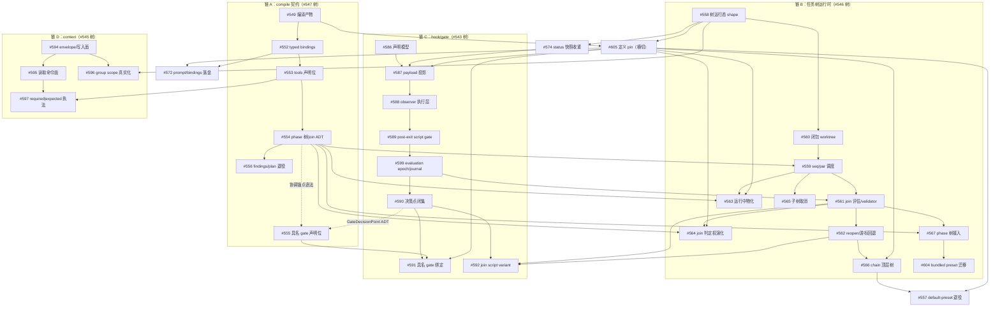

# coder-loop v3 执行编排：实现面串行链、并行泳道与分批执行计划

> 本文件不是 issue 完成清单，也不按 GitHub 子 issue 树或编号排序。它回答四个问题：哪些 issue 之间存在**实现面冲突**因而必须串行合流、哪些工作面**真正不相交**因而可以交给彼此不可见的无状态 agent 并行、全部 issue 按什么**分批顺序**执行到 v3 完成、合流之后由谁在什么 SHA 上证明接口真的连接。
>
> 事实来源是三份而非一份——GitHub issue graph（依赖边）、全部 v3 issue body 与关键 comment 的全文（每个 issue 自己声明的触碰锚点、契约输入与协调条款）、引擎源码的实现面核对（触碰函数在哪个文件、与谁同域）。**只看依赖图不足以判定并行**：依赖图只记录"没有你我无输入"，不记录"你我写同一个函数"与"你我共写同一份契约"。
>
> 本文**不承载完成状态**。计划由依赖与实现面决定，与哪些 issue 已经合并无关；任意时刻的"当前可启动集"，是拿 GitHub 实时状态在 §4 的批次上求值得出的，不写死在本文里。全部 issue（含已合并者）都在 §2 审计表与 §4 批次中占位——链条头部的实现面分析是理解下游契约的输入，不因完成而略去。
>
> 范围：v3 六个 RFC umbrella（#543–#548）下 59 个直接子 issue（含 #599/#601–#605）、P0 地基（#534 audit 树 #535–#542、#600）、验收分层 #683/#684/#685、外部仓 issue（`hapi-remote-session#1/#2`、`github-hapi-agent-router#12`、#569 的新 repo）。

## 1. 并行判定模型

### 1.1 并行成立的三个必要条件

一组 issue 可以由互不可见的无状态 agent 同时实施，当且仅当三条同时成立；任何一条不成立，该组事实上是串行链，把它标成"并行组"只会把冲突成本从计划期推迟到 review/rebase 期：

1. **图上无边**：组内两两之间没有声明的 Depends on / Blocks。
2. **实现面不相交**：组内成员触碰的函数域不重叠。引擎的实现面高度集中——`src/loop.ts`（7151 行）、`src/daemon.ts`（5951 行）、`src/scheduler.ts`（2863 行）、`src/sqlite-state.ts`（1861 行）四个文件承载几乎全部引擎语义；"同文件不同函数"可以靠 rebase 消化（如 doc 渲染与绑定类型流），"同一状态机的同一批函数"（如 scheduler 的推进/终止/run 收尾路径）不能，后者是同一个语义对象的共同作者。
3. **输入契约已冻结**：每个成员的输入契约在开工前已经存在且不再变动。若组内成员共同书写同一份契约（同一个 schema、同一个 ADT、同一张表的 shape），则"冻结的组输入契约"对该组不存在——它们的输出才是那份契约，这类组只能串行落地或由单一 owner 一次落齐。

三种边的词表沿用：**硬依赖**（下游无上游产物即无输入，跨批）、**协调边**（可并行开发但触同一语义面，先合者定形状、后合者 rebase 并重跑完整验收）、**验收边**（两端各自验收通过仍需第三方场景证明连接，归 §5 的 checkpoint）。协调边只在"面窄、双方触点是不同函数"时才是真自由度；当协调边落在同一状态机上（scheduler 推进面、run 收尾面、编译产物 shape），它按条件 2/3 降级为串行边。

两条实证钉住条件 2 的分量：#534 audit 树 body 明言 children"无语义依赖可全部并行"，但共触 daemon.ts/scheduler.ts 的 #535/#536/#538 在实际执行中经历多轮 changes-requested 与 chain exhausted，最终逐个串行合流（#534 六条 finalizer comment 是现场记录）；#576 的一次实跑 review 以 blocked 收场——卡在 #574 未落与 `buildCoderLoopStatusSnapshot` 非严格只读（readwrite + WAL pragma + migration）上，"GUI 是独立并行泳道"的第一步就撞进引擎链。

### 1.2 无状态并行纪律

对满足 1.1 的组：

1. 每个 agent 只读冻结的组输入契约、自己的 issue body 和当前默认分支，不依赖其他 agent 的聊天记录、worktree 或未合并代码。
2. 一个 agent 只负责一个 issue/PR。共写同一契约面的 issue 不进入同一并行组（1.1 条件 3）；面窄且函数不相交的同文件 issue 可并行，PR 合并排队 rebase，禁止人工拼接未验证 diff。
3. 合流验收不由任一实现 agent 自证：per-issue 局部验证按各 issue body「验证边界」节执行；跨 issue 接缝由 #684 在冻结合流 SHA 上以 `scripts/v3-integration.ts` 验证；bundled preset 兼容性由 #685 在发布候选 SHA 上以 real E2E 验证（§5）。
4. 验收失败回到拥有断裂契约的 implementation issue 修复，不在验收 issue 或 integration branch 临时写产品修复；修复后从冻结 SHA 重跑对应 checkpoint。

## 2. 每 issue 实现面审计（全量）

判定与排批的原料。触碰面来自各 issue body 的「上下文/锚点」节与源码核对；硬上游列全部声明的硬依赖，不按完成状态裁剪：

### P0 地基（#534 audit 树）

| Issue | 触碰面 | 硬上游 | 同面冲突/消费者 |
|---|---|---|---|
| #535 (F1/F2) | scheduler.ts spawn 流水线 per-attempt 失败域 | — | #536/#538 同触 daemon/scheduler 热面 |
| #536 (F3) | daemon.ts stop()/后台 promise 生命周期收口 | — | 同上 |
| #537 (F4) | loop.ts CLI parser 死 flag 退役 + docs（嵌套 #612） | — | #542 同文档域 |
| #538 (F5) | daemon.ts handleQueueUnblock 互斥面 | — | #535/#536 |
| #539 (F6) | loop.ts renderRuntimeInputsDoc 业务字面量退场 | — | #550 同渲染域 |
| #540 (F7) | install-commands.ts doctor --repo 消费 | — | — |
| #541 (F8) | daemon.ts decision 去重状态生命周期 | — | — |
| #542 (F9) | dogfood 文档 | — | — |
| #600 (F10) | daemon.ts item.exitAction 授权/审计归因 | — | 窄面 |

### #547 树（compile 契约）

| Issue | 触碰面 | 硬上游 | 同面冲突/消费者 |
|---|---|---|---|
| #549 | loop.ts 编译管线 + preset-dag-check.ts；`preset compile --json` 产物与 schemaVersion | 无 | #552–#556 演进其 shape；#567/#570/#582/#587 消费 |
| #550 | loop.ts doc 渲染声明位（窄） | #539 | — |
| #551 | loop.ts CLI 全站改名 + daemon.ts wire 字段 + sqlite chains 迁移 | 无 | #557（同迁 chains 表） |
| #552 | 编译产物 shape（variables）+ loop.ts 绑定类型流 + daemon.ts 创建期准入 | #549 | #553/#554/#555/#556（共写 shape）；#572/#570 消费 |
| #553 | 编译产物 shape（tools 块）+ loop.ts + install-commands.ts | #549 | 同上；#597 消费 |
| #554 | 编译产物 shape（phases 树/join ADT）+ loop.ts/preset-dag-check.ts + scheduler.ts 一道 guard | #549 | 同上；#559/#563/#564/#567/#604 消费 |
| #555 | 编译产物 shape（具名 gate 声明位） | #549 + **类型契约耦合 #590**（声明必须引用 GateDecisionPoint 封闭 ADT） | 同上；#591 消费 |
| #556 | 编译产物 shape（findings）+ fragments + bundled preset | #549 | 同上 |
| #605 | loop.ts 装载/物化 + daemon.ts 缓存键 + scheduler.ts resume 渲染 + sqlite 事务（定义 pin，横切极宽） | #549、#558 | 被 #563/#564/#566/#572/#587/#591/#557 消费 |
| #557 | daemon.ts chain create + sqlite chains 迁移 | #566、#605 | #551 |

### #546 树（任务树运行时）

| Issue | 触碰面 | 硬上游 | 同面冲突/消费者 |
|---|---|---|---|
| #558 | sqlite-state.ts 全套树运行态表（execution_definitions/task_trees/task_nodes/closures/…）+ TaskTreeSnapshot boundary；shape 设计 comment 先行发布 | 无 | #559–#566/#574/#596/#605 的契约输入 |
| #560 | scheduler.ts worktree 生命周期 + daemon 启动对账 | #558 | #559（同一控制流两半） |
| #559 | **scheduler.ts 核心推进**（schedulerTick/selectNextItemAndPhase/退避） | #558、#560 | #589/#590/#597/#602（同推进面） |
| #561 | scheduler.ts join 评估 + daemon.ts 准入 + loop.ts validator CLI | #558、#559、#599 | #592/#564 消费；#579 消费其 decision ADT |
| #562 | scheduler.ts 游标回退/预算 + daemon.ts createItems | #561、#560 | — |
| #563 | daemon.ts 物化命令面 + sqlite 容器落库 | #558、#559、#560、#554、#605 | 与 #561/#565 同域 |
| #564 | daemon.ts 命令面 + 版本追加写通道 | #558、#561、#554、#605 | — |
| #565 | scheduler.ts 击杀/取消传播 + daemon.ts 命令面 | #558、#559、#560 | 与 #561/#563 同域 |
| #566 | runtime-data.ts + daemon.ts + scheduler.ts chain-complete 迁移 + loop.ts 退役 | #558、#561、#562、#605 | #557 消费 |
| #567 | scheduler.ts phase 树展开/trigger 迁移 | #549、#554、#559、#561 | #604 消费 |
| #601 | scheduler.ts runner spawn 授权参数（--add-dir 收敛，窄面） | 无 | — |
| #604 | **纯 presets/**（两个 bundled preset prompt，零引擎源码） | #560、#554、#567 | — |
| #568 | docs 收尾 | #558–#567、#601、#604 | — |

### #543 树（hook/gate）

| Issue | 触碰面 | 硬上游 | 同面冲突/消费者 |
|---|---|---|---|
| #586 | loop.ts/daemon.ts hook 四层声明装载合并 + 内部生效视图 | 无 | #587/#588/#591/#575 消费 |
| #587 | loop.ts/observability 投影纯函数（窄） | #549、**#574**、#605 | — |
| #588 | daemon.ts 事件派发后沿 + hook 进程执行层 | #586、#587 | — |
| #589 | **scheduler.ts run post-exit 决策点** + stdout decision parse | #586、#587、#588 | #559/#597（同 run 收尾面） |
| #599 | daemon.ts 幂等层 + sqlite evaluation 状态机 + scheduler.ts 恢复 | #589 | #561 的硬地基；#592 消费 |
| #590 | scheduler.ts pre-spawn + daemon.ts admission/startup/shutdown/tick；GateDecisionPoint 封闭 ADT 的 owner | #589 | #555 的 ADT 供方；#559 协调 |
| #591 | 声明载体扩展 + 绑定解析（窄） | #555、#586、#590、#605 | — |
| #592 | scheduler.ts join script variant | #589、#590、#561、#562 | 跨 hook×runtime 汇聚点 |
| #593 | docs 收尾 | 全部上游 | — |

### #545 树（context）

| Issue | 触碰面 | 硬上游 | 同面冲突/消费者 |
|---|---|---|---|
| #594 | daemon.ts 写入命令面 + sqlite context 表 + envelope ADT | 无 | #595–#597 的事实源 |
| #595 | daemon.ts 命令面 + loop.ts CLI + arktype read boundary | #594 | boundary 是 #583 的消费契约；#597 消费 |
| #596 | daemon.ts admission + 树运行态消费（group=par 容器稳定 id） | #594、#558 | — |
| #597 | **scheduler.ts run 收尾路径**（attachRunCloseHandler）+ daemon.ts + loop.ts doc builder | #594、#595、#553 | **#589 挂同一 run 收尾路径** |
| #598 | docs 收尾 | #594–#597 | — |

### #544 树（观测与 GUI）

| Issue | 触碰面 | 硬上游 | 同面冲突/消费者 |
|---|---|---|---|
| #571 | scratch spike（零 src；TanStack Start (Bun) 宿主/多接口绑定/SSE 证据） | 无 | 结论供 #576/#577 |
| #573 | observability.ts 契约导出 + 段全序/翻段测试 | 无 | #577 唯一预期消费者 |
| #574 | loop.ts StatusSnapshotBoundary 收紧（七匿名槽） | #558（shape comment） | Blocks #575/#580/**#587**；#576 的事实前置 |
| #572 | loop.ts spawnOneAttempt 落盘（prompt.md + bindings.json） | #552、#605 | Blocks #581 |
| #576 | 网关新 app（同仓新目录）；两数据面接入 | #571 + 事实前置 #574 与 engine-owned 严格只读快照路径 | GUI 全树宿主 |
| #577 | 网关 events reader + SSE | #571、#573、#576 | — |
| #578 | 网关首屏 + daemon 生命周期控制 | #576、#577 | — |
| #579 | 网关 mutation client 闭集 | #576、#578、**#561** | — |
| #580 | 网关层级钻取 + 树渲染 | #574、#576、#577 | — |
| #581 | 网关 prompt 展示 | #572、#552、#576、#580 | — |
| #582 | 网关编译产物预览 | #549、#576 | — |
| #583 | 网关 context entries 展示 | #576、#580、**#595** | — |
| #584 | PWA + 移动收口 | #578、#579、#580 | — |
| #575 | 快照 hooks 节 + GUI 呈现 | #574、#578、#586、**#590** | — |
| #585 | docs 收尾 + 红线审计 | #575、#581–#584 | — |

### #548 树（外部 ingress 与 HAPI）

| Issue | 触碰面 | 硬上游 | 同面冲突/消费者 |
|---|---|---|---|
| #418 | 外部 spike（零 src；hrs 五命令面） | 无 | 结论供 `hrs#1` |
| #602 | loop.ts runner union + scheduler.ts probe gate + daemon.ts 去重 + sqlite CHECK | 无 | #559 协调边（body 自声明）；#603 消费 |
| #603 | hapi runner 接入专用 E2E | #602、`hrs#2`、#418 | — |
| #569 | **新独立 repo**（纯 CLI 调用方，与 src/ 零交集） | #551、`router#12`（外部 gate） | — |
| #570 | #569 的 repo（与 src/ 零交集） | #549、#552、#569 | — |
| `hrs#1/#2` | 外部仓 `hapi-remote-session` | #418 | #603 消费 |

## 3. 结构事实：串行链与汇聚点

### 3.1 从审计表得出的判定

1. **引擎核心是四条串行链，不是并行波次。** 依赖图自己声明的硬边已经把 #546/#543/#545 树切成串行链；剩余的"组内自由"全部落在 scheduler.ts/daemon.ts 同一状态机上，按 §1.1 条件 2 不构成并行度。
2. **#552–#556 共写同一份编译产物 shape。** 五个 issue 都修改 `CompiledTaskModel` 的块并演进同一 schemaVersion，每个 body 都要求"PR body 列 shape diff、每次 rebase 重生成全部 compile golden fixtures"。按条件 3 是契约共同作者组：串行落地或单 owner 批量，不派五个互不可见的 agent。
3. **run 收尾/推进面是全仓最热的汇聚点。** #559（推进）、#589（post-exit 决策）、#590（pre-spawn 决策）、#597（收尾执法）、#565（终止）、#567（phase 展开）、#602（probe gate）全部挂在 scheduler 的同一条控制流上；其中 #589 与 #597 直接挂**同一个** `attachRunCloseHandler` 收尾路径。这条面上任意两个 issue 同时开发都是双写同一状态机。
4. **跨树汇聚点使"每树一条泳道"也不成立。** #592 同时依赖 hook 链（#589/#590）与 runtime 链（#561/#562）；#597 依赖 context 链（#595）与 compile 链（#553）；#587 依赖观测面（#574）；#591 依赖 compile 链（#555）；#555 反向依赖 hook 链的 #590 类型契约；#579/#583/#575 把 GUI 钉在 #561/#595/#590 上。树与树在中段互相咬合，唯一贯通的排序是全局一条主链加少量支线。
5. **GUI 泳道的独立性止于宿主骨架。** #576 的事实前置是 #574 + engine-owned 严格只读快照读取路径（§1.1 末尾的 blocked 实证）；此前 GUI 树只有 spike 与 #582 类纯消费项可动。GUI 作为整体与引擎面不冲突（新目录 + 只读消费），但它不是"随时可开工的并行容量"，而是消费端队列。
6. **真正的并行度在面不相交的泳道**：外部 repo（#569/#570、`hrs#1/#2`→#603）、纯 preset（#604，但它是 runtime 链尾部消费者）、窄面独立项（#550/#600/#601/#602）、各树 docs 收尾。

### 3.2 链图

### 3.3 汇聚点登记

合流排序时必须显式处理、不能靠"后合者 rebase"糊掉的点：

| 汇聚点 | 参与方 | 处理 |
|---|---|---|
| scheduler run 收尾路径（`attachRunCloseHandler`） | #589（hook 决策点）、#597（context 执法） | #589 先落定形态；#597 其后 |
| scheduler 推进面（tick/spawn/终止） | #559、#589、#590、#565、#567、#602 | 按 §4 批次单队列合入 |
| GateDecisionPoint ADT | #590（owner）、#555（引用方）、#591（消费方） | #590 → #555 → #591 |
| evaluation journal/consumer | #599（owner）、#561（validator ingress）、#592（script variant） | #599 → #561 → #592 |
| 编译产物 schemaVersion | #552–#556（共同作者）、#570/#582/#587（消费者） | 链 A 串行；消费者只读最终公开 shape |
| chains 表迁移 | #551、#557 | 不同列；migration 序号后合者 rebase |
| pinned definition 解引用 | #605（owner）、#563/#564/#566/#572/#587/#591/#557（消费者） | #605 先行 |
| status 快照 boundary | #574（owner）、#576/#580/#575/#587（消费者） | #574 先行，并连带裁决 #576 的严格只读快照读取路径 |

## 4. 分批执行计划

全部 issue 恰好落位一个批次。每批的**进入条件**是上一批 required 成员全部合并到同一默认分支 SHA（及标注的 checkpoint 通过）；**退出条件**是本批 required 成员全部合并 + 标注的 #684 checkpoint 在冻结 SHA 上通过。批内分**泳道**：泳道之间实现面不相交、真并行；泳道之内是合并队列，按序单 PR 在途。执行位置随时用 GitHub 实时状态在本节求值——某成员已合并即视为该位置已通过，不改变批次结构。

### S0 — 地基清场（#534 audit 树）

| 泳道 | 合并队列 | 说明 |
|---|---|---|
| daemon/scheduler 热面 | #535 → #536 → #538 → #600 | 同触热面，严格排队（§1.1 实证组） |
| 窄面穿插 | #537（含 #612）、#539、#540、#541、#542 | 与热面队列并行，函数不相交 |

**退出**：全部 children 关闭；main 上跑 #534 复现 driver + `bun test` + 一次 compatibility 基线（真实 spawn → PR MERGED / issue CLOSED，记录为 #685 的 v3 开工前基线），#534 伞终验关闭。

### S1 — 契约种子

| 泳道 | 合并队列 | 说明 |
|---|---|---|
| 引擎文件队列 | #549 → #558 → #586 → #594 → #573 → #601 → #550 → #551 | 各成员面窄且互不同函数域，队列只为 rebase 有序；#558 的 shape 设计 comment 必须先于其实现发布（#574/#596/#605 的契约输入） |
| spike | #571、#418 | scratch/外部，零 src，完全并行 |

**退出**：八个契约种子全部合并；两个 spike 结论 comment 落档（failed 则走 #544/#548 设计修正，不进下游实现）。

### S2 — 契约固化与横切 pin

| 泳道 | 合并队列 | 说明 |
|---|---|---|
| compile shape（单 owner 域） | #605 → #552 → #553 → #554 → #556 | #605 横切最宽、七个下游等它，置队首；#552–#556 共写 schemaVersion 严格串行；#555 不在本批（等 #590 的 ADT，见 S4） |
| scheduler 域 | #560 | 与 compile 队列不同函数域，真并行 |
| 观测面 | #574 → #572 | #574 同时解除 #587 与 #576 的前置；#572 在 #552/#605 之后入队 |
| context 域 | #595 → #596 | daemon 命令面/admission，与上述域不相交 |
| 外部 ingress | #569（等 #551）；`router#12` 外部 gate 同步推进 | 新 repo，零 src 交集 |
| HAPI 外部 | `hrs#1`（消费 #418 结论） | 外部仓 |

**退出**：#684 checkpoint `contracts` 在冻结 SHA 通过（场景见 §5）。

### S3 — 调度主干与 hook 前段

| 泳道 | 合并队列 | 说明 |
|---|---|---|
| scheduler 推进面（单队列） | #559 → #602 → #563 → #565 | #559 是主干；#602 的 probe gate 与之协调（先合者定形态）；#563/#565 与推进面同域，排队不并行 |
| hook 前段 | #587 → #588 | #587 消费 #574/#605；#588 在 daemon 事件派发后沿，与推进面不同函数域 |
| GUI 骨架 | #576 → #577 → #582 | #576 进入前必须裁决严格只读快照读取路径（§3.3 末行）；#582 只消费 #549 产物 |
| 外部 ingress | #570（等 #552+#569） | — |
| HAPI 外部 | `hrs#2` | — |

**退出**：#684 checkpoint `compile` 通过（scheduler 只消费编译产物启动 par 的首连证明）。

### S4 — 决策面统一（最热面，严格单队列）

| 泳道 | 合并队列 | 说明 |
|---|---|---|
| run 决策/收尾面（单队列） | #589 → #599 → #561 → #562 → #590 → #555 → #591 → #592 → #564 → #597 → #566 → #567 | 全批同域：#589 定 run 收尾接线形态 → #599 落 evaluation 地基 → #561 加 validator ingress → #562 展开 reopen → #590 收决策点闭集并供出 GateDecisionPoint ADT → #555/#591 声明位与绑定 → #592 跨链收口 → #564 判定权演化 → #597 context 执法（同收尾面，让位 #589 之后）→ #566 顶层树 → #567 phase 树接入 |
| GUI 消费队列 | #578 → #580 → #579 | #578/#580 只等 S3 产物与 #574；#579 在 #561 合并后入队（decision ADT 消费方） |

**退出**：#684 checkpoints `task-tree`、`gates`、`recovery` 在同一冻结 SHA 通过。

### S5 — 消费收口

| 泳道 | 合并队列 | 说明 |
|---|---|---|
| 引擎尾单 | #557（等 #566+#605） | chains 表迁移与 #551 协调 |
| preset | #604（等 #560+#554+#567） | 纯 L2 面 |
| GUI 尾单 | #575（等 #590+#578+#574）、#581（等 #572+#580）、#583（等 #595+#580）、#584（等 #578/#579/#580） | 四项互不相交，真并行 |
| HAPI 收口 | #603（等 #602+`hrs#2`） | 真实远端 session 专用 E2E |

**退出**：#684 checkpoint `consumers` 通过。

### S6 — 收尾与全系统验收

| 泳道 | 成员 | 说明 |
|---|---|---|
| docs 收尾 | #568、#593、#598、#585 | 各树结构性 children 全绿后执行，互相独立、真并行 |
| 验收 | #684 `--checkpoint all`（冻结合流 SHA）→ #685（发布候选 SHA：`real-e2e-minimal` + `gh-issue-pr-iteration` 全保真） | 两者不可互替 |
| RFC 伞关闭 | #547 → #546 → {#543, #545} → #548 → #544 → #683 | #548 等外部 router、消费 daemon、HAPI runner 实证；#544 最后（GUI 是集成消费者，提前关闭会掩盖接缝缺口）；全部引用 #684/#685 证据 |

### 并行度结论

任一时刻的稳态并行度是：**引擎热面单队列一条（S3/S4 的 scheduler/决策面）+ compile/观测/context 等不同函数域各一条（S1/S2 期）+ 外部 repo 泳道两条（ingress、HAPI）+ GUI 消费队列一条 + 窄面/docs 穿插**。超过这个并行度往 scheduler/daemon/shape 三个热面加 agent，只会制造互相作废的 diff（§1.1 两条实证）。

## 5. 合流验收：#683/#684/#685 三层分离

验收归属由 #683 伞裁定，实施细节以 #684/#685 的 issue body 为准；本节登记编排侧分工与 checkpoint 场景源。

- **per-issue 局部验证**：每个 implementation issue 只验证自己新增的行为，按其 body「验证边界」节执行。implementation issue **不运行** `bun scripts/real-e2e.ts`，也不为整链路负责。
- **#684 — v3 整链路 integration**：§4 各批退出时，由未参与实现的验证 agent 在冻结 SHA 上运行 `bun scripts/v3-integration.ts --checkpoint <名>`，用非 GitHub、非 bundled 的 v3 preset 证明跨 issue 接缝真实连接。失败归属回拥有断裂契约的 implementation issue。
- **#685 — bundled preset compatibility real E2E**：发布候选 SHA 上运行 `bun scripts/real-e2e.ts --preset real-e2e-minimal` 与 `--preset gh-issue-pr-iteration`，只回答"现有生产 GitHub 工作流是否兼容"，不替代 #684，也不被 #684 替代。

### #684 的 checkpoint 场景（本文件是其 design source）

| Checkpoint | 挂接批次 | 场景要点 |
|---|---|---|
| `contracts` | S2 退出 | 同一最小 preset：compile 产物、SQLite 树运行态、`status --json` 三处 task identity 可关联；`prompt.md`/`bindings.json`/events/status 以同一 runId/phase/attempt 关联；boundary schema round-trip，消费者零私有补丁；修改同路径 preset 为 H2 后 kill -9/restart，旧实例仍绑定 H1 |
| `compile` | S3 退出 | 非 bundled Gate preset 一次编出 typed bindings/任务树/join ADT/toolRequirements/gate 引用/findings，全部稳定 ID 可连接；scheduler 只消费编译产物启动 par，不二次解析 TOML；required binding 缺失在创建期失败 |
| `task-tree` | S4 退出 | 两层 seq/par 真实重叠执行（记录时间窗，不以"最终都跑过"冒充）；运行中派生 correction leaf、取消子树不污染兄弟；validator 首答 reopen 使游标回退、二次 advance 前下游绝未 spawn；chain-complete 走顶层 join |
| `gates` | S4 退出 | 具名 gate 经 compile 进四层生效视图，脚本 stdin 的 task/gate identity 与 compile 输出一致；post-exit hold 阻推进、advance 放行；required 工具漏调用则 run 不能完成、补跑后完成；fingerprint 与 evaluation epoch 正交 |
| `recovery` | S4 退出（同 SHA） | daemon 在 hold/在途状态重启：恢复 pinned definition、tree cursor、evaluation epoch、context 与事件因果链，不重复 spawn、不重复插入 correction |
| `consumers` | S5 退出 | hold/reopen/violation/外部请求结果经正式 events/status boundary 到达网关实时流；GUI 不读私有表；ingress 非法请求在 daemon 停机时也被消费 daemon 点名拒绝，合法请求恰创建一次 item；PC 与 mesh 移动端完成观察与解卡动作 |

全部 checkpoint 在同一冻结 SHA 与同一 loop-data-root fixture 上完成；分别运行的 mock demo 拼不成通过。

## 6. Issue 覆盖核对

- #534：#535–#542、#600（+嵌套 #612）→ S0。
- #547：#549、#550、#551 → S1；#605、#552、#553、#554、#556 → S2；#555 → S4；#557 → S5。
- #546：#558、#601 → S1；#560 → S2；#559、#563、#565 → S3；#561、#562、#564、#566、#567 → S4；#604 → S5；#568 → S6。
- #543：#586 → S1；#587、#588 → S3；#589、#599、#590、#591、#592 → S4；#593 → S6。
- #545：#594 → S1；#595、#596 → S2；#597 → S4；#598 → S6。
- #544：#571、#573 → S1；#574、#572 → S2；#576、#577、#582 → S3；#578、#579、#580 → S4；#575、#581、#583、#584 → S5；#585 → S6。
- #548：#418 → S1；#569、`hrs#1` → S2；#602 → S3（队列位）；#570、`hrs#2` → S3；#603 → S5；外部 Gate `github-hapi-agent-router#12` 随 #569 关闭验证。
- 验收层：#683、#684（S2–S6 各 checkpoint）、#685（S0 基线 + S6 发布候选）。

任何新增 v3 issue 必须先按 §1.1 三条件判定：它触碰哪些实现面（§2 加行）、参与哪些汇聚点（§3.3）、落在 §4 哪个批次的哪条泳道、进入 #684 哪个 checkpoint 的 required 集合。只挂到 RFC tree 不构成可执行编排；只看依赖图无边就宣布可并行，同样不构成。
