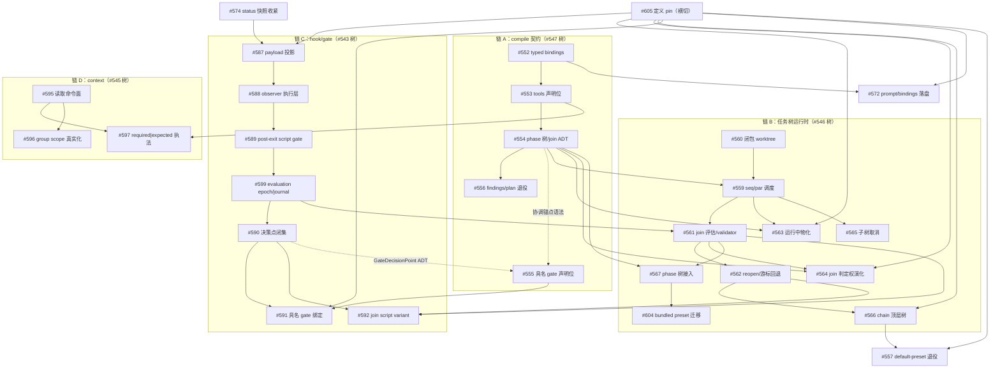

# coder-loop v3 执行编排：实现面串行链与真并行泳道

> 本文件不是 issue 完成清单，也不按 GitHub 子 issue 树或编号排序。它回答三个问题：哪些 issue 之间存在**实现面冲突**因而必须串行合流、哪些工作面**真正不相交**因而可以交给彼此不可见的无状态 agent 并行、合流之后由谁在什么 SHA 上证明接口真的连接。
>
> 基线：2026-07-17。事实来源是三份而非一份——GitHub 实时 issue graph（依赖边）、全部 v3 issue body 与关键 comment 的全文（每个 issue 自己声明的触碰锚点、契约输入与协调条款）、引擎源码的实现面核对（触碰函数在哪个文件、与谁同域）。**只看依赖图不足以判定并行**：依赖图只记录"没有你我无输入"，不记录"你我写同一个函数"与"你我共写同一份契约"。
>
> 范围：v3 六个 RFC umbrella（#543–#548）下 59 个直接子 issue（含 #599/#601–#605）、验收分层 #683/#684/#685、外部仓 issue（`hapi-remote-session#1/#2`、`github-hapi-agent-router#12`、#569 的新 repo）。P0 地基（#534 audit 树）children #535–#542 已全部 CLOSED，#534 伞待最终 main 终验，F10 的 #600 仍 OPEN。

## 1. 并行判定模型

### 1.1 并行成立的三个必要条件

一组 issue 可以由互不可见的无状态 agent 同时实施，当且仅当三条同时成立；任何一条不成立，该组事实上是串行链，把它标成"并行组"只会把冲突成本从计划期推迟到 review/rebase 期：

1. **图上无边**：组内两两之间没有声明的 Depends on / Blocks。
2. **实现面不相交**：组内成员触碰的函数域不重叠。引擎的实现面高度集中——`src/loop.ts`（7151 行）、`src/daemon.ts`（5951 行）、`src/scheduler.ts`（2863 行）、`src/sqlite-state.ts`（1861 行）四个文件承载几乎全部引擎语义；"同文件不同函数"可以靠 rebase 消化（如 #550 的 doc 渲染与 #552 的绑定类型流），"同一状态机的同一批函数"（如 scheduler 的推进/终止/run 收尾路径）不能，后者是同一个语义对象的共同作者。
3. **输入契约已冻结**：每个成员的输入契约在开工前已经存在且不再变动。若组内成员共同书写同一份契约（同一个 schema、同一个 ADT、同一张表的 shape），则"冻结的组输入契约"对该组不存在——它们的输出才是那份契约，这类组只能串行落地或由单一 owner 一次落齐。

三种边的词表沿用：**硬依赖**（下游无上游产物即无输入，跨组）、**协调边**（可并行开发但触同一语义面，先合者定形状、后合者 rebase 并重跑完整验收）、**验收边**（两端各自验收通过仍需第三方 Gate 场景证明连接）。协调边只在"面窄、双方触点是不同函数"时才是真自由度；当协调边落在同一状态机上（scheduler 推进面、run 收尾面、编译产物 shape），它按条件 2/3 降级为串行边。

### 1.2 无状态并行纪律

对满足 1.1 的组：

1. 每个 agent 只读冻结的组输入契约、自己的 issue body 和当前默认分支，不依赖其他 agent 的聊天记录、worktree 或未合并代码。
2. 一个 agent 只负责一个 issue/PR。共写同一契约面的 issue 不进入同一并行组（1.1 条件 3）；面窄且函数不相交的同文件 issue 可并行，PR 合并排队 rebase，禁止人工拼接未验证 diff。
3. 合流验收不由任一实现 agent 自证：per-issue 局部验证按各 issue body「验证边界」节执行；跨 issue 接缝由 #684 在冻结合流 SHA 上以 `scripts/v3-integration.ts` 验证；bundled preset 兼容性由 #685 在发布候选 SHA 上以 real E2E 验证（见 §7）。
4. 验收失败回到拥有断裂契约的 implementation issue 修复，不在验收 issue 或 integration branch 临时写产品修复；修复后从冻结 SHA 重跑对应 checkpoint。

### 1.3 每 issue 实现面审计

判定的原料。触碰面来自各 issue body 的「上下文/锚点」节与源码核对，硬上游只列 OPEN 的（已 CLOSED 上游视为就绪）：

| Issue | 树 | 触碰面 | 硬上游（仅 OPEN） | 同面冲突对象 |
|---|---|---|---|---|
| #550 | #547 | loop.ts doc 渲染声明位（窄） | 无 | — |
| #551 | #547 | loop.ts CLI 全站改名 + daemon.ts wire 字段 + sqlite chains 迁移 | 无 | #557（同迁 chains 表） |
| #552 | #547 | 编译产物 shape（variables）+ loop.ts 绑定类型流 + daemon.ts 创建期准入 | 无 | #553/#554/#555/#556（共写 shape） |
| #553 | #547 | 编译产物 shape（tools 块）+ loop.ts + install-commands.ts | 无 | 同上 |
| #554 | #547 | 编译产物 shape（phases 树）+ loop.ts/preset-dag-check.ts + scheduler.ts 一道 guard | 无 | 同上；#559/#567 消费 |
| #555 | #547 | 编译产物 shape（gate 声明位） | **类型契约耦合 #590**（声明必须引用 GateDecisionPoint 封闭 ADT） | 同上 |
| #556 | #547 | 编译产物 shape（findings）+ fragments + bundled preset | 无 | 同上 |
| #605 | #547 | loop.ts 装载/物化 + daemon.ts 缓存键 + scheduler.ts resume 渲染 + sqlite 事务 | 无 | 横切极宽；被 #563/#564/#566/#572/#587/#591/#557 消费 |
| #557 | #547 | daemon.ts chain create + sqlite chains 迁移 | #566、#605 | #551 |
| #560 | #546 | scheduler.ts worktree 生命周期 + daemon 启动对账 | 无 | #559（同一控制流两半） |
| #559 | #546 | **scheduler.ts 核心推进**（schedulerTick/selectNextItemAndPhase/退避） | #560 | #589/#590/#597/#602（同推进面） |
| #561 | #546 | scheduler.ts join 评估 + daemon.ts 准入 + loop.ts validator CLI | #559、#599 | #592/#564 消费 |
| #562 | #546 | scheduler.ts 游标回退/预算 + daemon.ts createItems | #561、#560 | — |
| #563 | #546 | daemon.ts 物化命令面 + sqlite 容器落库 | #559、#560、#554、#605 | 与 #561/#565 同域 |
| #564 | #546 | daemon.ts 命令面 + 版本追加写通道 | #561、#554、#605 | — |
| #565 | #546 | scheduler.ts 击杀/取消传播 + daemon.ts 命令面 | #559、#560 | 与 #561/#563 同域 |
| #566 | #546 | runtime-data.ts + daemon.ts + scheduler.ts chain-complete 迁移 + loop.ts 退役 | #561、#562、#605 | #557 消费 |
| #567 | #546 | scheduler.ts phase 树展开/trigger 迁移 | #559、#561、#554 | #604 消费 |
| #604 | #546 | **纯 presets/**（两个 bundled preset prompt，零引擎源码） | #560、#554、#567 | — |
| #568 | #546 | docs 收尾 | #559–#567、#604 | — |
| #587 | #543 | loop.ts/observability 投影纯函数（窄） | **#574**、#605 | — |
| #588 | #543 | daemon.ts 事件派发后沿 + hook 进程执行层 | #587 | — |
| #589 | #543 | **scheduler.ts run post-exit 决策点** + stdout decision parse | #588 | #559/#597（同 run 收尾面） |
| #599 | #543 | daemon.ts 幂等层 + sqlite evaluation 状态机 + scheduler.ts 恢复 | #589 | #561 的硬地基 |
| #590 | #543 | scheduler.ts pre-spawn + daemon.ts admission/startup/shutdown/tick | #589 | #555 的 ADT 供方；#559 协调 |
| #591 | #543 | 声明载体扩展 + 绑定解析（窄） | #555、#590、#605 | — |
| #592 | #543 | scheduler.ts join script variant | #589、#590、#561、#562 | 跨 hook+runtime 汇聚点 |
| #593 | #543 | docs 收尾 | 全部上游 | — |
| #595 | #545 | daemon.ts 命令面 + loop.ts CLI + read boundary | 无 | boundary 是 #583 的消费契约 |
| #596 | #545 | daemon.ts admission + 树运行态消费 | 无（#594/#558 已关，shape comment 在手） | — |
| #597 | #545 | **scheduler.ts run 收尾路径**（attachRunCloseHandler）+ daemon.ts + loop.ts doc builder | #595、#553 | **#589 挂同一 run 收尾路径** |
| #598 | #545 | docs 收尾 | #595–#597 | — |
| #574 | #544 | loop.ts StatusSnapshotBoundary 收紧（七匿名槽） | 无（#558 shape comment 在手） | Blocks #575/#580/**#587**/#576 解锁 |
| #572 | #544 | loop.ts spawnOneAttempt 落盘 | #552、#605 | Blocks #581 |
| #576 | #544 | 网关新 app（同仓新目录） | 事实前置 #574 + 严格只读快照路径（见 §2） | GUI 全树宿主 |
| #577 | #544 | 网关 events reader + SSE | #576 | — |
| #578 | #544 | 网关首屏 + daemon 生命周期控制 | #576、#577 | — |
| #579 | #544 | 网关 mutation client 闭集 | #578、**#561** | — |
| #580 | #544 | 网关层级钻取 + 树渲染 | #574、#576、#577 | — |
| #581 | #544 | 网关 prompt 展示 | #572、#552、#580 | — |
| #582 | #544 | 网关编译产物预览 | #576 | — |
| #583 | #544 | 网关 context entries 展示 | #580、**#595** | — |
| #584 | #544 | PWA + 移动收口 | #578、#579、#580 | — |
| #575 | #544 | 快照 hooks 节 + GUI 呈现 | #574、#578、**#590** | — |
| #585 | #544 | docs 收尾 + 红线审计 | #575、#581–#584 | — |
| #602 | #548 | loop.ts runner union + scheduler.ts probe gate + daemon.ts 去重 + sqlite CHECK | 无（在途 PR #676） | #559 协调边（body 自声明） |
| #603 | #548 | hapi runner 接入专用 E2E | #602、`hapi-remote-session#2` | — |
| #569 | #548 | **新独立 repo**（纯 CLI 调用方，与 src/ 零交集） | #551、`router#12`（外部 gate） | — |
| #570 | #548 | #569 的 repo（与 src/ 零交集） | #552、#569 | — |
| `hrs#1/#2` | #548 | 外部仓 `hapi-remote-session` | 无（#418 spike 已 passed） | — |
| #600 | #534 | daemon.ts item.exitAction 归因 | 无 | 与引擎链低冲突，尽早合 |

已 CLOSED 的地基（不再出现在编排里，作为就绪事实引用）：#549（CompiledTaskModel + `preset compile --json`）、#558（任务树运行态全套 SQLite shape + TaskTreeSnapshot，shape 设计 comment 即 #596/#574 的契约输入）、#571（TanStack Start (Bun) 宿主 spike）、#573（events 消费契约导出）、#586（hook 四层声明模型）、#594（context envelope + 写入面）、#601（runner 授权面收敛）、#418（HAPI headless spike）、#535–#542（P0 audit children；各树 body 中「#535/#536/#538 先合、本 child 其后 rebase」的排序条款已因此全部清空）。

## 2. 从审计表得出的结构事实

1. **引擎核心是四条串行链，不是并行波次。** 依赖图自己声明的硬边已经把 #546/#543/#545 树切成串行链（§3）；剩余的"组内自由"全部落在 scheduler.ts/daemon.ts 同一状态机上，按 §1.1 条件 2 不构成并行度。
2. **#552–#556 共写同一份编译产物 shape。** 五个 issue 都修改 `CompiledTaskModel` 的块并演进同一 schemaVersion，每个 body 都要求"PR body 列 shape diff、每次 rebase 重生成全部 compile golden fixtures"。按条件 3，这是契约共同作者组：串行落地（§3 链 A）或单 owner 批量，不派五个互不可见的 agent。
3. **run 收尾/推进面是全仓最热的汇聚点。** #559（推进）、#589（post-exit 决策）、#590（pre-spawn 决策）、#597（收尾执法）、#565（终止）、#567（phase 展开）、#602（probe gate）全部挂在 scheduler 的同一条控制流上；其中 #589 与 #597 直接挂**同一个** `attachRunCloseHandler` 收尾路径。这条面上任意两个 issue 同时开发都是双写同一状态机。
4. **跨树汇聚点使"每树一条泳道"也不成立。** #592 同时依赖 hook 链（#589/#590）与 runtime 链（#561/#562）；#597 依赖 context 链（#595）与 compile 链（#553）；#587 依赖观测面（#574）；#591 依赖 compile 链（#555）；#555 反向依赖 hook 链的 #590 类型契约；#579/#583/#575 把 GUI 钉在 #561/#595/#590 上。树与树在中段互相咬合，唯一贯通的排序是全局一条主链加少量支线（§3）。
5. **GUI 泳道的独立性止于宿主骨架，且今天就被卡住。** #576 已有 review blocked 现场记录：`StatusSnapshotBoundary` 仍是七个匿名槽（#574 未落），且 `buildCoderLoopStatusSnapshot` 打开 SQLite 走 readwrite + WAL pragma + migration，与"网关严格只读 + 复用构建器 + 零引擎改动"三约束互斥。解除方式二选一且都在引擎侧：落 #574 并提供 engine-owned 严格只读快照读取路径，或修订 #576 契约。在此之前 GUI 树没有可启动的实现 issue（#582 除外，它只挂 #576+#549✓，随 #576 解锁）。
6. **真正的并行度在面不相交的泳道**：外部 repo（#569/#570、`hrs#1/#2`→#603）、纯 preset（#604，但它是 runtime 链尾部消费者）、窄面独立项（#550/#600/#602）、各树 docs 收尾。见 §5。

## 3. 引擎串行链

### 链 A：compile 契约（单 owner 域）

顺序 #552 → #553 → #554 → #556；#555 移出本链尾部，与 #590 对齐（见链 C）。理由：四者共写同一 schemaVersion 产物（§2 事实 2），且 #554 是链 B 四个 issue（#559/#563/#564/#567）与 #604 的输入。#549 已落地，链 A 今天即可启动。#605 是横切宽面（loop.ts 装载 + daemon 缓存 + scheduler resume + sqlite 事务），上游 #549/#558 均已关闭，**应在链 A 早期插队落地**——它被 #563/#564/#566/#572/#587/#591/#557 七个下游消费，晚落一天，七个下游的输入契约就悬空一天。

### 链 B：任务树运行时（scheduler 状态机域）

主干 #560 → #559 → #561 → #562 → #566 → #557。#559 与 #560 的 Depends on 互指（#559 消费 #560 的转移调用签名，#560 的 slot 退役以 #559 完成为前提）——同一条控制流的两半，视作紧邻的两级而非并行项。#561 除 #559 外还硬依赖链 C 的 #599（validator 与 script 共用同一 evaluation journal/consumer，避免两套恢复协议），这是链 B 与链 C 的第一个汇合点。支线 #563/#565（等 #559）、#564（等 #561）与主干同落 scheduler/daemon 推进-终止-物化状态机，按 §1.1 条件 2 逐个排队合入，不并行开发；#567（等 #554+#559+#561）与 #604（等 #560+#554+#567）在主干之后。

### 链 C：hook/gate（run 决策面域）

主干 #587 → #588 → #589 → #599 → #590 → {#591, #592}。#587 的输入 #574 未落，是链 C 今天的**唯一卡点**；#574 自身上游已清空（#558 shape comment 在手），立即可做。#589 与链 B 的 #559 是 scheduler 推进面协调边（先合者定接线形态）；#590 拥有 GateDecisionPoint 封闭 ADT，链 A 的 #555 必须引用它——因此 #555 排在 #590 之后或与其同一 owner 协同落地，而不是在链 A 内并行。#592 是 hook×runtime 双链汇聚点（另等 #561/#562），天然是两链主干都完成后的收口项。

### 链 D：context（daemon 命令面域）

#595 →（#596 ∥ #597）→ #598。#595 上游 #594 已关闭，立即可做；其 read boundary 同时是 GUI #583 的消费契约。#596 上游全清（#594✓ + #558✓ shape comment）。#597 除 #595 外等链 A 的 #553，且其执法点挂 `attachRunCloseHandler`——与链 C 的 #589 同一条 run 收尾路径，两者不同时开发：按主链顺序 #589 先落（它定收尾路径的接线形态），#597 其后 rebase。

### 全局关键路径

把汇合点串起来，v3 引擎侧的关键路径是：

**#574 → #587 → #588 → #589 → #599 → #561（另需 #560→#559 就位）→ #562 → #566 → #557**，旁挂 #590 →（#555/#591/#592）与 #567 → #604。链 A 的 #552→#553→#554 必须在 #559/#597 需要之前完成，但它面窄于 scheduler 域，可与 #574/#560 同期推进。

## 4. 跨链汇聚点登记

合流排序时必须显式处理、不能靠"后合者 rebase"糊掉的点：

| 汇聚点 | 参与方 | 处理 |
|---|---|---|
| scheduler run 收尾路径（`attachRunCloseHandler`） | #589（hook 决策点）、#597（context 执法） | #589 先落定形态；#597 其后 |
| scheduler 推进面（tick/spawn/终止） | #559、#589、#590、#565、#567、#602 | 按链 B/C 主干顺序单队列合入 |
| GateDecisionPoint ADT | #590（owner）、#555（引用方）、#591（消费方） | #590 → #555 → #591 |
| evaluation journal/consumer | #599（owner）、#561（validator ingress）、#592（script variant） | #599 → #561 → #592 |
| 编译产物 schemaVersion | #552–#556（共同作者）、#570/#582/#587（消费者） | 链 A 串行；消费者只读最终公开 shape |
| chains 表迁移 | #551、#557 | 不同列；migration 序号后合者 rebase |
| pinned definition 解引用 | #605（owner）、#563/#564/#566/#572/#587/#591/#557（消费者） | #605 尽早落地 |
| status 快照 boundary | #574（owner）、#576/#580/#575/#587（消费者） | #574 尽早落地，同时解 #576 blocked |

## 5. 真并行泳道

与引擎主链实现面零交集或纯消费冻结契约、可全程并行推进的工作：

- **泳道 1 — GitHub ingress 外挂（外部 repo）**：#569（新 repo，等 #551 + 外部 gate `github-hapi-agent-router#12`）→ #570（另等 #552）。与 `src/` 零交集；#551 是引擎侧唯一前置，本身无上游、今天可做（注意其面宽：CLI 改名 + daemon wire + sqlite 迁移，属于"早合减 rebase"项）。
- **泳道 2 — HAPI 远端执行（外部 repo + 窄引擎面）**：`hapi-remote-session#1`（设计书，#418 结论在手）→ `hapi-remote-session#2`（CLI 实现）→ #603（接入 E2E，另等 #602）。#602 有在途 PR #676，其 scheduler probe gate 与 #559 是协调边，进 §4 推进面队列。
- **泳道 3 — GUI**：解锁条件是 #574 + 严格只读快照路径（§2 事实 5）。解锁后内部仍是串行主干 #576 → #577 → #578 → {#579, #580} → {#581, #583, #584} → #585，只有 #582 可随 #576 早做；#579/#583/#575 分别在 #561/#595/#590 落地前不能收口。GUI 作为整体与引擎面不冲突（新目录 + 只读消费），但它不是"随时可开工的并行容量"，而是消费端队列。
- **泳道 4 — 窄面独立项**：#550（doc 渲染声明位）、#600（exitAction 归因，audit 尾单）、#556（随链 A）。同文件不同函数，低冲突，可穿插。
- **泳道 5 — docs 收尾**：#568/#593/#598/#585 各在所属链全绿后执行，互相独立。

实际可持续的并行度：**引擎主链一条（§3 全局关键路径上始终只有一个在途实现 PR + 紧邻的下一个在准备）+ 泳道 1/2 各一条 + 泳道 4 穿插**；GUI 在 #574 落地后加入为第四条。超过这个并行度的新增 agent 只会在 scheduler/daemon/shape 三个热面上制造互相作废的 diff——P0 audit 树已经实证过这一点：#534 明言 children"无语义依赖可全部并行"，但共触 daemon.ts/scheduler.ts 的 #535/#536/#538 在实际执行中经历多轮 changes-requested 与 chain exhausted，最终逐个串行合流。

## 6. 立即可启动集合（2026-07-17）

上游全部就绪、按 §3/§4 排序今天就能开工的 issue：

| 启动项 | 泳道/链 | 备注 |
|---|---|---|
| #605 | 链 A 插队 | 七个下游等它；横切宽面，最高优先 |
| #552 | 链 A 首位 | 其后 #553 → #554 → #556 依次 |
| #574 | 观测面 | 同时解 #587（链 C 卡点）与 #576（GUI blocked） |
| #560 | 链 B 首位 | 其后 #559 |
| #595 | 链 D 首位 | read boundary 即 #583 契约 |
| #596 | 链 D | 上游全清 |
| #551 | 泳道 1 前置 | 宽面早合 |
| #550、#600 | 泳道 4 | 窄面穿插 |
| #602（续 PR #676） | 泳道 2 | probe gate 进推进面队列 |
| `hapi-remote-session#1` | 泳道 2 | 外部仓 |

不可启动但常被误判为可启动的：#555（等 #590 的 ADT）、#597（等 #553/#595 且让位 #589）、#563/#565（等 #559，且与之同域排队）、#576（等 #574 + 只读路径裁决）、#572（等 #552/#605）。

## 7. 合流验收：#683/#684/#685 三层分离

验收归属由 #683 伞裁定，实施细节以 #684/#685 的 issue body 为准；本节只登记编排侧的分工与场景源。

- **per-issue 局部验证**：每个 implementation issue 只验证自己新增的行为，按其 body「验证边界」节执行（真实 daemon + 隔离 loop-data + 确定性 runner 的进程级 integration，或 boundary/contract 级）。implementation issue **不运行** `bun scripts/real-e2e.ts`，也不为整链路负责。
- **#684 — v3 整链路 integration**：各链在一个 checkpoint 的 required issue 全部落到同一默认分支 SHA 后，由未参与实现的验证 agent 在冻结 SHA 上运行 `bun scripts/v3-integration.ts --checkpoint <名>`，用非 GitHub、非 bundled 的 v3 preset 证明跨 issue 接缝真实连接。失败归属回拥有断裂契约的 implementation issue。
- **#685 — bundled preset compatibility real E2E**：发布候选 SHA 上运行 `bun scripts/real-e2e.ts --preset real-e2e-minimal` 与 `--preset gh-issue-pr-iteration`，只回答"现有生产 GitHub 工作流是否兼容"，不替代 #684，也不被 #684 替代。

### #684 的 checkpoint 场景（本文件是其 design source）

| Checkpoint | 就绪条件（required issue 全合流） | 场景要点 |
|---|---|---|
| `contracts` | #605、#574、#572、#595 + 链 A 全部 | 同一最小 preset：compile 产物、SQLite 树运行态、`status --json` 三处 task identity 可关联；`prompt.md`/`bindings.json`/events/status 以同一 runId/phase/attempt 关联；boundary schema round-trip，消费者零私有补丁；修改同路径 preset 为 H2 后 kill -9/restart，旧实例仍绑定 H1 |
| `compile` | 链 A + #559 消费端首连 | 非 bundled Gate preset 一次编出 typed bindings/任务树/join ADT/toolRequirements/gate 引用/findings，全部稳定 ID 可连接；scheduler 只消费编译产物启动 par，不二次解析 TOML；required binding 缺失在创建期失败 |
| `task-tree` | #559–#566 主干 | 两层 seq/par 真实重叠执行（记录时间窗，不以"最终都跑过"冒充）；运行中派生 correction leaf、取消子树不污染兄弟；validator 首答 reopen 使游标回退、二次 advance 前下游绝未 spawn；chain-complete 走顶层 join |
| `gates` | 链 C 主干 + #597 + #592 | 具名 gate 经 compile 进四层生效视图，脚本 stdin 的 task/gate identity 与 compile 输出一致；post-exit hold 阻推进、advance 放行；required 工具漏调用则 run 不能完成、补跑后完成；fingerprint 与 evaluation epoch 正交 |
| `recovery` | 与 task-tree/gates 同 SHA | daemon 在 hold/在途状态重启：恢复 pinned definition、tree cursor、evaluation epoch、context 与事件因果链，不重复 spawn、不重复插入 correction |
| `consumers` | GUI 主干 + ingress 泳道 | hold/reopen/violation/外部请求结果经正式 events/status boundary 到达网关实时流；GUI 不读私有表；ingress 非法请求在 daemon 停机时也被消费 daemon 点名拒绝，合法请求恰创建一次 item；PC 与 mesh 移动端完成观察与解卡动作 |

全部 checkpoint 在同一冻结 SHA 与同一 loop-data-root fixture 上完成；分别运行的 mock demo 拼不成通过。

### RFC 伞关闭顺序

1. #547（compile）→ 2. #546（runtime）→ 3. #543 与 #545（hook/context，可并行复核）→ 4. #548（等外部 router、消费 daemon、HAPI runner 实证）→ 5. #544 最后（GUI 是集成消费者，提前关闭会掩盖接缝缺口）。六伞的关闭复核全部引用 #684/#685 证据；#534 伞在 audit children 之外还需 main 上复现 driver + `bun test` + real-e2e 终验，与 #685 同一发布候选系列执行。

## 8. Issue 覆盖核对

- #543：#586（closed）、#587–#593、#599。
- #544：#571（closed）、#572–#585。
- #545：#594（closed）、#595–#598。
- #546：#558（closed）、#559–#568、#601（closed）、#604。
- #547：#549（closed）、#550–#557、#605。
- #548：#418（closed）、#569、#570、#602、#603、`mouriya-s-lab/hapi-remote-session#1/#2`、外部 Gate `github-hapi-agent-router#12`。
- 验收层：#683、#684、#685。
- P0 尾单：#600（F10）；#534 伞终验。

任何新增 v3 issue 必须先按 §1.1 三条件判定：它落在哪条链/哪条泳道、触碰哪些实现面（§1.3 表加行）、参与哪些汇聚点（§4）、进入 #684 哪个 checkpoint 的 required 集合。只挂到 RFC tree 不构成可执行编排；只看依赖图无边就宣布可并行，同样不构成。
