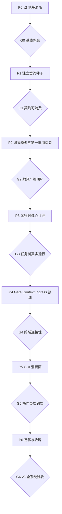

# coder-loop v3 无状态任务组与连接性 Gate 编排

> 本文件不是 issue 完成清单，也不按 GitHub 子 issue 树或编号排序。它定义的是：哪些 issue 可以交给彼此不可见的无状态 agent 并行实施、这些产物何时合流，以及合流后必须怎样证明接口真的连接起来。
>
> 基线：2026-07-10 GitHub 实时 issue graph（含同日 #548 设计修正后预建的 #602、#603、`hapi-remote-session#2`）。v3 六个 RFC umbrella（#543–#548）下共 55 个直接子 issue；连同 umbrella 共 61 个 issue，当前 60 open、1 closed（#571）。

## 1. 执行模型

### 1.1 三种边

本编排只承认三种边，不能把 GitHub tree 误当执行 DAG：

- **硬依赖**：下游没有上游产物就不存在可实现输入，必须跨组。例如 #567 必须消费 #554 的 phase tree 声明与 #559/#561 的运行语义。
- **协调边**：可以并行开发，但触碰同一语义面或文件；先合者确定形状，后合者必须 rebase，并由连接性 Gate 验证组合。例如 #559 与 #589/#590 都触碰 scheduler 推进点。
- **验收边**：两个任务各自满足自己的 Acceptance Criteria 仍不足以证明整体成立；必须由一个不属于任一实现任务的 Gate 场景把两端连起来。例如 #553 声明 `toolRequirements` 与 #597 运行期执法。

### 1.2 无状态并行组规则

一个任务组内的实现 agent：

1. 每个 agent 只读冻结的组输入契约、自己的 issue body 和当前默认分支，不依赖其他 agent 的聊天记录、worktree 或未合并代码。
2. 一个 agent 只负责一个 issue/PR；共享文件并不自动取消并行，但 PR 合并必须排队 rebase，禁止靠人工拼接未验证 diff。
3. 组内任务可以同时开发；只有全部 required task 落到同一个默认分支 SHA 后，才运行该组 Gate。
4. Gate 由新的无状态验证 agent 执行，不由任一实现 agent自证。验证 agent只拿：冻结 SHA、Gate 场景、本仓规则和公开 issue/PR 证据。
5. Gate 失败不是“补文档”：必须定位断开的生产者/消费者契约，回到对应 issue PR 修复，或开一个有明确 owner 的 correction issue；修复后从冻结 SHA 重新跑整个 Gate。
6. Gate 产物至少包含：输入 SHA、真实命令、fixture/配置、观察到的跨边界值、失败诊断。单元测试、typecheck、静态 grep、分别展示两端输出都不能单独算连接性证明。

### 1.3 合并纪律

- 每组设一个 **integration branch/worktree**，只用于按既定次序合并已通过各自 issue 验收的 PR；不在 integration branch 临时写产品修复。
- 同组 PR 的推荐合并顺序写在任务组中。发生冲突时后合者 rebase 并重跑自己的完整验收，不允许只解决文本冲突。
- 每个 Gate 都在合并后的单一 SHA 上执行。Gate 通过后该 SHA 成为下一组的唯一输入基线。
- 调度、worktree、终止、resume、preset 加载路径发生变化的组，Gate 必须包含 `bun scripts/real-e2e.ts`，并实际观察 PR MERGED / issue CLOSED。

## 2. 总体波次

## 3. P0 — v2 地基清场（不计入 v3 功能，但约束 v3 起跑线）

### 并行任务组 P0-A

- #535、#536、#537、#538、#539、#540、#541、#542（#534 audit children）。
- 可以并行开发；触碰 `src/daemon.ts` / `src/scheduler.ts` / `dev-loop.md` 的后合者 rebase。
- v3 的 #550 至少等待 #539；#551、#557 至少等待 #535/#536/#538。为避免在已知缺陷地基上扩张，推荐整个 #534 Gate 关闭后再冻结 v3 基线。

### G0 — 基线冻结 Gate

**目的**：证明 v3 不是建立在已知 scheduler/daemon 失败上。

1. 在同一默认分支 SHA 上运行 `bun run typecheck`、`bun test`。
2. 运行 #534 各复现 driver，确认已知缺陷不再复现。
3. 运行 `bun scripts/real-e2e.ts`，观察真实 agent spawn → iteration → review → PR MERGED → issue CLOSED。
4. 保存当前 SQLite schema version、`status --json` boundary fixture、events fixture、preset compile 前的 preset fixture，作为后续 Gate 的 before 基线。

**放行条件**：四项均来自同一 SHA；否则 P1 不进入合并阶段。

## 4. P1 — 独立契约种子

这些任务没有 v3 树内硬上游，适合由互不可见的无状态 agent 同时实施。

### 并行任务组 P1-A：引擎契约种子

| Issue | 交付契约 | 后续消费者 |
|---|---|---|
| #549 | `CompiledTaskModel` + `preset compile --json` + schemaVersion | #552–#556、#567、#570、#582、#587 |
| #605 | 运行实例绑定事前可计算的不可变执行定义 | daemon 重启恢复、status/events/hook/GUI 历史定义一致性 |
| #550 | doc 渲染声明驱动化 | bundled/non-bundled preset 一致性 |
| #551 | GitHub 记法与 repository 原语退役 | #569 的稳定 CLI 调用面 |
| #558 | 任务树运行态持久化与 status tree shape | #559、#561–#566、#574、#596 |
| #560 | per-闭包 worktree 生命周期；suspend 零 GC；consumed 后回收 | #559 并行调度 |
| #572 | `prompt.md` + `bindings.json` 落盘 | #581 |
| #573 | events boundary 与滚动段消费规则 | #577 |
| #586 | 四层 hook 声明合成与生效视图 | #588、#589、#591、#575 |
| #594 | context envelope ADT、append-only 存储、写入面 | #595–#598 |
| #602 | 外部执行终端缺席语义：`hapi` kind 词表准入 + 显式警告 + hold | #603、#559 调度面（协调边） |

推荐合并顺序：#550 → #551 → #549 → #558 → #605 → #560 → #572 → #573 → #586 → #594 → #602。顺序是为了压低共享核心文件的 rebase 风险，不代表开发串行。

### 并行任务组 P1-B：独立宿主/可行性

- #576：GUI 网关骨架（其硬上游 #571 已关闭）。
- #418：HAPI headless runner spike；结论是 `hapi-remote-session#1` 设计书与实现线的输入（实现 children #602/#603/`hapi-remote-session#2` 已按操作员 2026-07-10 裁决预建，不再由 spike gate 创建；If failed 走 #548 设计修正改写或关闭它们）。
- `github-hapi-agent-router#12`：不是 coder-loop 子 issue，但它是 #569 端到端关闭证据的外部硬 Gate，应与 P1 同时推进。

### G1 — 契约可消费 Gate

**不是检查“九个 PR 都合了”**，而是用一个新的消费者验证这些契约能同时存在：

1. 用同一个最小 preset 编译出 `CompiledTaskModel`，构造 `seq(leaf, par(leaf, leaf))` 运行态，再由 `status --json` 读取；断言 task node identity 在 compile 输出、SQLite、status 三处可关联，而不是三套临时 ID。
2. 用该运行态创建一次真实 run，断言 `prompt.md`、`bindings.json`、events、status snapshot 都以同一 `runId/phase/attempt` 关联。
3. 为同一 chain 写一条 context entry、装载四层 hook 声明；断言 status 中的引用不会丢失 chain/item/run 身份，也不出现匿名 object 或未解析自由字符串。
4. GUI 网关只读消费上述 status/events fixture；禁止 SQLite 写入，禁止 GUI 自己猜测缺失字段。
5. 对 compile/status/events/context/prompt 的 boundary 做 schema round-trip；任何消费者需要私有补丁、字段猜测或 fallback 才能读取即 Gate 失败。
6. `bun test` + `bun scripts/real-e2e.ts` 绿。
7. 用定义 `H1` 创建运行实例后修改同路径 preset 为 `H2`，kill -9/restart daemon；旧实例仍绑定 `H1`，新实例才使用 `H2`，所有消费者报告各自相同的 definition identity。

## 5. P2 — 编译模型真实化与第一批消费者

### 并行任务组 P2-A：向编译产物填充真实语义

共同硬上游：#549 / G1。

- #552：typed bindings、required 与缺失语义。
- #553：`[[tools]]` 与 per-phase `toolRequirements`。
- #554：phase `seq/par` 递归任务树与 join ADT。
- #555：具名 gate 点声明位。
- #556：dead-fragment findings 与 plan 面退役。

五项可以并行开发，但都修改编译产物 shape。合并顺序建议 #552 → #553 → #554 → #555 → #556；每次 rebase 后必须重新生成全部 compile golden fixtures，schemaVersion 只按最终公开 shape 演进，不能让消费者依赖中间私有 shape。

### 并行任务组 P2-B：首批独立消费者

- #559：等待 #558 + #560；实现 seq/par 调度和 slot 退役。
- #574：等待 #558；收紧 status snapshot boundary。
- #587：等待 #549；定义 hook stdin payload = 编译产物投影 + 运行态快照。
- #595：等待 #594；context 分页读取 boundary。
- #569：等待 #551；可先做本地 1–4 行验收，关闭仍被 `github-hapi-agent-router#12` 端到端 Gate 阻塞。
- `hapi-remote-session#1`：等待 #418 结论作为输入后启动设计书；其后 `hapi-remote-session#2`（CLI 实现）→ #603（hapi runner 接入，另等 #602）串行推进。

### G2 — 编译产物闭环 Gate

用一个 **非 bundled** 的 Gate preset，禁止使用 `gh-issue-pr-iteration` 已知名字或字段：

1. preset 同时声明 typed bindings、`seq/par` phase tree、required/expected tools、具名 gate 和一个故意不可达 fragment。
2. `preset compile --json` 必须一次产出：精确 binding 类型/required、任务树、join ADT、tool requirements、gate references、findings；所有引用可由稳定 ID 连接。
3. scheduler 只能消费编译产物启动 `par` 分支；不得二次解析 TOML 或按 phase 名特判。
4. hook payload 从同一 compiled model 投影；status tree 从同一 task identity 投影；GUI skeleton 和第三方预校验 fixture 能在各自 boundary parse 后读取，不能各造 adapter 猜字段。
5. required binding 缺失在创建期失败；dead fragment 只按已裁语义形成 finding；非法 join/gate/tool 引用在 load/compile 期失败，不能进入调度。
6. 运行 `bun scripts/real-e2e.ts --preset real-e2e-minimal`，证明原有线性 preset 仍可执行。

## 6. P3 — 任务树运行时核心

P3 必须拆成两个并行组，中间有一次核心合流；不能把 #561–#567 全扔给同一轮并行 agent。

### 并行任务组 P3-A：树调度后的正交能力

共同硬上游：#559 / G2。

- #561：par join 评估、validator、drain/hold。
- #563：运行中 leaf → par 物化与 `createItems` 作用域。
- #565：子树取消传播。
- #567 暂不进入本组：它还依赖 #561 与 #554，是合流消费者。

#561、#563、#565 可并行；后合者必须针对并发完成、取消、动态追加三者组合重新跑 integration tests。

### 并行任务组 P3-B：join 能力展开

在 #561 合并后启动：

- #562：reopen、纠正追加、seq 游标回退、级联再验证、预算耗尽。
- #564：join 声明运行时 control-plane 化。
- #567：等待 #554 + #549 + #559 + #561；把 preset phase tree 接入真实 scheduler。

#562、#564、#567 可并行开发，但 #566 不能提前启动。

### 串行合流任务 P3-C

- #566：等待 #558 + #561 + #562；chain 顶层任务树、顶层 join、chain-complete 迁移。

### G3 — 任务树真实运行 Gate

使用真实 daemon + 真实 agent，构造一个同时覆盖两个并行层次的 preset：

1. chain 顶层为 `seq(A, par(B, C), D)`；B 的 phase tree 也是 `seq(prep, par(implementation, independent-review), integrate)`。
2. B/C 必须各持有独立 per-run worktree 并真实同时在途；记录重叠时间窗口，不能用“最终都运行过”冒充并行。
3. 运行中由 B 派生一个平行 correction leaf；取消 C 的子树；断言取消不污染 B，新 leaf 被同一 par join 纳入。
4. validator 第一次返回 reopen，插入 correction 并使 seq 游标回退；第二次 advance 后才允许 D 开始。验证 D 在第一次 validator 后绝未 spawn。
5. daemon 中途重启；从 SQLite 恢复 tree cursor、container identity、在途/终态，不重复 spawn 已完成 leaf。
6. chain-complete 通过顶层 join 完成，不再依赖旧 stdout token；`status --json` 与 events 能重建上述因果链。
7. 最后运行标准 `bun scripts/real-e2e.ts`，证明 GitHub preset 不回归。

## 7. P4 — Gate、Context 与 Ingress 接线

### 并行任务组 P4-A：hook 执行骨架与 context 执法

- #588：等待 #586 + #587；observer 异步执行层。
- #596：等待 #594 + #558；group scope 对接真实 par container identity。
- #597：等待 #594 + #595 + #553；required/expected tool 调用执法。
- #570：等待 #549 + #552 + #569；第三方 daemon 用 compiled model 预校验请求。
- #577：等待 #573 + #576；events 增量读取与推送。
- #582：等待 #549 + #576；compiled model 预览。

### 串行骨干 P4-B：script gate

- #589：等待 #586 + #587 + #588；先只贯通 run post-exit gate。
- #590：等待 #589；物化决策点闭集、tick 节流、hold fingerprint 泛化。

这两项是同一执行骨干，必须串行，不能因 issue tree 同级而并行。

### 并行任务组 P4-C：统一 gate 的两个消费者

共同硬上游：#590 + G3。

- #591：另等 #555 + #586；preset 具名 gate 绑定与未绑定语义。
- #592：另等 #561 + #562；join script validator 与 reopen 派发。

### P4-D：后置 schema 迁移

- #557：只在 #566 合并后实施 chain metadata 精确 parse、`DEFAULT_PRESET_NAME` 退役。它虽然属于 #547 tree，却是运行时顶层声明的消费者，放在这里而不是按编号放在 P2。
- #564：运行中修改 join 等同于 future-function mutation，语义仍待操作员讨论；讨论完成前不得实施，也不得把普通字段原子写或 #599 evaluation epoch 当成裁决。

### G4 — 跨域连接性 Gate

这个 Gate 专门检查“各领域各自正确，但串起来不工作”的风险：

1. **Compile → Hook**：preset 中的具名 gate 经 compile 输出进入四层合成生效视图；脚本收到的 stdin 中 task/gate identity 与 compile 输出完全一致。
2. **Hook → Scheduler → Task tree**：run post-exit 脚本达到阈值后通过 CLI 插入检查 leaf 并返回 hold；scheduler 不推进原 seq。检查 leaf 通过后返回 advance，原 seq 才继续。
3. **Script validator → reopen**：par join 绑定 script gate；第一次返回 `reopen(target, corrections)`，correction 经 CLI 插入并真实运行，第二次 advance 后 join 才完成。
4. **Context → Required tool enforcement**：两个互不可见的并行 agent 分别写/read group-scoped entry；漏调用 required 工具的 run 不能完成，补跑后能完成；expected 只产生已定义的非阻塞结果。禁止用共享 worktree 文件代替 context CLI。
5. **Ingress → Compile → Daemon**：GitHub 外挂发送一条合法和一条缺 required/type 错误请求；非法请求在 coder-loop daemon 停机时也能由消费 daemon 点名拒绝，合法请求在 daemon 启动后只创建一次 item。
6. **Events → GUI**：上述 hold、reopen、context/tool violation、外部请求结果都通过正式 events/status boundary 到达网关实时流；GUI 不读私有表、不推断缺失状态。
7. daemon 在 hold 状态重启，恢复后不得重复插入 correction，不得丢失 fingerprint/context/container identity。
8. 全场景在一个冻结 SHA 和同一个 loop-data-root fixture 上完成；分别运行六个 mock demo 不算通过。

## 8. P5 — GUI 消费面

### 串行骨干 P5-A

- #578：等待 #576 + #577；首屏 daemon 三证活性与生命周期控制。
- #579：等待 #578；控制面解卡动作与 F 档写入口收口。

### 并行任务组 P5-B

在 #578 合并后可并行：

- #580：等待 #574 + #576 + #577；全链路层级与 task tree。
- #575：等待 #574 + #578 + #586 + #590；hooks/gate hold 可见性。

### 并行任务组 P5-C

在 #580 合并后可并行：

- #581：另等 #572；per-attempt prompt 与 bindings。
- #583：另等 #595；context entries。
- #584：另等 #578 + #579；移动端/PWA，并复用 #580 深层浏览模型。

### G5 — 操作员端到端 Gate

1. 启动真实 daemon 与网关，从 PC 和 mesh 内移动端分别打开。
2. 在一个执行 G4 场景的 chain 上，首屏能回答“daemon 是否活着、哪个 chain 在跑、为什么 hold”；不能只显示绿色进程灯。
3. 从 chain 下钻到 item → task tree → run → phase/attempt，看到与 events 相同的并行、reopen、correction 因果顺序。
4. 打开某 attempt，展示当时真实 `prompt.md` 和 typed bindings；修改当前 item 后历史 attempt 内容不得漂移。
5. 展示 group context entries，scope 过滤正确，跨 chain 不可见。
6. 从 GUI 执行一个允许的解卡动作，确认走 daemon RPC、事件有审计记录；验证网关无 SQLite 写路径。
7. 手机端完成：判断运行状态、定位 hold 原因、执行允许的解卡动作。仅“页面能响应式打开”不算通过。

## 9. P6 — 外部通道、文档与 RFC 收尾

### 并行任务组 P6-A：末端实现与文档

- 完成 `hapi-remote-session#2` 与 #603 后，执行 #548 关闭验证行 7 双腿验收：① 真实 item 以 runner=hapi 在真实远端 session 完成 run；② 缺席场景显式警告 + hold + 恢复执行（#602）。不得以设计书替代真实远端 session。
- #568：等待 #558–#567、#601、#604 全部完成。
- #593：等待 #586–#592 全部完成。
- #598：等待 #594–#597 全部完成。
- #585：等待 #575、#581–#584 全部完成。

### RFC 关闭顺序

1. #547：compiled model/type system 关闭复核。
2. #546：task model/runtime 关闭复核。
3. #543 与 #545：hook/context 关闭复核，可并行。
4. #548：等待外部 router、消费 daemon、HAPI runner 实证后关闭。
5. #544：最后关闭；GUI 是其他主线的集成消费者，提前关闭会掩盖接缝缺口。

### G6 — v3 全系统验收 Gate

必须由未参与实现的无状态 agent 在干净 checkout 上执行：

1. 从零装载一个非 GitHub、非 bundled 的 v3 preset：typed bindings、两层 seq/par、agent validator、script gate、required context tool 全部只由 meta 声明。
2. 通过正式第三方 CLI 契约创建 chain/item，不传 prompt；外部输入经 compiled model 预校验。
3. 真实 daemon 运行任务，证明并行重叠、独立 worktree、context 传递、hold/reopen/correction、重启恢复和顶层 join。
4. GUI 在 PC/移动端完整观察并操作该运行，历史 prompt/bindings 可复核。
5. 再跑 `gh-issue-pr-iteration` 全保真 real-e2e，观察 PR MERGED / issue CLOSED，证明 v2 生产 preset 在 v3 引擎上仍成立。
6. 运行 HAPI runner 真实远端 session 路径；退出码、status、worktree 生命周期与其他 runner 同构。并验证缺席场景：终端不可达时 daemon 显式警告、item hold 不消耗 attempt、恢复后无人工干预继续执行。
7. 删除 chain 后验证 context 生命周期收敛；检查 daemon/router/GUI 没有 GitHub 业务字面量反向渗入 L1。
8. `bun run typecheck`、`bun test`、所有 boundary fixture 和 schema migration fixture 绿。
9. 运行中修改 preset 后重启 daemon，旧实例的执行定义不得漂移；该证明只能依赖 #605 的事前可计算不可变定义绑定，不得引入运行态 MVCC/事务快照。

**最终放行标准**：每项证据来自同一发布候选 SHA/版本；任何一项只能靠 README、mock、静态类型或某个实现 agent 的会话记忆解释，都不算 v3 已连接。

## 10. Issue 覆盖核对

本编排覆盖的 v3 children：

- #543：#586–#593。
- #544：#571（已关闭）、#572–#585。
- #545：#594–#598。
- #546：#558–#568、#601、#604。
- #547：#549–#557、#605。
- #548：#418、#569、#570、#602、#603、`mouriya-s-lab/hapi-remote-session#1`、`mouriya-s-lab/hapi-remote-session#2`；并显式纳入外部 Gate `github-hapi-agent-router#12`。

任何新增 v3 issue 必须先确定它属于哪一任务组、有哪些硬依赖/协调边/验收边，以及修改哪个 Gate；只挂到 RFC tree 不构成可执行编排。
