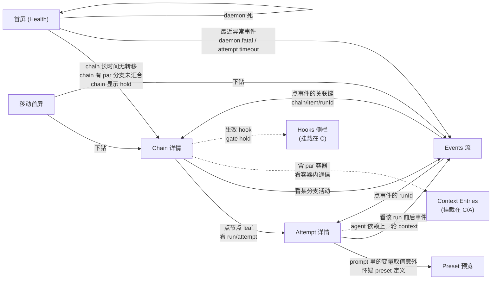

# coder-loop v3 GUI 业务流梳理

> 目的：把"操作员什么时候打开 GUI、想回答什么问题、按什么按钮、什么时候关掉"钉死。禁止直接把 chain/item/run/entries 表的数据契约摊开陈列。所有论断可回指 issue 编号 + 大意，推断处标 [推断]。

## 权威源速查

| 源 | 大意 |
|---|---|
| v3-goals.md 目标 1 | GUI，PC + 移动端，一眼可见跑没跑，全链路展示，prompt 展示 |
| v3-goals.md 目标 3 | 全链路类型化 → 状态机判定可预览 |
| v3-goals.md 目标 4 | 零原语纯 meta 定义 + context 共享 CLI |
| v3-goals.md 目标 5 | 生命周期 hook — observer + gate，operator 侧脚本 |
| #544 | GUI RFC：mesh-only 网关进程 · 三数据面 · 三证探针 · F 档控制面闭集 · SSE/WS 推送 |
| #546 | 任务代数 `leaf | seq | par(join)`；join `drain | validator`；decision `advance | hold | reopen`；per-run worktree |
| #547 / #549 | `coder-loop preset compile --json` 六块编译产物（GUI 元信息预览唯一数据源）|
| #543 | hooks observer / gate；四层声明（global/chain/preset/item）；hold 语义 |
| #545 | context entries；envelope 类型化 body 不透明；三 scope `item / chain / group`；required / expected |
| #558 | 任务树运行态持久化 shape；status 快照树结构；单 chain 多活 run 成立 |
| GUI children #571–#585 | 每 issue 一个 GUI 能力切片，本文件动作出处 |

---

# 第一部分 操作员画像与场景总表

## 1.1 画像

**唯一用户**：操作员本人（dogfood 环境）。跑多条 chain 做 GitHub issue → PR 迭代；同一台 Mac 起 daemon + GUI 网关；从 PC 浏览器与 mesh 内手机 PWA 两个客户端消费同一网关（依据：#544 架构节 + 关闭验证行 6/8）。

- **不是 preset 作者**（大多数时候）。但在写 preset / 排查 preset 时切换到 preset 作者角色。依据：v3-goals 目标 3、#582 使用场景。
- **不是终端拒绝者**。CLI 与 GUI 并存：创建类（chain create / item add / batch）显式在 v3 GUI 外由 CLI + agent 完成（#544 F 裁决"创建类重交互留给 CLI/agent，不进 v3"）。GUI 是运维+观测面。
- **信任模型是 mesh-only 裸信任**：GUI 只在 localhost + netbird 接口监听，无鉴权（#544 D 裁决）；因此"手机上一键处置"是合法运维路径。

## 1.2 场景总表（按频率降序）

| # | 场景 | 频率 [推断] | 依据（issue 编号 + 大意引用） |
|---|---|---|---|
| S1 | 例行瞥一眼健康度 | 高（每日多次） | #544 目标 verbatim："一眼就知道跑没跑"；#544 关闭验证行 1；#584 使用场景"例行瞥一眼" |
| S2 | daemon 死后一键拉起 | 中（每次 app 更新 + 每次崩溃） | #544 裁决 A 理由"补上 `daemon-restart-after-app-update` 的运维闭环"；关闭验证行 2；#578 使用场景 |
| S3 | 移动端异常处置 | 中（不在电脑前时） | #544 F 裁决理由"手机场景 = 看见异常当场处置"；#584 使用场景 |
| S4 | 深查某次 attempt 为什么错 | 中低（每周若干次） | #544 目标 verbatim："还得有 prompt 展示"；关闭验证行 4/5；#581 使用场景 |
| S5 | gate hold / blocked 卡链调查 | 中低（hook 落地后频率上升） | #543 body"这个 chain 为什么不动"隐含；#575 使用场景；#579 使用场景（`queue.unblock`） |
| S6 | 调查上一轮 agent 给下一轮传了什么（context entries）| 低（#545 落地后） | #583 使用场景"上一轮 agent 给下一轮留了什么" |
| S7 | preset 作者调试编译产物 / 状态图预览 | 低（写 preset 时） | v3-goals 目标 3 verbatim"GUI 可预览"；#582 使用场景；#544 关闭验证行 9 |
| S8 | 观察并行分支进展（#546 落地后） | 中（含 par 的 preset 上线后频率上升） | #544 接口假设 RFC-1"活 run 并行分支 = par 内多 leaf 各自的 run"；#580 使用场景（含 par 树 fixture） |
| S9 | item 顺序调整 / 主动停链 | 低 | #544 F 档 `chain.stop`/`chain.resume`/`item.reorder`；#579 使用场景 |

**不进 GUI 的动作**（列出为设计边界）：chain create、item add、item batch-add、preset 编辑、hook 脚本编辑、context entries 写入（只读展示）、join 策略运行时改写（#546 已声明为 control-plane 但 #544 F 档未收编）。依据：#544 F 裁决 + #544 范围外节。

---

# 第二部分 每个场景的业务流

## S1 例行瞥一眼健康度

### 触发
- 无外部触发；操作员主动打开首屏（PC 浏览器或手机 PWA）。这是操作员对 dogfood 环境的"心跳感"，频率高但每次时长短。依据：v3-goals 目标 1 verbatim"看一眼就知道跑没跑"。

### 要回答的问题序列
1. **daemon 活着吗？** — 一眼可判。三证（pid 文件、socket connect、`daemon.status` 应答）不折叠布尔，任一分裂状态如实显示（依据：#578 预期结果 1；#544 架构节"三证呈现给前端而非折叠成一个布尔"）。
2. **各 chain 有活 run 吗？** — 每 chain 是否有正在跑的 attempt（依据：#544 信息架构"每 chain 的活 run/最近转移"）。
3. **有没有异常在冒？** — 最近异常事件（`daemon.fatal` / `scheduler.tick_failed` / `attempt.timeout` 等）与 rate-limit 冷却状态（依据：#544 信息架构；#578 预期结果 5）。
4. **[有 par 的 preset 后] 有没有 par 分支落到 exhausted 或 hold？** [推断] — #558 shape 承诺容器级 reopen 计数与状态可读；#575 承诺 hooks 节含 hold 状态。首屏是否直接呈现 par-container 异常需要具体设计决策。

### 决策点
- 三证全绿 + 无异常 + 各 chain 都在动 → **关掉窗口**，回去干别的事。这是最常见的退出路径。
- 三证有分裂（pid 活 socket 死等） → 走 S2（daemon 恢复）。
- 有最近异常事件 → 走 S4 或 S5（钻取到具体 attempt 或调查 hold）。
- 有 chain 长时间无转移 [推断，无明确 RFC 定义"长时间"阈值] → 走 S5。

### 可执行动作
本场景**不做**任何写动作。首屏是读面。如果决定处置，跳到 S2/S3/S4/S5。

### 退出条件
- 三证全绿 + 无异常 + 各 chain 有正常进展 → 关闭。
- 判定需要处置 → 跳到相应场景（非 S1 的退出）。

### 涉及的 v3 概念（错误呈现会误导决策的点）
- **三证独立**（#544 架构节、#578 预期结果 1）：折叠成单布尔会让 #359 型"进程活/socket 死"分裂状态被误判为"活"或"死"。
- **daemon 死 vs 断网可区分**（#544 信息架构"网关仍应答即非断网"）：错乱会把网络问题误诊为 daemon 崩溃。
- **rate-limit 冷却**（#544 信息架构，`daemon.status.rateLimit`）：不显示会让操作员误认为 daemon 卡死。
- **每 chain 活 run 而不是 slot**（#544 接口假设 RFC-1"slot 语义退役，不再是展示对象"）：以 slot 呈现会与 #546 任务树语义打架。

---

## S2 daemon 死后一键拉起

### 触发
- **规律触发**：`app/coder-loop` 每次同步后必须重启 daemon（依据：repo 规则 `daemon-restart-after-app-update`）。GUI 一键路径就是该规则的新履约方式（#544 裁决 A 理由 verbatim"补上运维闭环"；#585 上下文）。
- **异常触发**：S1 首屏发现三证异常，或收到最近 `daemon.fatal` / `daemon.stop` 事件。

### 要回答的问题序列
1. **daemon 是什么时候死的？** — 最后 `daemon.stop` / `daemon.fatal` 事件时间或最后事件时间（#578 预期结果 2）。
2. **死因是什么？** — 死因线索事件（`daemon.fatal` / `daemon.stop.terminated_runs`；#388 的崩溃记录就是这些事件本身，同一 events 流，无独立 crash 文件——#578 上下文核实）。
3. **队列现在什么样？** — SQLite 只读快照仍可读，daemon 死不影响队列终态展示（#544 架构节"队列终态（SQLite 只读）可读"）。
4. **拉起后会恢复吗？** — 三证是否翻绿；recovery 是否进入正常状态（#578 预期结果 4"restart 后三证翻绿"）。

### 决策点
- 死因是常规 stop（app 更新触发的重启）→ 直接点 restart。
- 死因是 `daemon.fatal` 且非首次 → 先看事件流找模式，再决定重启还是先查代码 [推断]。
- 断网而非 daemon 死（GUI 层面：网关不可达）→ 不能通过 GUI 处置，检查 mesh。

### 可执行动作
| 动作 | 机制 | 出处 |
|---|---|---|
| `daemon start` | 网关 spawn `coder-loop daemon up` | #544 F 档 daemon 生命周期；#578 上下文机制精化 |
| `daemon stop` | 网关调 socket RPC `daemon.down` | #578 上下文机制精化（RFC 措辞"stop 经 socket RPC"实为 `daemon.down`） |
| `daemon restart` | 网关调 `daemon.down` 后 spawn `daemon up` | #578 上下文机制精化 |

**F 档闭集范围内**，全部由 #578 提供。

### 退出条件
- 三证翻绿 + `daemon.status` 应答正常 + 队列 recovery 完成 → 关闭。#578 预期结果 4 直接钉这一步。
- restart 后三证仍分裂 → 走 S5（人工介入 / 查代码），GUI 无法继续。

### 涉及的 v3 概念
- **三个 daemon 动作各自的实际机制**（#578 上下文"机制事实精化"）：GUI 语义 = start=spawn / stop=`daemon.down` / restart=`daemon.down`+spawn；显示为"stop RPC"等 v2 CLI 措辞会误导。
- **死因事件即 #388 崩溃记录**（无独立 crash 文件；#578 上下文核实）：GUI 呈现"最后事件"就是完整死因线索。
- **网关与 daemon 解耦**（#578 预期结果 4"spawn 的 daemon 进程与网关解耦，网关退出不带走 daemon"）：错误耦合会让重启 daemon 需要重启网关。

---

## S3 移动端异常处置

### 触发
- 不在电脑前收到异常感知（[推断] 目前 v3 未定义推送通知机制，操作员靠"例行瞥一眼"或外部感知），或例行手机瞥一眼（S1 移动端表现）后发现异常。依据：#544 裁决 F 理由"手机场景 = 看见异常当场处置"；#584 使用场景。

### 要回答的问题序列
同 S1，但在移动首屏优先级重排：跑没跑（三证 + 活 run）→ 异常清单 → 控制面动作，三段无滚动可见（#584 预期结果 2）。深层浏览与 PC 同构，需要时下钻。

### 决策点
- 异常本身：daemon 死 → S2 路径（restart）；某 chain 卡 blocked → S5 路径（`queue.unblock`）；某 chain 需要停 → `chain.stop`；某 item 顺序错 → `item.reorder`。
- 需要看 prompt / 深查 → 深层浏览在手机上同构可达，但屏幕小，通常操作员会记住"回电脑再说"[推断，RFC 未明说]。

### 可执行动作
移动端可完成 **#578/#579 全部 F 档动作**（#584 预期结果 3），即：
- daemon start / stop / restart（S2）
- `queue.unblock`（S5）
- `chain.stop` / `chain.resume`
- `item.reorder`

### 退出条件
- 处置动作已发出且看到 status 反映预期变化（#579 验收 integration 行"每个动作后 status 反映预期变化"）→ 关闭。
- 处置需求超出 F 档 → 记录，回电脑走 CLI/agent（#544 F 裁决明确"创建类留给 CLI/agent，不进 v3"；GUI 需要指路到 CLI [推断，未明说]）。

### 涉及的 v3 概念
- **移动与 PC 同构**（#584 预期结果 4"无移动专用第二实现"）：如果移动端裁一套语义，深层浏览会走岔。
- **PWA 加主屏 + mesh-only**（#544 D 裁决 + #584 预期结果 1）：主屏图标是常规入口，不是首次访问；错误呈现会让操作员每次都手输 mesh 地址。

---

## S4 深查某次 attempt 为什么错

### 触发
- S1 首屏看到 `attempt.timeout` 或 chain 状态异常。
- 收到 PR 被 review 打回的信号（[推断] 目前无 GUI 内 GitHub 集成，靠外部知晓）。
- 定期审计。

### 要回答的问题序列
1. **哪个 chain / item / run / attempt 出错？** — 从异常事件跳到其 run/item（#544 信息架构"事件→run→item 可关联跳转"；#580 预期结果 3）。
2. **那次 attempt 收到的 prompt 是什么？** — per attempt 渲染全文 + 变量→值对照 + fresh/resume 标记（#581 预期结果 1/2；#544 信息架构 prompt 展示节）。
3. **变量取值合理吗？** — bindings.json 里每个 KEY 的实际值（#572 落盘产物；#581 预期结果 2）。
4. **那次 attempt 前后事件序列是什么？** — 从 run/item 视图反查其事件序列（#580 预期结果 3 双向跳转）。
5. **preset 声明本身有问题吗？** — 跳到 S7 看编译产物找到那个 phase 的定义。

### 决策点
- prompt 内容错（变量取值意外）→ 通常回 CLI / agent 侧改 preset 或改 item 数据，GUI 只指路 [推断]。
- prompt 内容对但 agent 行为错 → 属于 LLM 判断问题，GUI 帮不上，回 GitHub 侧看 PR 与 comments。
- attempt 超时 → 判断是否是 rate-limit 或运行时 bug；如需重跑，走 CLI 或等 chain 自然 retry [推断]。

### 可执行动作
本场景**主要是读**。可能触发的写动作：`queue.unblock`（若判定该 item 应该跳过 blocked 状态；#579）、`item.reorder`（调整该 item 位置）。

### 退出条件
- 找到根因 + 记录 → 关闭；若需要改 preset 或加 hook，走 GUI 外流程（#544 范围外"创建类不进 v3"，#544 F 裁决同源）。
- 判断该错是"agent 判断力问题"→ 转 GitHub PR 讨论。

### 涉及的 v3 概念
- **prompt 全文 = argv 所发**（#544 关闭验证行 4"全文与实际 argv 所发一致"；#572 预期结果 1"落盘输入与 argv 构造取自同一个 `effectivePrompt` 值"）：如果 GUI 展示的是重新渲染而非落盘产物，事后不可查。
- **历史 attempt 无快照**（#572 之前的旧 attempt；#581 预期结果 3"明示无快照的原因"）：错误呈现会让操作员误以为"这次没跑"。
- **A 域文件透传不解析**（#544 范围外"GUI 对 A 域只做路径引用与原文透传"）：trace/evidence/handoff 只透传原文，不做格式化展示——这是 v3 已裁的边界，GUI 展示不越过。
- **run 目录 status.json 是 fallback**（#580 上下文"非第一契约面"，"以快照与事件为第一数据源"）：把 run 目录当第一契约面会重复 v2 的错误。

---

## S5 gate hold / blocked 调查

### 触发
- S1 发现某 chain 长时间无转移，或看到 `hook.*` 事件里的 gate decision。
- 已知有 gate 挂着（例：操作员自己挂了 post-run gate 算轮数插队 check 任务，见 #543 body 操作员目标 verbatim）。
- item 落 blocked 状态。

### 要回答的问题序列
1. **这个 chain 为什么不动？** — 是 gate hold 中，还是 item 卡 blocked？（#575 使用场景直接钉此问题："hold 不再只是「chain 不动了」的无线索停滞"）。
2. **是哪个决策点在 hold？** — 决策点标识、hold 起始、重问节奏（#575 预期结果 1；#543 gate 决策点闭集含 run pre/post-spawn、item transition、container-advance、chain-complete、daemon lifecycle、tick）。
3. **[gate 情境] 是哪个 hook 在 hold？** — 生效 hook 清单（四层合成后视图，标注来源层：全局 / chain / preset / item；#575 预期结果 1；#543 声明位与合成语义节）。
4. **[blocked 情境] item 为什么 blocked？** — item 状态转移事件序列 + preset 声明的 `unblockable` 状态集（#579 上下文"unblock 语义上游"）。
5. **hold 是暂时的还是需要人工介入？** — 重问会自然解开还是永远 hold [推断]。

### 决策点
- **等**：hold 判定会自然改判（例：等 agent 完成 handoff → gate advance）。
- **改 hook 脚本**：hook 逻辑错，回 CLI/编辑器修脚本；GUI 只呈现事实（#543 约束"引擎不含任何 gate 策略业务语义……全在 operator 脚本内"）。
- **`queue.unblock`**：item 卡 blocked 且判定应放行（#579）。
- **`chain.stop` + 手工介入 + `chain.resume`**：hold 无法解除且不是 hook bug（[推断，未明说 chain.resume 能解 hold]）。

### 可执行动作
| 动作 | 何时用 | 出处 |
|---|---|---|
| `queue.unblock` | item 状态在 unblockable 集内 | #544 F 档；#579 |
| `chain.stop` / `chain.resume` | 停链人工介入后恢复 | #544 F 档；#579 |
| （不在 GUI）改 hook 脚本 | 判定 hook 逻辑错 | GUI 外，#543 约束 |
| （不在 GUI）改 join 策略 | 想在运行时改 drain↔validator | #546 声明这是 control-plane，可 socket 改；但 #544 F 档未收编，v3 GUI 外 |

### 退出条件
- hold 已解除或 item 已 unblock；chain 恢复推进（在 S1 首屏可见）→ 关闭。
- 判定需要改 hook / 改 preset / 改 join → GUI 只指路，操作员回 CLI 侧继续。

### 涉及的 v3 概念
- **hooks 节 = 四层合成后生效视图**（#575 预期结果 1；#543"顺序 全局 → chain → preset → item；gate decision 合成为「任一非 advance 即不放行」"）：错误呈现某一层单独视图会让操作员误判是哪层的 hook 在 hold。
- **快照 vs 事件**（#575 预期结果 3"hooks 节反映「现在」，`hook.*` 事件反映「过程」"）：只看事件不看快照会把已解除的 hold 误认为仍在。
- **decision 三词 ADT**（#543 body`advance | hold | reopen`）：hold 展示为"blocked"会与 item blocked 混淆——它们是不同层的状态。
- **`unblockable` 状态集由 preset 声明**（#579 上下文；CLAUDE.md L1/L2 分层）：GUI 不复制该词表，只按 daemon 拒绝/接受呈现结果。

---

## S6 调查 context entries

### 触发
- S4 深查某 attempt 时发现"agent 判断依赖了上一轮某处信息"，想知道 entries 里到底有什么。
- 排查并行分支通信问题（group scope；#546 par 落地后）。

### 要回答的问题序列
1. **这个 item / chain / group 有哪些 entries？** — 按 scope 浏览（#583 预期结果 1）。
2. **每条 entry 的 envelope 与 body 是什么？** — id/ts/scope/author + body 原文（#583 预期结果 1；#545 core design"envelope 类型化 body 不透明"）。
3. **是不是 `required` 条件缺失导致 run 失败？** — 检查是否有 `validation` 事件或 `run` 失败根因是"未调用 required 工具"（#545 关闭验证行 5 required 执法机制）。

### 决策点
- 找到根因 → 关闭窗口 / 或回 S4 继续。
- entries 语义有问题（agent 没写对内容）→ 属于 LLM 判断力，GUI 无处置面。

### 可执行动作
本场景**只读**。entries 写入只通过 CLI（#583 不应残留"绕过 daemon socket 直读 entries 存储"）；GUI 不提供 entries 写面。

### 退出条件
- 已获得所需上下文信息 → 关闭。

### 涉及的 v3 概念
- **三 scope**（#545 裁决 2 verbatim：`item` / `chain` / `group`；#583 预期结果 1）：错误呈现（例如把 group 误标为 chain）会让操作员误判可见范围。
- **body 原文透传**（#583 预期结果 3；#545 body"body 不透明"）：GUI 若做 markdown 二次渲染，会把 body 里的字面量（`FINALIZER SUMMARY` 等）"识别"成控制记号——恰是 #545 body/#411 严禁的边界（#396"内容通道 ≠ 流转信号"）。
- **entries append-only**（#545 预期结果 3）：GUI 无更新/删除按钮不是遗漏，是设计。
- **group scope 键 = par 容器稳定 id**（#546 已裁；#545 裁决 2；#558 shape 承诺"存储位显式写明"）：v2 无树运行态时 group scope 全部 admission 拒绝（#545 拆解决策"group 写一律 admission 拒绝……正路径归 #596"）。

---

## S7 preset 作者调试编译产物

### 触发
- 操作员在写新 preset，或修既有 preset 后想立刻看结构。
- 排查某 chain 行为异常时怀疑是 preset 声明问题。

### 要回答的问题序列
1. **这个 preset 的状态图什么样？** — stateGraph 节点（状态分类）+ 边（哪个 phase 的哪个 exit 写它）+ 引擎自有转移 entry/exhausted/unblock（#582 预期结果 1；#549 body"产物六块"）。
2. **每个 phase 的任务树什么样？** — phases 块的 seq/par 树结构（#582 预期结果 1；#546 phase 层任务树）。
3. **每个变量的类型与来源？** — variables 的 KEY / type / source / required 视图（#582 预期结果 1；#547 裁决 D typed bindings）。
4. **有没有 warn？** — findings 块的 warn 全列（例：dead-fragment、dead-vocabulary；#582 预期结果 4；#547 裁决 I）。
5. **compile 版本能对上吗？** — schemaVersion 严格（#582 预期结果 3）。

### 决策点
- 状态图 / 任务树 / 变量类型不符合预期 → 回 CLI 改 preset.toml，本 GUI 页刷新即见新产物（#582 预期结果 2"与 CLI 一致"）。
- 有 warn → 决定是否修（dead-fragment / dead-vocabulary 不是错但通常应修 [推断]）。

### 可执行动作
本场景**只读**。preset 编辑属于 GUI 外（#544 F 裁决 + 范围外节明确 preset 编辑不进 v3）。

### 退出条件
- 编译产物符合预期 + 无 warn 或 warn 都被理解 → 关闭。

### 涉及的 v3 概念
- **CompiledTaskModel 单一计算路径**（#549 预期结果 1"导出的产物与 daemon/scheduler/渲染运行时查表的是同一 CompiledTaskModel 计算路径"）：GUI 若二次 parse toml 就破坏了 v3 目标 3 verbatim"元信息本身是可计算的"。
- **schemaVersion 严格**（#582 预期结果 3"不支持时显式报错并显示版本号，不静默降级渲染"）：静默降级会让操作员基于错误产物做判断。
- **产物 vs 快照互补**（#544 接口假设"快照 boundary 收紧与编译产物互补不重叠（快照=运行态，编译产物=定义态）"）：把运行态数据混进编译产物页会污染语义。
- **plan 面退役**（#547 裁决 I）：v3 preset 不再有 plan 节，UI 若为之留位是回补 v2 死代码。

---

## S8 观察并行分支进展

### 触发
- 含 par 结构的 preset 上线后（[推断] v3 落地时机；`gh-issue-pr-iteration` 的 iter 三阶段两并行是首选例）。
- S1 首屏发现 par 容器长时间未汇合。

### 要回答的问题序列
1. **par 容器里有几个分支？** — 树节点结构（leaf/seq/par + join 声明 + 状态 + reopen 计数；#580 预期结果 2；#558 shape 承诺）。
2. **每个分支在哪个 phase？** — 活 run 状态；"活 run 并行分支 = par 内多 leaf 各自的 run"（#544 接口假设 RFC-1）。
3. **join 策略是什么？** — `drain` 还是 `validator(item 调用声明)`？（#546 body）。
4. **谁在等谁？** — drain：谁还没 terminal；validator：validator run 状态。
5. **有分支 reopen 了吗？** — 容器级 reopen 计数（#546 body；#558 shape 预期结果）；接近 reopen 预算耗尽会走 exhausted 终态。

### 决策点
- 一切正常按 join 收敛 → 关闭。
- 某分支挂了 → S4 深查那个 attempt。
- reopen 计数临近预算 → 判断是否需要人工介入停链（`chain.stop`）。

### 可执行动作
- `chain.stop` / `chain.resume`（#544 F 档）
- `item.reorder`（分支容器内 [推断，未明说 par 内 reorder 语义]）
- **不在 v3 GUI**：运行时改 join 策略（`drain ↔ validator`；#546 声明为 control-plane 但 #544 F 档未收编）；追加平行 item（`item.add`，创建类，明确不进 v3）。

### 退出条件
- par 已汇合（drain 全 terminal 或 validator advance） + 外层 seq 继续推进 → 关闭。

### 涉及的 v3 概念
- **树 = 队列**（#546 body"chain 树的叶子是 item，item 展开为其 preset 声明的 phase 任务树"）：v3 里"队列"实际是"树"，slot 语义已退役（#544 接口假设"slot 语义退役，不再是展示对象"）。
- **join ADT 的 variant 展示**（#546 body`join ::= drain | validator（预留 best-of-n | script）`）：错误 stringly 展示会让新增 variant 时前端不报错静默漏渲染（#580 预期结果 2"discriminated union 穷尽渲染"）。
- **reopen 语义 ≠ rollback**（#546 body"reopen 零状态重置：已 terminal 的 item 保持 terminal；纠正 item 追加进 target"）：呈现为"回滚"会误导操作员以为副作用被撤销。
- **单 chain 多活 run 成立**（#558 body 预期结果"每 chain 至多一个活 run"的物理约束消解）：错误呈现"一个 chain 一个活 run"会把 par 分支挤成串行画面。
- **退化树 = v2 线性链**（#558 body 预期结果"v2 既有线性链呈现为退化树 seq(leaf…)"）：错误呈现两套 UI 会造成 v2/v3 心智负担。

---

## S9 item 顺序调整 / 主动停链

### 触发
- 操作员想插队某 item / 让某 item 后跑（v2 现状：CLI `item reorder` 手动做；v3 GUI 提供入口）。
- 想停某 chain（例：怀疑 bug 但不想 kill daemon）。
- 已完成的 chain 想 resume（[推断，`chain.resume` 语义未详读，但 #579 明确列入 F 档]）。

### 要回答的问题序列
1. **要动的是哪个 chain / item？** — 从首屏钻取到目标（S1 → drill down）。
2. **当前 position 和状态是什么？** — item 视图（#580）。
3. **改完的副作用范围？** — reorder 只影响未启动 item（`phase-continuation 优先于 pending 选择——插队不打断进行中 item 的 pipeline`；#543 现状事实节）。

### 决策点
- reorder → 调 `item.reorder`（#579）。
- 停链 → 调 `chain.stop`（#579）；准备好后 `chain.resume`。

### 可执行动作
| 动作 | 出处 |
|---|---|
| `item.reorder` | #544 F 档；#579 |
| `chain.stop` | #544 F 档；#579 |
| `chain.resume` | #544 F 档；#579 |

### 退出条件
- 动作后 `coder-loop status --json` 反映预期变化（#579 验收 integration 行）→ 关闭。

### 涉及的 v3 概念
- **F 档闭集**（#544 F 裁决"不多不少"；#579 预期结果 2"mutation 面是编译期闭集"）：呈现更多操作入口会破坏范围收口承诺。
- **daemon 是唯一裁判**（#579 预期结果 4"转发不加语义"）：GUI 不做第二套合法性判断，daemon 拒绝就如实呈现拒绝。

---

# 第三部分 从场景反推的屏幕职责建议

不画布局，只钉每屏第一眼问题、服务哪些场景、屏间跳转由什么怀疑驱动。

## 3.1 屏清单（[推断] 全部）

| 屏 | 第一眼问题 | 服务的场景 | 树是第一眼对象？ |
|---|---|---|---|
| **首屏（Health）** | daemon 三证？各 chain 有活 run 吗？有异常吗？rate-limit 冷却？| S1, S2 触发, S3, S5 触发 | 否——首屏是"跑没跑"聚合视图，树只作各 chain 的一行摘要（有几活 run + reopen 计数标记） |
| **Chain 详情（Chain）** | 这条 chain 现在树结构什么样？哪些节点活/成功/失败/hold？| S5, S8, S9 | **是**——chain 视图的主体就是任务树渲染（#580 预期结果 2 discriminated union 穷尽渲染） |
| **Item / Run / Attempt 详情** | 这个 attempt 收到什么 prompt？变量值？前后事件？| S4 | 否——树是背景（面包屑显示所在容器），主体是 prompt/bindings/events |
| **Events 流** | 最近发生了什么？某关联键（chain/item/runId/phase）的事件序列？| S4 反向跳转、S1 异常清单钻取 | 否——事件流本身是时间序列，与树正交 |
| **Preset 编译预览（Preset）** | 这个 preset 的状态图 / phase 任务树 / 变量类型流是什么？findings 有 warn 吗？| S7 | **是**——phase 任务树是定义态的树（与 Chain 详情的运行态树互补，#544 接口假设"快照=运行态，编译产物=定义态"） |
| **Context Entries 视图** | 这个 item/chain/group 有哪些 entries？envelope + body 是什么？| S6 | 否——挂载在 Chain / Item / par-container 详情内，作为子视图；不独立成屏 |
| **Hooks 视图** | 这个 chain 生效的 hook 清单（四层合成后）+ 当前 gate hold 状态？| S5 | 否——hooks 节挂在 Chain 详情侧栏（#575 预期结果 2"gate hold 状态在 chain 视图/首屏异常区呈现"） |
| **移动首屏（Mobile Home）** | 跑没跑 + 异常清单 + 控制面动作，无滚动可见 | S3 | 否——移动首屏是首屏的裁剪；深层浏览下钻到同一 Chain / Item 屏（同构） |

## 3.2 屏间跳转（由什么怀疑驱动）

## 3.3 树在何处是第一眼对象、在何处是背景

- **第一眼对象**：Chain 详情（S8/S5/S9）、Preset 预览（S7）。
- **背景（面包屑 / 摘要）**：首屏（S1/S3）、Attempt 详情（S4）、Events 流（S4）、移动首屏（S3）。
- **v2 退化树**：Chain 详情对 v2 线性链呈现为 seq(leaf, leaf, …) 退化树，语义不变（#558 body 预期结果；#580 验收"退化树正常显示"）。呈现上不做两套 UI。

---

# 第四部分 反面清单——"数据契约陈列"陷阱

以下候选屏没有场景需要整屏看它，如果被单独立屏就是把 SQLite 表复制成 UI。**点名说明为什么**。

| 候选屏 | 陷阱说明 |
|---|---|
| **chains 表列表**（一屏列所有 chain 的 SQLite row）| 首屏已经按"跑没跑"聚合展示每 chain 摘要（活 run / 最近转移 / 异常），场景 S1/S3 从不需要一份"所有 chain 的 row 数据字典视图"。做成表 = 把 status 快照的 chains 数组摊平陈列，无场景问题驱动。 |
| **items 表列表**（chain 内所有 item）| v3 里 chain 详情主视图是**任务树**（#580 预期结果 2），不是 flat item list。做 item 表 = 复刻 v2 的 flat 队列心智，与 #546 树 = 队列（body"chain 树的叶子是 item"）打架。item 只在 Chain 树内作为 leaf 节点显示。|
| **runs 表列表**（所有 run）| 没有场景问"给我一份跨 chain 的 run 全表"。查具体 run 从 attempt 详情进（S4），查跨 run 事件从 events 流进（S4 反向跳转）。runs 表整屏 = 陈列。|
| **current_runs 表**（活跑的 run）| #558 body 明说"每 chain 至多一个活 run"物理约束消解，v3 单 chain 多活 run。"活 run 列表"的场景已被"Chain 详情里的活分支节点"覆盖（S8）。独立列 = 暴露实现细节。|
| **events 全表原始 JSONL**（不带任何过滤 / 关联键跳转的原始流）| 事件流的场景是 S4 反查（带 runId/chain/item 过滤）、S1 最近异常（时间倒序 + 严重度过滤）。整屏 raw JSONL = 把 file view 端进浏览器，无过滤维度就无场景需求（#577 预期结果 3 明确了过滤查询是必需能力）。|
| **fragments 表**（preset 的 fragment 一览）| 没有独立场景。fragment 在 Preset 预览里作为 findings 上下文出现（例：dead-fragment warn 指向具体 fragment id；#547 裁决 I）。整屏 fragment 一览 = 陈列 registry。|
| **statuses 词表表**（preset 的 status 列表独占一屏）| 状态词表在 Preset 预览的 stateGraph 里已可视化（节点=状态、边=exit）。词表纯清单 = 把 stateGraph 的节点集合拎出来重复展示。|
| **tools 注册表**（`[[tools]]` 一览独占一屏）| tools 是 Preset 预览 findings/约束的上下文（#547 裁决 G；#553 承载）。独立立屏 = registry 陈列。|
| **hooks 全部声明表**（跨 chain 全局所有 hook 声明一览）| S5 的问题是"这条 chain 现在生效的 hook 是哪些"（chain 级四层合成后视图；#575 预期结果 1）。全局 hook 声明表是 dashboard 幻觉——操作员不需要"所有 chain 的所有 hook 大表"，需要的是"这个 chain 为什么不动"。 |
| **daemon.status 全字段裸展示**（一屏 status --json 缩进 JSON）| status --json 是 fallback debug 面（CLAUDE.md 规则），不是 UI 契约。首屏应该把三证、rate-limit、活 run 等字段结构化呈现（S1），而不是 dump JSON。这条陷阱在 v2 现状里最容易复刻（operator 已经习惯 status --json），要显式避开。|
| **worktree 列表**（现役 per-run worktree 与其 branch）| #546 独立 worktree 公理下 worktree 是短命执行资源；#544 也未在 F 档收编 worktree 管理。呈现 worktree 表 = 暴露执行资源实现细节，无场景问题驱动。|
| **plan 面**（fragment role="plan" 相关）| #547 裁决 I：plan 面从 preset 退役；planning 归 operator 侧活动（skill + CLI + RFC-6）。给它留位 = 复活 v2 死代码。|
| **slot 视图**（v2 (chainId, repoCwd) slot 串行）| #546 slot 语义退役、#544 接口假设逐字"slot 语义退役，不再是展示对象"。呈现 slot = 保留 v2 心智，与 v3 树模型直接打架。|

---

# 结语

- 场景清单 9 项（S1–S9），按频率降序；每项能定位到 issue 编号 + 大意。
- 屏建议 8 屏（首屏 / Chain / Attempt / Events / Preset / Mobile Home + Context/Hooks 挂载子视图）；树在 Chain 详情和 Preset 预览是第一眼对象，其余场景是背景。
- 反面清单 13 类"数据契约陈列"陷阱点名说明。
- 所有 F 档动作 = daemon start/stop/restart + queue.unblock + chain.stop/resume + item.reorder（#544 F 裁决，闭集）；创建类、preset 编辑、hook 编辑、join 运行时改写全在 GUI 外，GUI 至多"指路"。
