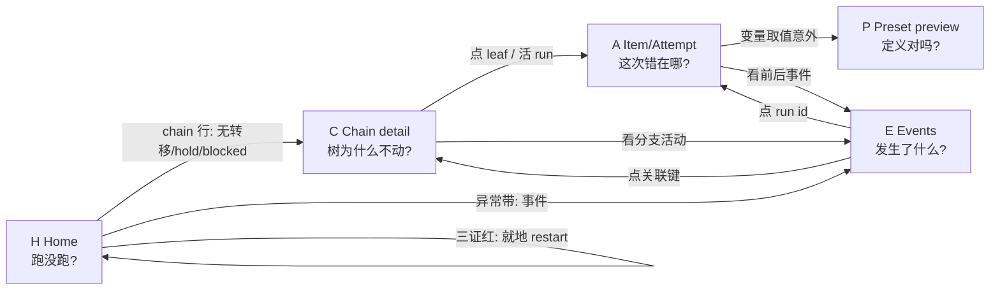

# coder-loop v3 GUI — UX 设计

输入：`gui-business-flows.md`（9 场景业务流，全部带 issue 出处）+ `gui-old-prototype-inventory.md`（旧原型考古）。
本文档回答三件事：为什么人要看每一屏、每一屏的页面逻辑（信息层级）、跨屏的交互逻辑。布局与视觉不在本文档，获确认后才进原型。

---

## 0. 设计原则（从业务流直接推出）

1. **GUI 是短停留运维面，不是常驻工作台。** 9 个场景的退出条件全部收敛到「status 反映预期变化后关掉」。因此每屏第一眼必须给**结论**（好/坏），坏消息才展开细节；不做需要人长时间盯着的 dashboard。
2. **每屏为一个怀疑服务。** 屏的存在理由 = 某场景里操作员带着的问题；没有场景问题驱动的数据面一律不立屏（反面清单 13 项，见 business-flows 第四部分）。
3. **动作在决策现场，不设集中控制台。** F 档闭集的每个动作都出现在它对应的决策证据旁边：unblock 在 blocked leaf 行上、restart 在三证卡上、stop/resume 在 chain header、reorder grip 在 pending leaf 上。人看到证据 → 当场决策 → 当场动手。
4. **关联键是全局通货。** chain / item / run / phase 标识在任何屏出现都可点击跳转（#544 信息架构「事件→run→item 可关联跳转」、#580 双向跳转）。怀疑驱动的跳转靠它实现。
5. **GUI 不做第二套判断。** 写动作原样转发 daemon，daemon 拒绝就原样呈现拒绝（#579「转发不加语义」）；状态词表来自 preset 编译产物，GUI 不复制词表。

---

## 1. 为什么人要看 —— 屏清单与存在理由

6 屏 + 2 个挂载子视图。每屏一句存在理由（= 场景里的怀疑）：

| 屏 | 存在理由（人带着什么问题来） | 场景 | 树的角色 |
|---|---|---|---|
| **H · Home** | 「跑没跑？有没有事？」——每天多次、几秒钟的心跳确认 | S1, S2/S3/S5 的触发地 | 背景（每 chain 一行摘要） |
| **C · Chain detail** | 「这条 chain 为什么不动 / par 分支跑到哪了 / 我要动它」 | S5, S8, S9 | **第一眼对象**（运行态树） |
| **A · Item / Attempt detail** | 「这次 attempt 到底收到了什么、做错在哪？」 | S4 | 背景（面包屑） |
| **E · Events** | 「刚才发生了什么？这个 run 前后发生了什么？」 | S4 反查、S1 异常钻取 | 无 |
| **P · Preset preview** | 「我声明的 preset 编译出来到底是什么形状？」 | S7 | **第一眼对象**（定义态树） |
| **M · Mobile home** | 「不在电脑前，瞥一眼 + 当场处置」 | S3 | 背景 |
| 挂载 · Hooks 节 | 「哪个 hook 在 hold 这个决策点？」（挂在 C） | S5 | — |
| 挂载 · Context entries | 「上一轮给这一轮留了什么？」（挂在 C 与 A） | S6 | — |

**与旧原型 6 屏的对照**：Overview→H（继承三证卡，杀 slot 计数与 delta 虚荣指标）；Chain detail→C（杀 flat 队列表，换运行态树）；Item detail v2 tabbed→A（**裁决：v2 胜出**，杀 v1；理由见 §2.3）；Preset preview→P（补齐右列与 tab，状态图改用组件不再手绘）；**Chains list 整屏删除**（陈列陷阱：dogfood 规模下 H 的 per-chain 行已覆盖「我有哪些 chain」，没有场景需要过滤分页的资产清单）；**Settings 删除**（无场景）；Events 从「有导航无屏幕」补成真屏。

**删除的动作/组件及理由**（全部 F 档外或 v3 退役概念）：
- ChainCreateModal / EnqueueItemModal / SetRunnerModelModal —— 创建类明确不进 v3 GUI（#544 F 裁决），侧边栏也不留入口。
- Item 页的 Skip / Cancel run / Force retry —— 不在 F 档闭集，呈现它们即破坏范围收口承诺（#579）。
- DaemonHealthCard 里的「ACTIVE RUNS 2 / 8 slots」—— slot 退役（#544 逐字「不再是展示对象」），改为活 run 计数。
- ThirdPartyTriggerCard（RFC-6 inbox）—— #544 范围外。
- ItemQueueRow 10 列表 —— flat 队列是 v2 投影，树=队列（#546）。
- MetricStatCard 的「+1 since yesterday」delta —— 虚荣指标，不服务任何决策。

**从旧原型继承的结构决策**（考古 §6，全部保留）：
1. screen-as-PageShell-instance：屏幕 = PageShell 实例 + Crumbs/Actions/Content 三槽 override。
2. 四层组件粒度：pill/chip 原子 → field 组合 → row → card/strip；屏只做布局与 override。
3. 来源可追溯性做成一等公民：runner/preset/binding 值全部带 source 标注（engine/preset/chain/item 四层）。
4. 三证卡：pid file / socket LISTEN / RPC 应答三张 cert + Alive/Split/Down 判活文案。
5. Prompt viewer 钉 determinism：「same bytes the agent saw」+ sha256。
6. 文案全用真实领域数据（真路径、真状态词、真 CLI 命令）。
7. 一屏一问题，副标题写明数据来源。
8. 领域状态全部 pill 化，无裸文本状态。
9. 事件 kind 五分类（LIFECYCLE/DECISION/VALIDATION/AUDIT/DIAGNOSTIC）chip 体系。
10. （修正旧原型未收敛点）token 单体系：只用文档自有 variables，零外部 lib import——headless 可渲染是硬约束。

---

## 2. 页面逻辑 —— 每屏的信息层级

层级铁律：**第一层 = 结论（好/坏一眼可判）；第二层 = 坏消息的证据；第三层 = 钻取入口**。好消息永远只占一行。

### 2.1 H · Home

1. **第一层：daemon 三证卡。** 三张 cert（pid / socket / RPC）独立显示，合成判词 Alive / Split / Down；**动作就地**：restart / stop（带二次确认）。旁挂 rate-limit 冷却条（有冷却才显示，`daemon.status.rateLimit`）。「网关不可达」是 GUI 自身的连接错误态，与「三证红」视觉上截然不同——这是「断网 vs daemon 死」的可区分性（#544）。
2. **第二层：异常带。** 最近异常事件（`daemon.fatal` / `attempt.timeout` / gate hold / reopen 临近预算），每条带关联键可跳。**设计决策：par 容器级异常（hold、reopen 临近预算）直接进首屏异常带**——首屏职责就是异常感知，#575 也钉了「gate hold 状态在 chain 视图/首屏异常区呈现」。无异常时此带整体消失，不留空壳。
3. **第三层：per-chain 摘要行。** 每 chain 一行：chain 名（repo 路径）· 活 run 数 · 最近转移时间（「8s ago」）· 健康标记（hold / blocked / reopen 计数，无异常则无标记）。**「长时间无转移」不硬编码阈值**——引擎无此 fact，GUI 发明阈值即发明词表；显示相对时间让人自己判断。行点击 → C。
4. daemon 死时的降级形态：三证卡红 + 最后事件（死因线索，#578「死因事件即崩溃记录」）+ SQLite 只读快照仍显示队列终态（#544 三数据面里 SQLite 面独立于 daemon 存活）。

### 2.2 C · Chain detail

1. **第一层：chain header。** 身份（repo 路径 + chain id）+ 状态 pill + 最近转移时间；**动作就地**：stop / resume。其下一行紧凑 meta（preset / default runner / base branch，各带 source 标注）——回答 S9 的「要动的是哪条」，不占卡片区。
2. **第二层：运行态任务树（主体，第一眼对象）。** 节点词表严格 #546/#558：
   - leaf（item）：id + title + 状态 pill + 活 run 指示（spinner）；**blocked leaf 行内就地 Unblock 按钮**；pending leaf 有 reorder grip（par 容器内的 grip 同样提供，语义由 daemon 裁决——#579 GUI 不预判合法性）。
   - seq 容器：cursor 位置（「@ 2/5」）。
   - par 容器：join chip（`drain` / `validator → 指向 validator leaf`）+ 容器稳定 id（= group scope 键）+ reopen 计数/预算 + HOLD 标记（有 gate hold 时）。
   - join ADT 用 discriminated union 穷尽渲染（#580），新增 variant 前端必须显式处理。
   - v2 线性链渲染为退化树 seq(leaf…)，同一套 UI（#558）。
   - leaf 点击 → A；活 run 的 leaf 直接显示 run id（点击 → A 的对应 attempt）。
3. **第三层：侧栏两个挂载视图。**
   - **Hooks 节**：四层合成后的生效 hook 清单（每条标来源层：global/chain/preset/item），当前 gate hold 现场（决策点标识 + hold 起始 + 重问节奏）。快照语义 =「现在」，与 `hook.*` 事件的「过程」区分（#575）。
   - **Context entries**：按 scope（item/chain/group）过滤浏览，envelope 显示 id/ts/scope/author，body 原文透传**不做 markdown 二次渲染**（#545/#583：内容通道≠流转信号）。append-only，无写面。

### 2.3 A · Item / Attempt detail

**裁决旧原型 v1/v2 并存：v2 tabbed 胜出。** 理由：S4 的问题序列（哪次错→prompt 是什么→变量值对吗→前后事件→preset 定义对吗）天然是并列的调查维度而非纵向流，tab 化让每个问题一屏内可答；v1 纵向堆叠迫使滚动寻找。

1. **第一层：item header。** item id + title + 状态 pill + phase pill + 面包屑（Home › chain › 所在容器路径——树在此屏是背景）。blocked 时 header 下就地 Unblock。
2. **第二层：attempt 选择器 + tabs。** attempt 时间线（每 attempt 一行：run id · phase · runner/model · FRESH/RESUME 徽标 · 起止/时长 · 终态），选中 attempt 后 tabs 展开：
   - **Prompt**（S4 主战场）：prompt.md 逐字渲染（「same value argv got」，#572 单一 effectivePrompt）+ sha256 + bindings 表（KEY / type / source / 实际值，BindingRow 继承）+ FRESH/RESUME 与 resumed session id。**#572 之前的旧 attempt 显示诚实的无快照态**（明示原因，不伪装成「没跑过」，#581）。
   - **Events**：该 run/item 过滤的事件序列（与 E 同构件，预置过滤）。
   - **Context**：该 item scope 的 entries（挂载视图复用）。
   - **Metadata**：KV 全带 source 标注（继承 ItemMetadataCard）。
3. trace/evidence/handoff 等 A 域文件：只给路径引用与原文透传，不解析不格式化（#544 范围外裁决）。run 目录 `status.json` 不作数据源（#580：快照与事件才是第一契约面）。

### 2.4 E · Events

1. **第一层：过滤条 + LIVE 指示。** 过滤维度 = kind / type / chain / item / run / phase / since（#577）；SSE tail 实时追加，LIVE 指示器显示流速；暂停/恢复 tail。
2. **第二层：事件行。** TIME / KIND chip（五分类）/ TYPE / 关联键（全部可点跳 C 或 A）/ SUMMARY。继承 EventStreamRow。
3. 永远带过滤地进入：从 H 异常带来时预置严重度过滤，从 A 来时预置 run 过滤。**无过滤的 raw JSONL 全量视图不存在**（陈列陷阱）。

### 2.5 P · Preset preview

数据源唯一：`preset compile --json`（与 daemon/scheduler 同一 CompiledTaskModel 计算路径，GUI 不二次 parse toml，#549）。schemaVersion 不支持时**显式报错显示版本号，不静默降级**（#582）。

1. **第一层：编译结论条。** preset 名 + schemaVersion + findings 汇总（0 warn = 绿一行；有 warn = 展开 findings 列表，每条指向具体 fragment/status）。
2. **第二层：三个并列视图（tab 或分区）**：
   - **状态图**：节点=状态（词表来自产物），边=哪个 phase 的哪个 exit 写它 + 引擎自有转移（entry/exhausted/unblock）。用 StateNode/EdgeArrow 组件渲染，**不手绘画布**（修旧原型的未收敛点）。
   - **Phase 任务树（定义态，第一眼对象之一）**：seq/par 结构 + 每 phase 的 runner/model + exits + toolRequirements（required 徽标仅 engine-kind 合法，#547 裁决 G）。与 C 的运行态树同一套树组件、不同数据面——「快照=运行态，编译产物=定义态」互补不重叠（#544）。
   - **Variables**：KEY / type / source / required 表。
3. tools 注册表、fragments、statuses 词表不独立成屏，作为上述视图的上下文出现（陷阱清单）。

### 2.6 M · Mobile home

与 PC 同构（无第二实现，#584）：同一组件树响应式。首屏三段**无滚动可见**（#584）：① 三证 + 每 chain 活 run 一行；② 异常清单；③ 控制面动作（F 档全集可达，#584 预期结果 3）。下钻进入同一 C/A/E 屏的窄布局。PWA 加主屏是常规入口（mesh-only 裸信任，无登录流）。

---

## 3. 交互逻辑

### 3.1 怀疑驱动的跳转图

（Hooks 节、Context entries 是 C/A 内的挂载视图，不参与屏间跳转。）

### 3.2 写动作的统一交互模式

F 档闭集 = daemon start/stop/restart + queue.unblock + chain.stop/resume + item.reorder，**不多不少**（#544）。每个动作同一生命周期：

1. **触点在决策现场**（见 §0 原则 3）。
2. **破坏性动作二次确认**：daemon stop / restart（会终止活 run）、chain.stop。unblock / resume / reorder 无确认（低破坏、可逆或 daemon 会拒绝非法请求）。
3. **发出后按钮进 pending 态**，GUI 不乐观更新——等 SSE 推的快照变化反映结果（退出条件的 UI 化：「status 反映预期变化」）。
4. **daemon 拒绝原样呈现**（错误文本 verbatim），GUI 不预判也不翻译（#579「daemon 是唯一裁判」）。
5. **F 档外诉求指路不代办**：改 preset / 改 hook / 运行时改 join / 创建 chain·item——在对应现场给一行「via CLI: …」指路文案（真实命令），不提供按钮。

### 3.3 Live 与连接状态

- SSE 推送（#571 spike passed）：快照失效推送 + 事件 tail。断线自动重连，重连期间显示「gateway unreachable」——这是 GUI 自身状态，与 daemon 三证红严格区分（断网 vs daemon 死可区分，#544）。
- 三数据面的呈现映射：socket RPC（快照/控制）→ H/C/A 的状态区；events JSONL（网关直读）→ E 与各处事件嵌入；SQLite 只读 → daemon 死时的队列终态兜底。

### 3.4 移动端

同构不裁剪语义：全部 F 档动作可达（#584），布局响应式收窄。深查类场景（S4 prompt 逐字读）在手机上可达但不优化——业务流确认操作员通常「回电脑再说」。

---

## 4. 组件体系规划（获确认后才进原型）

继承旧原型四层粒度，v3 概念补进原子层与 row 层：

- **原子（pill/chip）**：DaemonCertPill×3、StatusPill（词表来自 preset 产物）、PhaseChip、RunnerPill（带 source）、EventKindChip×5、RateLimitTag、LiveIndicator、**JoinChip（drain|validator，discriminated union）**、**ReopenBudgetChip（n/budget）**、**HoldBadge**、**Fresh/ResumeBadge**、SourceBadge（engine/preset/chain/item）。
- **树组件**：TreeLeaf（grip + id + title + pill + run 指示 + 就地动作槽）、TreeSeq（cursor）、TreePar（join chip + 容器 id + reopen + hold）——**运行态（C）与定义态（P）共用**，数据面不同。
- **row**：EventRow、AttemptRow、BindingRow、HookRow（带来源层）、EntryRow（envelope + body 透传）。
- **card/strip**：DaemonHealthCard（三证 + 就地动作）、RateLimitBar、AlertBanner、PromptBlock（sha256 + 行号）、CompileFindingRow。
- **shell**：PageShell（三槽）、Sidebar（H/Chains 无——直接 chain 行/E/P，无 Settings）、MobileTabBar、Crumb。

---

## 5. 本设计中我做掉的裁决（列出供推翻）

1. Chains list 整屏删除；「我有哪些 chain」由 H 的 per-chain 行回答。
2. Item detail 采用 v2 tabbed 方案，v1 弃。
3. par 容器级异常（hold / reopen 临近预算）直接进首屏异常带。
4. 「长时间无转移」不设阈值，显示相对时间由人判断。
5. par 容器内 reorder grip 照常提供，合法性交 daemon 裁决。
6. 树组件运行态/定义态共用一套，靠数据面区分。
7. token 单体系（零外部 lib import），headless 可渲染是硬约束。
8. 推送通知不做（v3 无此机制），移动端感知靠主动瞥——与业务流 [推断] ②一致。
