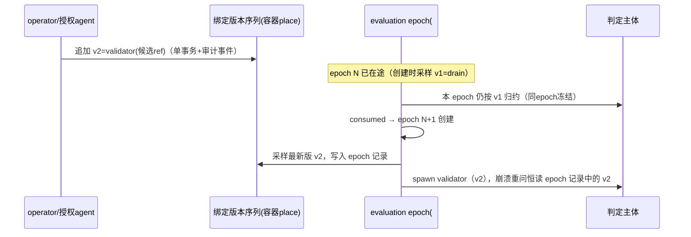

# v3 裁决报告：join 判定权演化——future-function mutation（边界 B）

> **SUPERSEDED（部分）**：裁决 3（物化态 join 绑定版本演化 + epoch 采样）被 2026-07-31 三时态/锁模型裁决整体 supersede——运行中程序不可编辑；§88 反例的前向回答 = 向外围开放结构 append 检查 task。裁决 5 的 override-advance 机制保留、救济定位废止。登记见 RFC #546 收敛稿 §9-2。其余条款存活。
>
> 裁决日期 2026-07-11，裁决主体操作员，产生于「边界 B：运行中修改 join 为什么等同于修改 future function，以及它是否应被允许」受边界约束设计审查会话。
> 本报告是该裁决的权威记录；#546 / #561 / #563 / #564 / #554 / #558 body 的对应条款以本报告为源同步修订。影响面：#546、#561、#562、#563、#564、#554、#547、#558、#599、`design-boundary.md` §3.1、`execution-orchestration.md` P3-B/P4-D、`gui-business-flows.md`。
> 姊妹报告：`definition-pin-decision.md`（边界 A，同日）——本报告在其「四域边界」与「rebind 在 API 面不可表达」钉子之上工作；`closure-lifecycle-decision.md` / `task-closure-decision.md`（边界 1/2）。

## 1. 裁决内容

原问题是 #564 的「join 声明运行时可改——drain↔validator 双向、下次评估生效、与 `repoCwd`/`runner`/`dependsOn`/`priority` 同入 control-plane 字段类」。操作员指出这等同于替换尚未执行完的 future function，冻结实施并要求先严肃讨论。审查与裁决后收口为六条：

1. **join 的语义定位 = future function（未归约汇合 redex 的函数位 + 判定主体绑定）。** `par(children, join)` 的语义是「children 落定后，把 join 绑定的判定主体 apply 到冻结的 outcome vector」；改写发生时这次 apply 尚未发生、operand（outcome vector）尚不存在，且 decision 的输出会生成程序结构（reopen 追加 corrections、回退游标）。改 join 改的是归约规则，不是执行参数。#413「判定是 DB 里可随时修改的状态」条款废止——它是 v2「判定 = item.status 字符串」的思维残留；v3 判定已升格为带主体、带 epoch、带原子消费的一等结构（#561/#599），「DB 字段可随时改」的前提已死。control-plane 类不均质：`repoCwd`/`runner`/`priority` 改变 leaf *怎么被执行*，`dependsOn` 只延迟启动；join 携带判定权并生成纠正结构，不入此类。
2. **定义态 join 实例生命周期内不可变。** preset phase 树（#554）与 chain metadata（#566）声明的 join 属 `definition-pin-decision.md` 保护域（六块闭集中 phases 任务树的一部分），无 rebind——与其不变量 5「definitionHash 写一次」同一扇门。判定者坏死/过时的救济：operator per-epoch decision（本报告裁决 5）、cancel + 以修正后定义重建实例；与 preset 任何其他 bug 的救济通道一致。
3. **物化态 join 允许演化，形态 = 同 place 绑定版本追加 + epoch 创建时采样 + 值域限候选引用。** #563 运行时物化诞生的容器，其 join 本就是运行态事实（边界 A 四域中的 dynamic runtime tree 域），落在「运行态域内演化」的许可空间。三个构件缺一不可：
   - **绑定版本（机制）**：判定权绑定是容器上的 append-only 版本序列 `JoinBinding{version, join, author, authorityClass, effectiveFromEpoch}`；当前绑定 = 最新版本；每次演化是一等审计事件。裸覆写出局——覆写后容器 id 只命名位置不命名程序，某次 advance 按哪版规则谁裁的从记录不可重建，击穿「让每次推进可解释」（`design-boundary.md` §9）。
   - **epoch 采样（生效时点）**：evaluation epoch 创建（#599 write-ahead 落 `evaluating`）时采样最新绑定版本并持久化进 epoch 记录；同 epoch 内（含崩溃重问、validator 重 spawn）主体永不更换；演化追加对在途 epoch 零影响，生效于下一 epoch。Erlang 热代码替换是同构先例：旧进程跑完当前调用，下次限定调用才进新版本。
   - **候选引用（值域）**：运行时进入 join 位的 validator 值只能是 pinned 定义内编译期已校验候选的引用（`(definitionHash, candidateId)` 对，definitionHash 继承 enclosing 实例——边界 A 不变量 7），运行时可补充经边界 parse 的绑定*值*，不可注入调用*结构*。自由注入「完整 item 调用声明」出局：它把 socket 写做成运行时代码注入面，且与 G2 行 5「非法 join 引用在 load/compile 期失败」不可同真——运行时自由注入没有 compile 期。
4. **物化请求增加诞生时 join 参数；「join 可随后改」无条件承诺废止。** 追加者（review agent / operator）在物化时刻最知道这批工作要不要 gate——物化请求可显式指定 join（值域同上）；未指定默认 drain（中性结构谓词，不发明判定权，保留）。事后安装收缩为罕见路径，走裁决 3 通道。
5. **operator 一次性判定权进 #561 契约。** 「一次性放行/否决」这类运维需求从 join 改写中剥离：判定权 = join binding 唯一确定的主体 ∪ operator 显式 override（同一准入门、同一 epoch 语义、独立审计词条）。为放行一次而改程序文本的需求形态消解。
6. **授权方向敏感。** 加严（drain→validator，安装候选）可经 preset rights 授 agent；放宽（validator→drain，拆除判定者）恒 operator-only。被判者不可自解其判——否则被授权 phase 的 agent 可拆掉将判定自己所在容器的 gate，blame 模型（递出面定理）在判定层被反向击穿。

**#564 现形态否决重写**：题目从「control-plane 化与授权面」改写为「物化容器判定权演化——绑定版本、候选引用与授权方向」。

### 绑定时点三层拆分

#564 原文「下次 join 评估即用新值」暗中选择了第二层的 late binding，却没回答第一、三层：

- **值的写入时点**：编译（定义态）/ 物化（诞生参数）/ 演化追加（裁决 3）；
- **语义生效时点**：epoch 创建时采样，写入 epoch 记录；
- **应用时点**：evaluation 归约 outcome vector 产出 decision。

### 操作员裁决记录（2026-07-11）

裁决会话呈报六条组合方向（定义态不可变 / 物化态 C2×D 演化 / 诞生时参数 / operator override / 授权方向 / #564 否决重写）后，操作员批复 verbatim：

> "你的决策没问题"

## 2. 不可妥协不变量

1. **epoch 冻结主体**：每次 evaluation 的判定主体在 epoch 创建（write-ahead）时采样并冻结进 evaluation identity；同 epoch 内（含崩溃重问、validator 重 spawn）主体永不更换——与 #599 I2「decided 直接重消费、不重问」严格兼容。
2. **decided 不可拦截**：已进 journal 的 decision 永远按其产生时的绑定消费；join 演化不能改写、吞掉或重判任何已判定结果。
3. **定义零漂移**（边界 A / G6 行 9）：编译定义声明的 join 在实例生命周期内不被覆写；运行时演化只存在于运行态诞生的结构上，任何形态不写回定义、不伪装成定义版本切换。
4. **演化即事件**：每次绑定变更是一等审计事件（谁、何时、v(n)→v(n+1)、生效 epoch）；evaluation 记录携带绑定版本引用——推进可解释性不因演化而衰减。
5. **被判者不可自解其判**：授权面区分加严与放宽；放宽恒 operator-only，agent 至多获加严权。
6. **place 属性不随绑定重置**：reopen 预算、par pin、容器 id、`group` context scope 附着于容器；换绑定不清零预算（否则演化通道成为预算洗白通道）、不重 pin（#564 原 body 已钉，维持）。
7. **join 位不接受运行时自由构造的程序**：值域 = pinned 定义内候选引用 + 边界 parse 的绑定值。

## 3. 在途各态的唯一语义

| 情形 | 唯一语义 |
|---|---|
| 在途 validator（epoch=`evaluating`，validator leaf 活跑） | 本 epoch 按创建时采样的绑定跑完；演化追加照常落库，生效于下一 epoch；追加**不取消**在途 validator——要杀它走 #565 子树取消，是另一个显式操作，不是 join 写的副作用 |
| 同 epoch 崩溃重问（#599 `evaluating` 残留） | 重问读 epoch 记录持久化的绑定版本引用——期间即使有新版本追加，同 epoch 永远同主体 |
| hold 后重问 | hold 消费 → epoch+1 → 新 epoch 创建时重新采样 → 新绑定生效。业务上正是「中途装上/拆除验证者，下轮重问即换判定者」 |
| reopen/corrections 在途 | decided decision 按其绑定原子消费（#562 单事务不变）；corrections 是 append-only 新任务，不因后续演化撤销（#599 I4 同哲学）；被演化孤儿化的质量义务以事件暴露（「r1 由 v1 发出、后续放行由 v2 裁定」），不 gate、不兜底——错误编排不归引擎 |
| 预算 | reopen 预算附着容器 place，跨绑定版本累计、不重置；耗尽落容器级 exhausted 的路径与绑定版本无关 |
| 已发生副作用 | validator run 成本、已插入 items、已发 PR/comment：append-only 零回滚——与「reopen 零状态重置」同一哲学 |
| 授权 | operator：物化容器上可追加任意候选引用绑定；agent（preset rights）：仅加严方向、仅候选引用；定义态容器：不开放演化 |
| crash cut points | 绑定追加 = 单事务写版本记录 + 审计事件；epoch 创建 = 单事务写 `evaluating` + 采样版本引用。两写点之间任意崩溃无歧义：恢复时 epoch 记录自含主体，版本序列 append-only 无中间态。不需要「evaluation 进行中拒绝写入」的互斥，因此也没有「operator 永远抢不进 hold 循环窗口」的活性问题 |

## 4. 候选模型比较记录

四个候选在「定义层动不动、变更有没有身份、值域封不封闭、place 换不换」四轴上取值不同，不是参数差异：

- **(A) 创建后完全不可变**：全部不变量自动满足、零新机制；死于 §5 反例——物化容器「事后装 gate」需求真实，且 seq-wrap 替代（`seq(par…, validator-leaf)`）不等价：seq 后继 leaf 拿不到引擎冻结的 outcome vector、无容器级 hold/预算语义，retro-wrap 是比改 join 更重的图重写。
- **(B) 静止边界裸覆写**（#564 原文收紧版：同 identity、epoch 量化、下次评估生效）：三处击穿——定义漂移（不变量 3）、绑定无版本身份使 evaluation 无从引用「按哪版裁的」（不变量 4）、自由注入面（不变量 7）。epoch/原子写回答的是「什么时候读」，回答不了「这个写合法吗、写的是什么身份的东西」——用一致性机制偷换程序演化议题正是被操作员点名的病灶。
- **(C1) 换容器**（新 par 节点接管成员）：否决——place 身份必须存续，pin/预算/context scope/成员闭包的迁移是给伪概念付税，重蹈 `task-closure-decision.md` §6 记录的「跨 worktree resume」错误。
- **(C2) 同 place 绑定版本追加**：程序演化显式化为一等运行态数据；身份分层（place id 稳定、绑定有版本）。**采纳为机制。**
- **(D) 预编译候选 + 运行时选择**：#605/#547 纯度最高（行为永远落在事前可计算定义包络内、GUI 可预览候选、注入面关闭）；单用不足——物化容器诞生于声明之外，且「选择」仍需回答生效时点与身份。**采纳为值域。**

C2 是机制、D 是值域，正交组合。A 是组合的退化形态（版本序列长度恒 1），B 是删掉版本身份与值域约束后的劣化形态。

## 5. 最强反例与化解

**对完全不可变（A）**：长寿命物化容器 + 判定者必须中途更换。review agent 经 #563 物化纠正批次容器（生而 drain），中途需装批次级 validator；或已在 validator 下经历 N 轮 hold/reopen，需换更严判定模板（escalation）。重建容器切断 par pin、`group` context scope、reopen 预算连续性与全部成员闭包归属；per-epoch operator decision 救不了持久需求——50 轮 evaluation 手工放行 50 次不是设计是事故。此场景迫使 v3 支持同 place identity 上的持久判定权演化，否决 A。

**对自由可变（B）**：validator 已发出 `reopen(target, corrections)`，corrections 在途时 join 被覆写为 drain——下次 evaluation 结构性直通，纠正质量永无人复验，而记录上只剩一个不复存在的 validator 曾要求过纠正。引擎不兜底该业务后果，但 B 连「让它可解释」都做不到。C2 下同一操作合法且每步在事件流有名有姓——「允许」与「允许但显式」的差别。

**对定义态开放演化**：定义态 validator 坏死致 hold 死循环的解卡，不需要动程序文本——operator per-epoch decision 或 cancel+重建即达；与 #605 既定哲学一致（preset 有 bug 时运行实例照样绑旧定义，救济是实例级运维不是定义热改）。

## 6. Falsifier

1. 出现真实场景：定义态容器必须持久更换判定者，且 per-epoch operator decision 与 cancel+重建都不可接受 → 裁决 2 落，退到「定义态 operator-only 运行态 overlay + 显式定义偏离标记」，需操作员重裁。
2. 物化时 join 参数落地后，真实使用中事后安装路径长期零使用 → 裁决 3 演化通道是死代码，收缩到 A + 诞生时选择。
3. 出现 validator **结构**（非绑定值）必须运行时合成、候选引用表达不了的真实判定需求 → 不变量 7 值域收紧落，退到边界 parse + doctor 告警。
4. operator per-epoch decision 被实证滥用为绕过一切 gate 的习惯通道 → 裁决 5 需加频率/审计压力或收回。

## 7. 对既有产物的修正清单

| 产物 | 修正 | 状态 |
|---|---|---|
| #546 body | 「join 策略运行时可改」条款整条替换为演化条款；「汇总判定权」节补 operator override；「动态追加」节物化 join 参数化；「与 #413 的关系」判定主体处置更新；关闭验证行 4 改写 + 新增定义态不可变/operator override 行；「范围外」冻结句解除 | 本次执行 |
| #564 body | 整体重写为「物化容器判定权演化——绑定版本、候选引用与授权方向」，解除 blocked 横幅 | 本次执行 |
| #563 body | 继承快照随源更新；诞生时 join 参数进目标/预期/验收；「随后可改」预设结论删除 | 本次执行 |
| #561 body | 判定权契约补 operator override 与 epoch 采样显式化；#564 指称更新 | 本次执行 |
| #554 body | join 候选具名声明位进声明面与装载期检查 | 本次执行 |
| #558 body | 绑定版本序列存储位 + evaluation 记录 bindingVersion 进 shape 承诺 | 本次执行 |
| #547 | 表达力需求第八项（join 候选声明位）登记 comment | 本次执行 |
| `design-boundary.md` §3.1 | 「尚待操作员讨论」句替换为裁决引用 | 本次执行 |
| `execution-orchestration.md` P3-B/P4-D | #564 冻结条目替换为裁决引用与重写后依赖 | 本次执行 |
| `gui-business-flows.md` | 「#546 声明这是 control-plane」两处引用改按本报告 | 本次执行 |
| #599 | 零改动——epoch 语义原样被本裁决消费，采样点即其 write-ahead `evaluating` | 登记 |
| #562 | 零改动——decided 原子消费与 append-only corrections 原样成立 | 登记 |

术语防讹传登记：「绑定版本」（物化容器判定权的运行态 append-only 序列）≠「定义版本」（definitionHash，写一次）——join 演化永不表现为 definitionHash 变更；「候选引用」解析域是 enclosing 实例的 pinned bundle，不是磁盘当前 preset。
